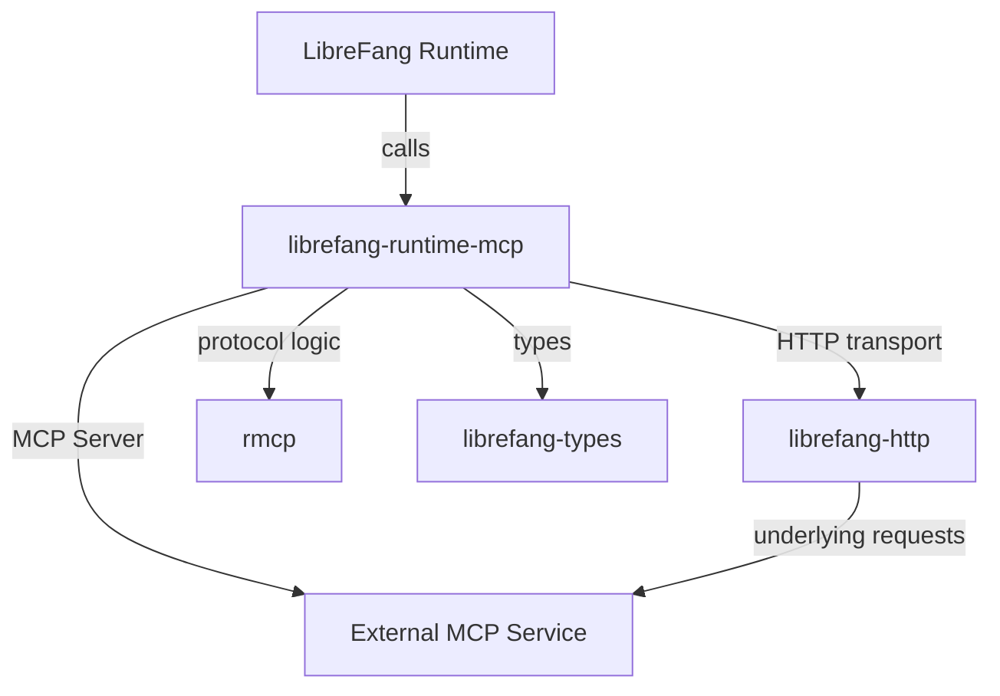

# Other — librefang-runtime-mcp

# librefang-runtime-mcp

MCP (Model Context Protocol) client for the LibreFang runtime. This crate provides integration with MCP-compatible services, enabling the runtime to communicate with model context servers for AI-assisted operations.

## Purpose

This module acts as the bridge between the LibreFang runtime and external MCP services. It handles connection management, request serialization, and response parsing for Model Context Protocol interactions.

## Dependencies & Their Roles

### Internal Crates

| Crate | Role |
|---|---|
| `librefang-types` | Shared type definitions used across the project |
| `librefang-http` | HTTP client infrastructure for making requests to MCP endpoints |

### External Crates

| Crate | Role |
|---|---|
| `rmcp` | Rust MCP client library — core protocol implementation |
| `reqwest` | Underlying HTTP client used for transport |
| `tokio` | Async runtime for non-blocking I/O |
| `serde` / `serde_json` | Serialization and deserialization of MCP messages |
| `http` | Low-level HTTP types (request/response builders, headers) |
| `async-trait` | Async trait definitions for MCP client abstractions |
| `thiserror` | Derived error types for protocol and transport failures |
| `base64` / `sha2` | Encoding and hashing — likely used for authentication or payload verification |
| `url` | URL parsing and construction for MCP endpoints |
| `rand` | Random number generation — likely for nonce or session identifier creation |
| `arc-swap` | Atomic swapping of shared state — enables live reconfiguration of MCP connections without service interruption |
| `tracing` | Structured logging throughout the client lifecycle |

## Architecture

The module wraps `rmcp` with LibreFang-specific configuration and error handling. `librefang-http` provides the transport layer, while `rmcp` handles the MCP protocol semantics.

## Key Design Decisions

**`arc-swap` for live reconfiguration.** MCP connection details (endpoints, authentication tokens, configuration) can be updated at runtime without requiring a restart. `arc-swap` provides lock-free atomic swaps of the shared client configuration.

**Authentication via `base64` + `sha2`.** MCP endpoints likely require authenticated requests. These crates support encoding credentials and computing request signatures or token hashes.

**Separation of transport and protocol.** HTTP-level concerns live in `librefang-http`, while MCP message formatting, method dispatch, and response parsing belong here. This keeps each crate focused and testable in isolation.

## Integration Points

This crate is consumed by other LibreFang runtime components that need to query or interact with MCP-compatible AI services. It does not depend on higher-level LibreFang modules, keeping it a leaf dependency in the crate graph.

No inbound or outbound call edges were detected in static analysis, suggesting the module exposes a library API (traits, structs, functions) rather than driving its own execution flow. The consuming runtime component is responsible for instantiation and lifecycle management.