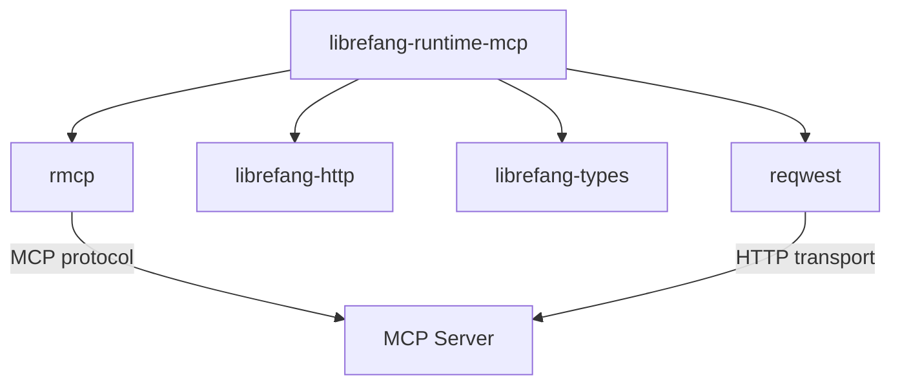

# Other — librefang-runtime-mcp

# librefang-runtime-mcp

MCP (Model Context Protocol) client for the LibreFang runtime. This module provides the integration layer that allows LibreFang to communicate with MCP-compatible services, enabling tool invocation, resource access, and prompt management through a standardized protocol.

## Purpose

The Model Context Protocol is a standard for communication between AI applications and external tool/resource providers. This crate implements the client side of that protocol within the LibreFang runtime, allowing the system to:

- Discover and invoke tools exposed by MCP servers
- Access resources provided by MCP servers
- Manage prompts offered by MCP servers
- Handle authentication and session management for MCP connections

## Architecture

The module sits between the LibreFang runtime and external MCP servers. It relies on `rmcp` (the Rust MCP client library) for protocol-level handling, while providing LibreFang-specific integration through `librefang-types` and `librefang-http`.

## Key Dependencies

### Internal Dependencies

| Crate | Role |
|---|---|
| `librefang-types` | Shared type definitions used across LibreFang crates |
| `librefang-http` | HTTP client infrastructure, connection pooling, and request configuration |

### External Dependencies

| Crate | Role |
|---|---|
| `rmcp` | Core MCP client implementation — protocol message serialization, transport negotiation, and client lifecycle |
| `reqwest` | HTTP client used for MCP server communication over HTTP/SSE transports |
| `http` | Low-level HTTP types (request/response headers, status codes) |
| `tokio` | Async runtime for non-blocking I/O |
| `serde` / `serde_json` | JSON serialization for MCP protocol messages |
| `async-trait` | Async trait definitions for transport and handler abstractions |
| `thiserror` | Typed error definitions for MCP client failures |
| `base64` / `sha2` | Encoding and hashing, likely for authentication tokens or session identifiers |
| `url` | URL parsing and construction for MCP server endpoints |
| `rand` | Random number generation for session nonces or request IDs |
| `arc-swap` | Atomic swapping of shared state, used for hot-reloading MCP client configuration |
| `tracing` | Structured logging and diagnostics |

## Integration with LibreFang

This crate is consumed by the LibreFang runtime to establish and manage MCP connections during execution. The dependency chain flows as follows:

- The **runtime** calls into this module to initialize MCP clients for configured servers.
- This module uses `librefang-http` for connection setup and `librefang-types` for shared data structures.
- Protocol-level communication is delegated to `rmcp`, with this crate providing the glue code that adapts MCP semantics to LibreFang's execution model.

## Testing

Tests use `wiremock` to mock HTTP endpoints, allowing verification of MCP client behavior (connection establishment, tool invocation, error handling) against simulated MCP servers without requiring live infrastructure. Test configuration is enabled via the `macros` and `rt-multi-thread` features of `tokio` in `[dev-dependencies]`.

## Error Handling

Errors are defined using `thiserror` and should cover:

- Connection failures to MCP servers
- Protocol-level errors (malformed responses, unsupported methods)
- Authentication failures
- Timeout and transport errors propagated from `reqwest`

## Logging

All significant operations are instrumented with `tracing` spans and events, enabling observability of MCP client lifecycle events, request/response cycles, and error conditions in production deployments.