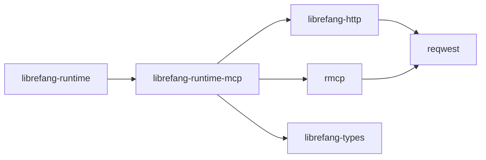

# Other — librefang-runtime-mcp

# librefang-runtime-mcp

MCP (Model Context Protocol) client for the LibreFang runtime. This crate provides the bridge between the LibreFang system and external MCP-compatible tool servers, enabling the runtime to discover and invoke tools exposed via the Model Context Protocol.

## Purpose

The Model Context Protocol is a standardized protocol that allows AI systems and tool consumers to interact with tool providers. This crate implements the client side — it connects to MCP servers, discovers their available tools, and facilitates invoking those tools from within the LibreFang runtime.

## Dependencies & What They Reveal

The crate's dependency graph reveals its core responsibilities:

| Dependency | Role |
|---|---|
| `rmcp` | Core MCP protocol implementation — handles the wire protocol, tool discovery, and invocation semantics |
| `reqwest` | HTTP transport for communicating with MCP servers |
| `librefang-types` | Shared type definitions across the LibreFang workspace (tool schemas, responses, etc.) |
| `librefang-http` | Shared HTTP client configuration and middleware, ensuring consistent connection behavior across the workspace |
| `base64`, `sha2` | Likely used for authentication handshakes or payload integrity verification with MCP servers |
| `url` | Parsing and constructing MCP server endpoints |
| `rand` | Generating nonces, session identifiers, or other random values for the protocol |
| `arc-swap` | Atomic swapping of shared state — enables live reconfiguration of MCP server connections without disrupting in-flight requests |
| `tokio` | Async runtime |
| `async-trait` | Async trait definitions for MCP client abstractions |
| `tracing` | Structured logging and diagnostics |
| `serde`, `serde_json` | Serialization of MCP protocol messages |

## Position in the Workspace



This crate sits between the higher-level runtime orchestration and the low-level MCP protocol. Other runtime components depend on it when they need to interact with external tools. It depends on `librefang-types` for shared schemas and `librefang-http` for consistent HTTP client behavior.

## Key Design Patterns

**Connection management via `arc-swap`:** The use of `arc-swap` indicates that MCP server connections can be reconfigured at runtime — for example, when the set of available MCP servers changes. The atomic swap allows hot-reloading of connection state without locking or blocking concurrent tool invocations.

**Shared HTTP infrastructure:** By routing through `librefang-http` rather than creating a standalone `reqwest` client, this crate inherits workspace-wide HTTP settings (timeouts, TLS configuration, retry policies, tracing middleware).

**Async trait abstraction:** The `async-trait` dependency suggests the MCP client functionality is exposed through trait(s), allowing consumers to program against an interface rather than a concrete implementation. This supports testability — consumers can be injected with mock MCP clients.

## When to Use This Crate

- You need to connect to an MCP server from within the LibreFang runtime
- You need to discover tools exposed by an MCP-compatible server
- You need to invoke remote tools and process their responses using LibreFang's type system

## Building & Testing

```bash
# Build the crate
cargo build -p librefang-runtime-mcp

# Run tests
cargo test -p librefang-runtime-mcp
```

## Notes

- The `http` crate (v1) is used directly rather than re-exported through `librefang-http`, suggesting this crate constructs or inspects HTTP primitives at the protocol level that go beyond what the shared HTTP layer provides.
- The combination of `base64` and `sha2` may indicate support for MCP server authentication schemes that involve challenge-response or HMAC-based verification.