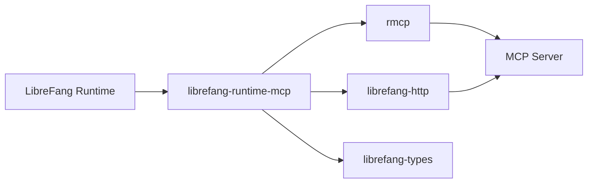

# Other — librefang-runtime-mcp

# librefang-runtime-mcp

MCP (Model Context Protocol) client for the LibreFang runtime. This module provides the integration layer between the LibreFang runtime and MCP-compatible services, enabling communication with AI model endpoints and tool servers using the Model Context Protocol specification.

## Purpose

The Model Context Protocol standardizes how applications communicate with language models and their associated tooling. This crate implements the client side of that protocol, allowing the LibreFang runtime to:

- Discover and invoke tools exposed by MCP servers
- Manage connections to MCP-compatible endpoints
- Serialize and deserialize MCP protocol messages using the shared `librefang-types` definitions

## Architecture



The module sits between the LibreFang runtime core and external MCP servers. It relies on `rmcp` for the core MCP client implementation, `librefang-http` for transport-level HTTP communication, and `librefang-types` for shared data structures used across the codebase.

## Dependencies

### Internal Crates

| Crate | Role |
|---|---|
| `librefang-types` | Shared type definitions for MCP messages, tool schemas, and protocol structures |
| `librefang-http` | HTTP client abstraction used for transport-level communication with MCP servers |

### External Crates

| Crate | Role |
|---|---|
| `rmcp` | Rust MCP client library providing protocol-level primitives |
| `reqwest` | Underlying HTTP client (used transitively via `librefang-http`) |
| `tokio` | Async runtime for non-blocking I/O |
| `serde` / `serde_json` | Serialization of MCP request/response payloads |
| `http` | HTTP type primitives (method, header map, status codes) |
| `base64` / `sha2` | Encoding and hashing, likely for authentication or payload verification |
| `url` | URL parsing and construction for MCP endpoints |
| `rand` | Random number generation, likely for nonce or session identifiers |
| `tracing` | Structured logging and diagnostics |
| `async-trait` | Async trait support for trait definitions |

## Integration Points

This module is consumed by higher-level runtime components that need to interact with MCP servers. It does not directly call into other LibreFang crates beyond `librefang-http` and `librefang-types`, keeping its responsibility focused on MCP protocol handling.

Consumers of this crate should expect to:

1. Initialize an MCP client with a target endpoint URL
2. Use the client to list available tools, invoke tools, and handle responses
3. Rely on the crate for proper serialization of MCP-compliant messages

## Building

```bash
cargo build -p librefang-runtime-mcp
```

## Testing

```bash
cargo test -p librefang-runtime-mcp
```