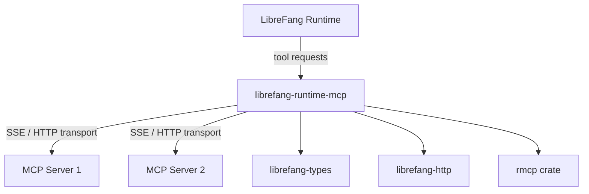

# Other — librefang-runtime-mcp

# librefang-runtime-mcp

MCP (Model Context Protocol) client for the LibreFang runtime. This module provides the client-side implementation for connecting to external MCP servers, enabling tool discovery and invocation through the standardized MCP protocol.

## Overview

The Model Context Protocol allows an application to interact with external tool servers that expose capabilities such as function calling, resource access, and prompt templates. This crate acts as the client half — it establishes connections to MCP servers, negotiates capabilities, discovers available tools, and dispatches tool calls on behalf of the LibreFang runtime.

## Architecture



The module wraps the `rmcp` crate (Rust MCP client) and layers LibreFang-specific concerns on top: type integration via `librefang-types`, HTTP transport via `librefang-http`, and security validations.

## Key Dependencies

| Dependency | Role |
|---|---|
| `rmcp` | Core MCP protocol client implementation — handles protocol negotiation, message framing, and tool invocation semantics |
| `librefang-types` | Shared type definitions used across LibreFang; ensures MCP tool inputs/outputs map to the same types the rest of the runtime uses |
| `librefang-http` | HTTP client utilities, providing the transport layer for MCP's HTTP-based communication (including SSE streams) |
| `reqwest` | Underlying HTTP client, used for outbound requests to MCP servers |
| `http` | Low-level HTTP types (request/response) |
| `sha2` / `base64` | Cryptographic hashing and encoding — used for verifying server identity and securing the handshake |
| `psl` | Public Suffix List — validates domain names of MCP server endpoints to prevent connections to ambiguous or unsafe hosts |
| `url` | URL parsing and validation for MCP server addresses |
| `arc-swap` | Atomic swapping of shared state — enables live reconfiguration of MCP server connections without dropping active sessions |
| `rand` | Random number generation — used for session nonces and challenge tokens |
| `async-trait` | Async trait support for trait objects used in the transport abstraction |
| `thiserror` | Ergonomic error type derivation |

## Transport

MCP communication typically flows over HTTP with Server-Sent Events (SSE) for server-to-client messages. This module relies on `librefang-http` and `reqwest` to handle the HTTP transport, while `rmcp` handles protocol-level message serialization and deserialization.

## Integration with LibreFang

This crate sits between the runtime core and external tool servers:

1. The runtime core decides a tool call is needed and identifies that the tool is hosted on an MCP server.
2. It delegates to this module, which looks up or establishes a connection to the appropriate MCP server.
3. The module sends the tool invocation request, awaits the response, and converts the result back into `librefang-types` structures that the runtime can process.

## Error Handling

Errors are defined using `thiserror` and cover:

- Connection failures (unreachable server, TLS errors)
- Protocol errors (handshake failure, unsupported MCP version)
- Transport errors (HTTP-level failures, SSE stream interruptions)
- Validation errors (invalid server URL, disallowed domain)
- Tool execution errors (server returned an error for the tool call)

All errors are tracked via `tracing` spans for observability.

## Testing

The test suite uses `wiremock` to mock HTTP endpoints, allowing verification of MCP protocol interactions without requiring a live MCP server. Tests are run with `tokio`'s multi-threaded runtime:

```toml
[dev-dependencies]
wiremock = "0.6"
tokio = { features = ["macros", "rt-multi-thread"] }
```

## Security Considerations

- **Domain validation**: The `psl` crate is used to check that MCP server URLs point to well-defined domains, rejecting ambiguous TLDs or IP-based addresses where appropriate.
- **Handshake verification**: `sha2` and `base64` are used during the initial connection to verify server identity.
- **URL parsing**: All server endpoints are validated through the `url` crate before any connection is attempted.