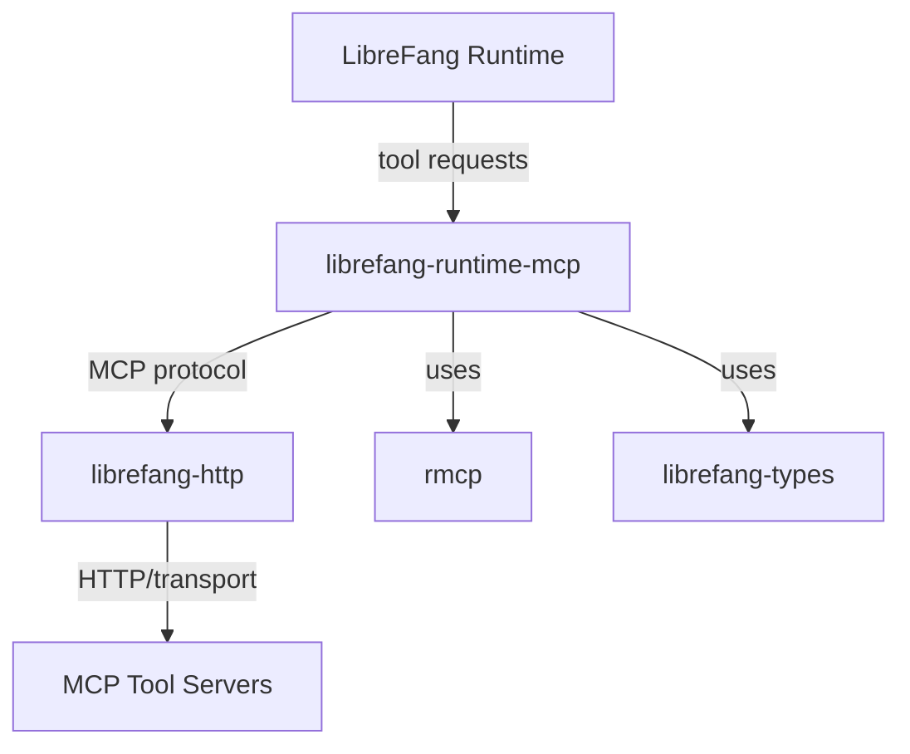

# Other — librefang-runtime-mcp

# librefang-runtime-mcp

MCP (Model Context Protocol) client for the LibreFang runtime. This crate provides the infrastructure needed to communicate with MCP-compatible tool servers, enabling the LibreFang runtime to discover and invoke external tools during execution.

## Overview

The Model Context Protocol standardizes how AI runtimes interact with external tools and data sources. This module implements the client side of that protocol within the LibreFang ecosystem, handling server discovery, tool invocation, and response processing.

## Dependencies

| Dependency | Role |
|---|---|
| `rmcp` | Core MCP protocol implementation — provides the client primitives for the Model Context Protocol |
| `librefang-types` | Shared type definitions used across LibreFang crates |
| `librefang-http` | HTTP transport layer, reused for MCP server communication |
| `reqwest` | Underlying HTTP client used for requests to MCP servers |
| `tokio` | Async runtime for concurrent MCP operations |
| `serde` / `serde_json` | Serialization of MCP protocol messages |
| `tracing` | Structured logging and diagnostic spans |
| `http` | Low-level HTTP types for request/response construction |
| `async-trait` | Async trait definitions for MCP client abstractions |
| `base64` / `sha2` | Encoding and hashing utilities, likely for authentication or payload verification with MCP servers |
| `url` | URL parsing and construction for MCP server endpoints |
| `rand` | Random number generation, likely for nonce or session identifier creation |

## Architecture

The crate sits between the LibreFang runtime core and external MCP-compatible tool servers. It translates runtime tool invocation requests into MCP protocol messages, sends them over HTTP via `librefang-http`, and returns results back to the runtime.

## Integration Points

This module connects to the broader LibreFang codebase through:

- **`librefang-types`** — consumes shared type definitions for consistency across the project.
- **`librefang-http`** — delegates HTTP-level communication rather than managing its own transport, keeping network logic centralized.

The runtime core imports this crate when MCP tool access is needed during execution.