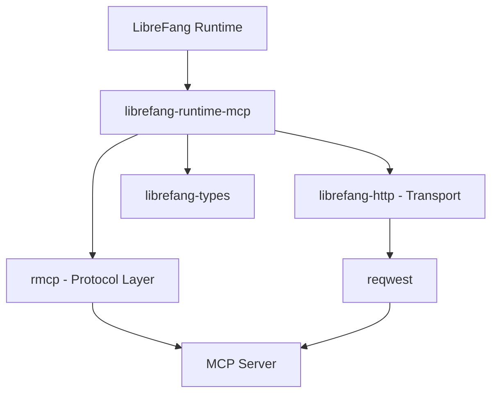

# Other — librefang-runtime-mcp

# librefang-runtime-mcp

MCP (Model Context Protocol) client for the LibreFang runtime. This crate provides the integration layer between the LibreFang system and MCP-compatible servers, enabling tool discovery, invocation, and resource management through the standardized MCP protocol.

## Purpose

The Model Context Protocol defines a standard for how AI systems interact with external tools and data sources. This module acts as the client side of that protocol within LibreFang — it connects to MCP servers, discovers their capabilities, and facilitates communication between the LibreFang runtime and those servers.

## Dependencies and Their Roles

| Dependency | Role |
|---|---|
| `rmcp` | Core MCP protocol implementation — handles message framing, handshake, and protocol-level logic |
| `librefang-types` | Shared type definitions used across the LibreFang workspace |
| `librefang-http` | HTTP transport layer, reused from the broader LibreFang HTTP infrastructure |
| `reqwest` | Underlying HTTP client used to communicate with MCP server endpoints |
| `http` | Low-level HTTP types (request/response headers, status codes) |
| `serde` / `serde_json` | Serialization of MCP messages and server responses |
| `tokio` | Async runtime for non-blocking I/O |
| `tracing` | Structured logging and diagnostic spans for MCP operations |
| `async-trait` | Async trait definitions for MCP client abstractions |
| `sha2`, `base64` | Likely used for session token generation, payload verification, or authentication headers |
| `url` | Parsing and constructing MCP server URLs |
| `rand` | Random value generation for nonce or session identifiers |

## Architecture



The module sits between the LibreFang runtime and remote MCP servers. Protocol semantics (handshakes, capability negotiation, message schemas) are delegated to `rmcp`, while transport concerns flow through `librefang-http` down to `reqwest`.

## Integration with the Workspace

This crate is one of potentially multiple runtime modules in the LibreFang workspace. It depends on:

- **`librefang-types`** for any shared data structures passed between the MCP client and other parts of the system.
- **`librefang-http`** to reuse existing HTTP client configuration (connection pooling, TLS settings, proxy support, etc.) rather than constructing its own.

No other workspace crates currently declare a dependency on `librefang-runtime-mcp`, which means it is either invoked directly by a top-level binary crate or dynamically loaded based on runtime configuration.

## Key Concerns

**Transport:** Communication with MCP servers happens over HTTP. The module relies on the workspace `reqwest` configuration, so any global TLS backend or proxy settings apply automatically.

**Protocol Compliance:** The `rmcp` crate handles the bulk of MCP protocol mechanics. This module wraps that functionality in LibreFang-specific types and error handling.

**Security:** The presence of `sha2` and `base64` suggests message integrity or authentication concerns — likely for verifying server responses or constructing signed requests. The `rand` crate supports generating unique identifiers for request correlation.

## Building and Testing

From the workspace root:

```bash
# Build this crate only
cargo build -p librefang-runtime-mcp

# Run tests
cargo test -p librefang-runtime-mcp
```

Ensure that any MCP servers required for integration tests are available or mocked appropriately.