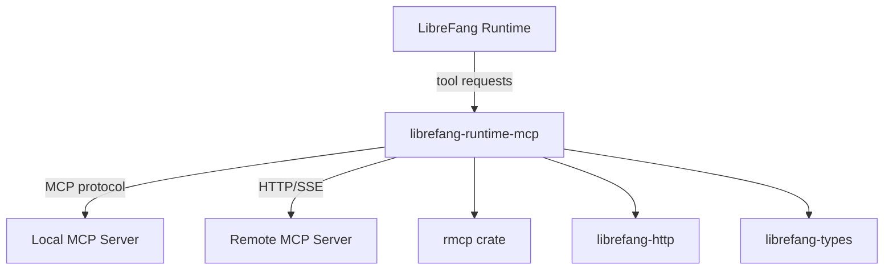

# Other — librefang-runtime-mcp

# librefang-runtime-mcp

MCP (Model Context Protocol) client for the LibreFang runtime. This crate provides the integration layer that allows LibreFang to communicate with MCP-compatible tool servers, enabling dynamic tool discovery, invocation, and resource management during runtime.

## Purpose

The Model Context Protocol standardizes how AI applications interact with external tools and data sources. This module implements the client side of that protocol within the LibreFang ecosystem, allowing the runtime to:

- Connect to MCP servers (both local stdio-based and remote HTTP/SSE-based)
- Discover available tools, resources, and prompts from those servers
- Invoke tools and return results to the calling context
- Manage the lifecycle of MCP server connections

## Architecture

```mermaid
graph TD
    A[LibreFang Runtime] -->|tool requests| B[librefang-runtime-mcp]
    B -->|MCP protocol| C[Local MCP Server]
    B -->|HTTP/SSE| D[Remote MCP Server]
    B --> E[rmcp crate]
    B --> F[librefang-http]
    B --> G[librefang-types]
```

The crate sits between the LibreFang runtime core and external MCP servers. It uses the `rmcp` crate as the underlying MCP protocol implementation, wrapping it with LibreFang-specific configuration, error handling, and type integration.

## Key Dependencies

| Dependency | Role |
|---|---|
| `rmcp` | Core MCP protocol implementation — handles JSON-RPC messaging, capability negotiation, and protocol compliance |
| `librefang-types` | Shared type definitions used across LibreFang crates |
| `librefang-http` | HTTP client infrastructure for connecting to remote MCP servers |
| `reqwest` | Underlying HTTP client used for remote MCP server communication |
| `tokio` | Async runtime for non-blocking I/O |
| `serde` / `serde_json` | Serialization of MCP protocol messages |
| `sha2` / `base64` | Likely used for message integrity verification or authentication token handling |
| `url` | URL parsing and validation for MCP server endpoints |
| `psl` | Public Suffix List — used for validating domain names in server URLs |
| `arc-swap` | Atomic reference swapping for thread-safe, lock-free updates to shared client state |
| `rand` | Random number generation for session identifiers or nonce values |

## Integration Points

This crate consumes types from `librefang-types` and may use HTTP transport from `librefang-http`. It exposes MCP client functionality to the broader LibreFang runtime, allowing tool calls to be routed through the MCP protocol to external servers.

The crate is designed as a runtime component — it is loaded and used during active LibreFang execution sessions rather than during compilation or static analysis phases.

## Error Handling

Errors are managed through `thiserror`, providing typed, ergonomic error variants that cover:

- Connection failures to MCP servers
- Protocol-level errors (malformed responses, capability mismatches)
- Tool invocation failures
- Transport-specific errors (HTTP, stdio)

## Testing

The crate uses `wiremock` in its dev-dependencies for mocking HTTP-based MCP servers, enabling integration-style tests without requiring live MCP server infrastructure. Tests run with the `tokio` multi-threaded runtime (`macros` and `rt-multi-thread` features enabled).