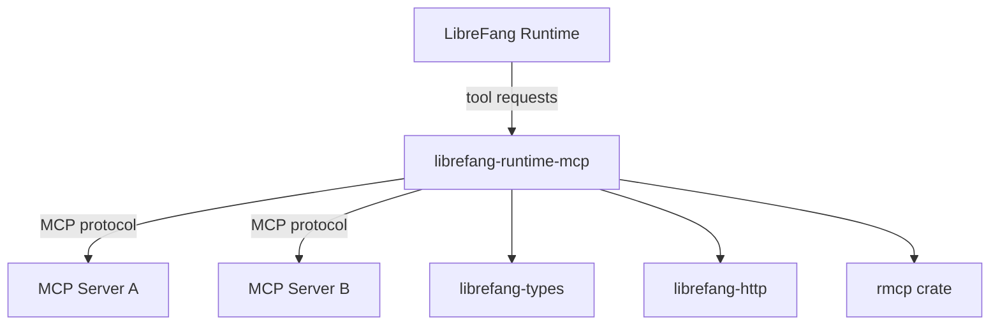

# Other — librefang-runtime-mcp

# librefang-runtime-mcp

MCP (Model Context Protocol) client for the LibreFang runtime. This crate provides the bridge between the LibreFang runtime and MCP-compatible tool servers, enabling the system to discover, call, and manage external tools via the Model Context Protocol.

## Purpose

The Model Context Protocol standardizes how applications communicate with tool providers. This module acts as the client side of that protocol within LibreFang, responsible for:

- Connecting to MCP servers (local stdio processes or remote HTTP endpoints)
- Discovering available tools, resources, and prompts exposed by those servers
- Invoking tools and returning structured results to the runtime
- Managing connection lifecycle and session state

## Architecture


```mermaid
graph TD
    A[LibreFang Runtime] -->|tool requests| B[librefang-runtime-mcp]
    B -->|MCP protocol| C[MCP Server A]
    B -->|MCP protocol| D[MCP Server B]
    B --> E[librefang-types]
    B --> F[librefang-http]
    B --> G[rmcp crate]
```

The crate sits between the LibreFang runtime (which decides *when* to call tools) and the actual MCP servers (which *provide* the tools). It depends on `rmcp` for the core MCP protocol implementation and layers LibreFang-specific concerns on top.

## Key Dependencies

| Dependency | Role |
|---|---|
| `rmcp` | Core MCP protocol client — handles JSON-RPC messaging, capability negotiation, and protocol conformance |
| `librefang-types` | Shared type definitions used across the LibreFang workspace |
| `librefang-http` | HTTP transport layer for connecting to remote MCP servers |
| `reqwest` | Underlying HTTP client used for remote server communication |
| `sha2`, `base64` | Used for verification and encoding of server messages or authentication tokens |
| `psl` | Public Suffix List — likely used for validating server URLs or sandboxing outbound connections |
| `url` | URL parsing and construction for server endpoints |
| `arc-swap` | Lock-free atomic swapping of shared state, used for hot-reloading server configurations or connection pools |
| `rand` | Random generation for session IDs, nonces, or challenge-response flows |

## Integration Points

### With `librefang-types`

Consumes shared type definitions that represent tools, results, and configuration structures. This ensures consistency between the runtime's view of a tool and the MCP client's representation.

### With `librefang-http`

Delegates HTTP transport concerns to `librefang-http`, keeping this module focused on MCP protocol logic rather than connection management, retries, or TLS configuration.

### With `rmcp`

The `rmcp` workspace dependency provides the foundational MCP client. This crate wraps it with LibreFang-specific configuration, error types, and lifecycle management.

## Error Handling

Errors are defined using `thiserror` and cover:

- Connection failures to MCP servers
- Protocol-level errors (malformed responses, unsupported capabilities)
- Timeout and transport errors
- Tool execution failures returned by remote servers

All errors implement `std::error::Error` and integrate with the `tracing` crate for structured diagnostic output.

## Testing

Tests use `wiremock` to mock HTTP-based MCP servers, allowing verification of:

- Tool discovery flows
- Request/response serialization
- Error handling for malformed or failing responses
- Connection lifecycle management

Tests are async and use `tokio` with the `macros` and `rt-multi-thread` features:

```rust
#[tokio::test]
async fn test_tool_discovery() {
    // Uses wiremock to simulate an MCP server
}
```

## Usage

This crate is intended to be used as a library dependency by other LibreFang workspace members. It is not a standalone binary.

```toml
[dependencies]
librefang-runtime-mcp = { path = "../librefang-runtime-mcp" }
```

Refer to the consuming runtime crates for initialization and configuration examples.