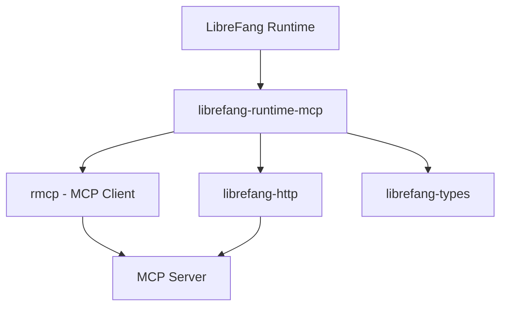

# Other — librefang-runtime-mcp

# librefang-runtime-mcp

MCP (Model Context Protocol) client for the LibreFang runtime. This crate provides the integration layer between LibreFang's runtime and MCP-compatible tool/context servers, enabling AI-driven agents to discover and invoke external tools through a standardized protocol.

## Purpose

The Model Context Protocol defines a standard way for AI applications to communicate with external tool providers, context sources, and resource servers. This crate implements the client side of that protocol within LibreFang, allowing the runtime to:

- Connect to MCP servers over HTTP transports
- Discover available tools and their schemas
- Invoke tools and retrieve structured results
- Manage connection lifecycle and authentication

## Architecture

```mermaid
graph TD
    A[LibreFang Runtime] --> B[librefang-runtime-mcp]
    B --> C[rmcp - MCP Client]
    B --> D[librefang-http]
    B --> E[librefang-types]
    C --> F[MCP Server]
    D --> F
```

## Dependency Breakdown

### Internal Dependencies

| Crate | Role |
|---|---|
| `librefang-types` | Shared type definitions — MCP request/response shapes, error types, and configuration structs used across the workspace |
| `librefang-http` | HTTP transport layer — handles connection pooling, request dispatch, and response parsing for MCP HTTP-based communication |

### Key External Dependencies

- **`rmcp`** — Rust implementation of the MCP client protocol. Provides the core protocol machinery including JSON-RPC message framing, capability negotiation, and tool invocation semantics.
- **`reqwest`** — Underlying HTTP client used to make requests to MCP server endpoints.
- **`arc-swap`** — Enables lock-free atomic swapping of shared state, likely used for hot-reloading MCP server configurations or rotating connection handles without disrupting active requests.
- **`sha2` / `base64`** — Cryptographic hashing and encoding, likely used for request signing, token generation, or verification of MCP server responses.
- **`psl` / `url`** — Public Suffix List and URL parsing for validating and normalizing MCP server endpoints.
- **`rand`** — Random number generation, likely for nonce generation in authentication flows or request identifiers.
- **`thiserror`** — Derive macro for defining structured error types.

## Error Handling

Errors are modeled using `thiserror` derives, producing a typed error enum that covers:

- HTTP transport failures (connection errors, timeouts, status errors)
- MCP protocol errors (invalid responses, capability mismatches)
- URL validation and parsing failures
- Authentication or signature verification errors

All errors implement `std::error::Error` and carry context via `tracing` spans for observability.

## Testing

The dev-dependency on `wiremock` indicates that MCP server interactions are tested via mock HTTP servers. This allows validating:

- Request serialization and endpoint routing
- Response deserialization and error handling
- Authentication header injection
- Retry and timeout behavior

Tests use `tokio` with the `macros` and `rt-multi-thread` features for async test functions.

## Integration Points

This crate sits below the main LibreFang runtime and above the HTTP transport layer. The runtime calls into this crate when it needs to interact with an MCP-compatible tool server. The crate delegates raw HTTP work to `librefang-http` and raw MCP protocol semantics to `rmcp`, while providing a LibreFang-native interface using types from `librefang-types`.