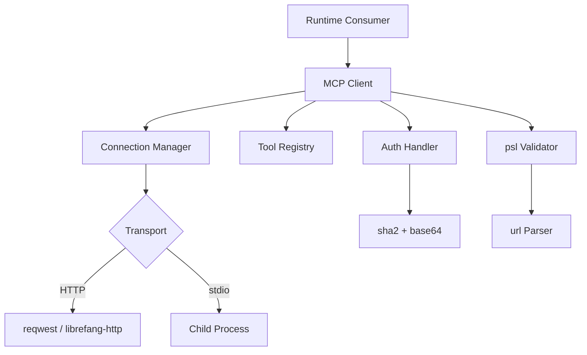

# Other — librefang-runtime-mcp

# librefang-runtime-mcp

MCP (Model Context Protocol) client for the LibreFang runtime. This crate provides the infrastructure for LibreFang to communicate with MCP-compatible servers, enabling tool discovery, invocation, and context exchange during fang generation and runtime operations.

## Purpose

The Model Context Protocol allows LibreFang to expose and consume tools across process boundaries. This client crate handles:

- Establishing connections to MCP servers (local stdio or remote HTTP-based)
- Discovering available tools and their schemas
- Invoking tools with structured parameters
- Managing authentication and session lifecycle
- Validating server responses against expected schemas

## Dependencies

### Internal Crates

| Crate | Role |
|---|---|
| `librefang-types` | Shared type definitions, error types, and domain models |
| `librefang-http` | HTTP client construction and request/response handling |

### Key External Crates

| Crate | Role |
|---|---|
| `rmcp` | Core MCP protocol implementation for Rust |
| `reqwest` | HTTP client for remote MCP server communication |
| `tokio` | Async runtime for concurrent operations |
| `serde` / `serde_json` | Serialization of tool parameters and responses |
| `sha2` / `base64` | Authentication token hashing and encoding |
| `psl` | Public Suffix List for validating server hostnames |
| `url` | URL parsing and validation for MCP endpoints |
| `arc-swap` | Lock-free atomic swapping of shared client state |
| `tracing` | Structured logging and diagnostic spans |

## Architecture


```mermaid
graph TD
    A[Runtime Consumer] --> B[MCP Client]
    B --> C[Connection Manager]
    C --> D{Transport}
    D -->|HTTP| E[reqwest / librefang-http]
    D -->|stdio| F[Child Process]
    B --> G[Tool Registry]
    B --> H[Auth Handler]
    H --> I[sha2 + base64]
    B --> J[psl Validator]
    J --> K[url Parser]
```

## Key Components

### MCP Client

The primary entry point. Wraps `rmcp` client functionality and integrates with LibreFang's type system. Handles connection initialization, capability negotiation, and tool invocation through a unified interface.

### Connection Manager

Manages the lifecycle of connections to MCP servers. Supports both:

- **HTTP transport** — Remote MCP servers accessed via HTTP/SSE, using `reqwest` through `librefang-http` for consistent request handling across the project.
- **Stdio transport** — Local MCP servers spawned as child processes communicating over stdin/stdout.

Uses `arc-swap` to allow hot-swapping of connection state without locking, enabling reconnection or endpoint migration during runtime.

### Tool Registry

Discovers and caches available tools from connected MCP servers. Maps tool names to their JSON Schema definitions, enabling parameter validation before invocation and structured response parsing afterward.

### Authentication Handler

For remote MCP servers requiring authentication, this component manages:

- Token generation using `sha2` hashing and `base64` encoding
- Credential storage and refresh
- Per-request authentication header injection

### URL and Hostname Validation

Before connecting to remote MCP endpoints, URLs are parsed with the `url` crate and validated against the Public Suffix List (`psl`) to prevent connections to ambiguous or dangerous hostnames (e.g., preventing SSRF attacks against public suffixes).

## Error Handling

Errors are defined using `thiserror` and integrate with `librefang-types`. Expected error categories include:

- **Connection errors** — Server unreachable, transport failure, timeout
- **Protocol errors** — Malformed MCP messages, capability mismatch
- **Authentication errors** — Invalid credentials, expired tokens
- **Validation errors** — Invalid URLs, disallowed hostnames, schema mismatch on tool parameters

## Testing

The crate uses `wiremock` for mocking HTTP-based MCP servers in tests, with `tokio`'s multi-threaded runtime enabled in dev-dependencies:

```toml
[dev-dependencies]
wiremock = "0.6"
tokio = { workspace = true, features = ["macros", "rt-multi-thread"] }
```

Tests typically spin up a mock MCP server via `wiremock`, configure expected request/response pairs, and validate that the client correctly handles tool discovery, invocation, error cases, and authentication flows.

## Integration with LibreFang

This crate sits between the runtime core and external tool providers:

- **Consumed by**: `librefang-runtime` (or higher-level orchestration crates) to invoke MCP tools during fang execution
- **Depends on**: `librefang-types` for domain models, `librefang-http` for HTTP infrastructure
- **Independent of**: Specific fang logic — this is a general-purpose MCP client unaware of LibreFang's domain beyond shared types