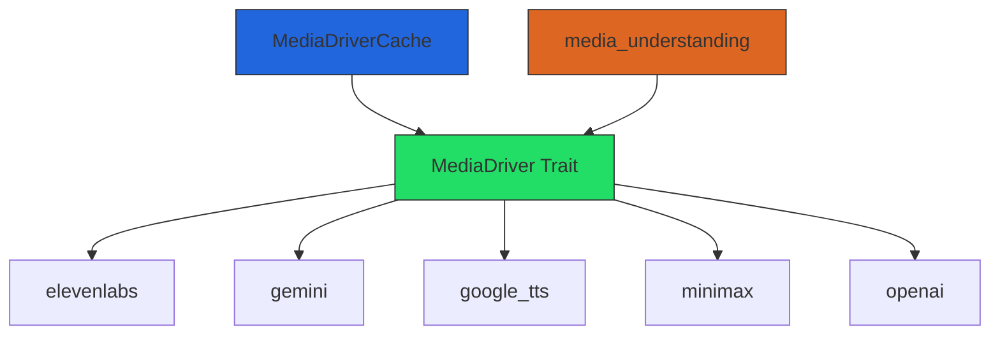

# Other — librefang-runtime-media

# librefang-runtime-media

Media generation drivers for [LibreFang](https://github.com/librefang/librefang). Provides provider-agnostic abstractions and concrete implementations for text-to-speech, image generation, video generation, and music generation.

## Overview

This crate was extracted from `librefang-runtime` during the #3710 god-crate split. It mirrors the architectural pattern established by `librefang-llm-drivers`, applying it to media generation rather than LLM inference. The parent crate `librefang-runtime` re-exports everything at its historical paths (`runtime::media`, `runtime::media_understanding`), so downstream code does not need to change imports. The re-export is gated behind the default-on `media` feature flag.

## Architecture

## Core Abstractions

### `MediaDriver` Trait

The central trait. Each method corresponds to a media modality. Providers that do not support a given modality do not need to implement the method — the trait provides a default implementation that returns a typed `NotSupported` error.

Supported modalities:

- **TTS** — text-to-speech audio generation
- **Image** — image generation from a prompt
- **Video** — video generation from a prompt
- **Music** — music generation from a prompt

This design lets callers work against a single trait without worrying about which provider supports which modality. Call the method you need; if the provider doesn't support it, you get a clear error rather than a panic or a runtime mystery.

### `MediaDriverCache`

Lazy-initializing, thread-safe driver cache with per-provider URL overrides. Built on `dashmap` for concurrent access without global locking.

Key behaviors:

- Drivers are constructed on first access, not at cache creation time.
- Each provider entry can have its base URL overridden (useful for proxies, self-hosted endpoints, or testing).
- Thread-safe: safe to share across async tasks and threads.

## Provider Implementations

| Provider    | TTS | Image | Video | Music | Notes |
|-------------|-----|-------|-------|-------|-------|
| `elevenlabs` | ✓ | — | — | — | Primary TTS provider. Requires `ELEVENLABS_API_KEY` env var. |
| `gemini` | — | ✓ | — | — | Google Gemini image generation. |
| `google_tts` | ✓ | — | — | — | Google Cloud TTS (distinct from Gemini). |
| `minimax` | — | — | — | ✓ | Music generation. |
| `openai` | — | ✓ | — | — | DALL·E / GPT-image generation. |

Check mark (✓) means the provider implements that modality's method. Dash (—) means it falls back to the `NotSupported` default.

## `media_understanding`

A submodule handling the inverse direction: analyzing media rather than generating it. Routes speech-to-text (transcription) and image/audio analysis requests to the appropriate provider. This lives alongside the generation drivers because the same provider accounts and HTTP plumbing are shared.

## Dependencies

The crate depends on several sibling crates and workspace-shared libraries:

| Dependency | Purpose |
|------------|---------|
| `librefang-types` | Shared domain types used across the workspace |
| `librefang-http` | HTTP client construction and shared request utilities |
| `tokio` | Async runtime |
| `reqwest` | HTTP client for provider API calls |
| `serde` / `serde_json` | Request/response serialization |
| `async-trait` | Async trait support for `MediaDriver` |
| `dashmap` | Concurrent hashmap for `MediaDriverCache` |
| `tracing` | Structured logging |
| `base64` | Encoding media payloads in API requests |
| `chrono` | Timestamp handling |
| `uuid` | Request/correlation IDs |
| `sha2` / `hex` | Content hashing (e.g., cache keys) |
| `url` | URL parsing and construction for provider endpoints |

## Testing

Tests that validate the ElevenLabs `voice_id` lookup mutate the `ELEVENLABS_API_KEY` environment variable. These tests use `serial_test` (pinned to version 3, matching the workspace) to prevent concurrent test runners from racing over that env var. If you add new provider integration tests that read or write environment variables, apply the same serialization.