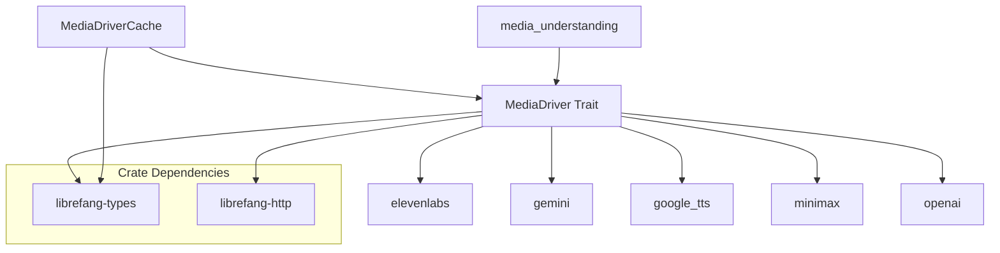
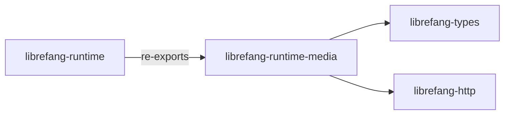

# Other — librefang-runtime-media

# librefang-runtime-media

Media generation drivers (TTS, image, video, music) for LibreFang. This crate provides a provider-agnostic abstraction layer for media generation, mirroring the pattern established by `librefang-llm-drivers`.

## Purpose

This crate was extracted from `librefang-runtime` as part of the [#3710 god-crate split](https://github.com/librefang/librefang/issues/3710). It isolates all media generation logic—text-to-speech, image synthesis, video generation, and music creation—into a standalone crate with a stable, provider-agnostic API.

The parent crate `librefang-runtime` re-exports this crate at its historical paths (`runtime::media`, `runtime::media_understanding`) behind the default-on `media` feature, so downstream consumers do not need to change imports.

## Architecture


```mermaid
graph TD
    A[MediaDriver Trait] --> B[elevenlabs]
    A --> C[gemini]
    A --> D[google_tts]
    A --> E[minimax]
    A --> F[openai]
    G[MediaDriverCache] --> A
    H[media_understanding] --> A

    subgraph "Crate Dependencies"
        I[librefang-types]
        J[librefang-http]
    end

    A --> I
    A --> J
    G --> I
```

## Key Components

### `MediaDriver` Trait

The central abstraction. Each provider implements this trait with per-modality methods. Modalities that a provider does not support default to returning a typed `NotSupported` error, so callers always get a well-typed response rather than a panic or unhandled exception.

Supported modalities:

| Modality | Description |
|----------|-------------|
| TTS | Text-to-speech audio generation |
| Image | Image synthesis from prompts |
| Video | Video generation from prompts or source material |
| Music | Music generation |

The trait is marked with `async_trait`, so all methods return pinned futures compatible with Tokio.

### `MediaDriverCache`

A lazy-initialization, thread-safe cache for driver instances. Built on `dashmap` for concurrent access without global locks.

Key behaviors:

- **Lazy init**: Drivers are constructed on first access, not at cache creation time.
- **Per-provider URL overrides**: Each cached driver can target a custom endpoint URL, enabling proxying, testing against staging environments, or self-hosted provider deployments.
- **Thread safety**: Safe to share across Tokio tasks and threads without external synchronization.

### Provider Implementations

| Module | Provider | Primary Modality |
|--------|----------|-----------------|
| `elevenlabs` | ElevenLabs API | TTS |
| `gemini` | Google Gemini | Image understanding, generation |
| `google_tts` | Google Cloud TTS | TTS |
| `minimax` | MiniMax | Video, image |
| `openai` | OpenAI | Image (DALL·E), audio |

Each provider module translates the generic `MediaDriver` calls into provider-specific HTTP requests via `librefang-http`.

### `media_understanding`

Handles the inverse direction: consuming media rather than generating it. Routes:

- **Speech-to-text** — transcription of audio input
- **Image analysis** — visual understanding and description
- **Audio analysis** — content identification, description

This module delegates to the same provider backends where applicable (e.g., OpenAI Whisper for STT, Gemini for image analysis).

## Dependencies

### Internal Crates

| Crate | Purpose |
|-------|---------|
| `librefang-types` | Shared type definitions for requests, responses, and errors |
| `librefang-http` | HTTP client abstraction, handling retries, auth header injection, and response parsing |

### External Crates

| Crate | Purpose |
|-------|---------|
| `tokio` | Async runtime for all driver operations |
| `reqwest` | Underlying HTTP client (via workspace) |
| `async-trait` | Async trait support for `MediaDriver` |
| `dashmap` | Concurrent hashmap for `MediaDriverCache` |
| `serde_json` | JSON serialization for API payloads |
| `tracing` | Structured logging and diagnostics |
| `base64` / `hex` | Encoding for binary media payloads in transit |

## Testing

The `serial_test` dev-dependency (version 3, pinned to match the workspace) serializes environment-mutating tests—specifically the ElevenLabs `voice_id` validator tests that read and write `ELEVENLABS_API_KEY`. This prevents test races when running with a multi-threaded test harness.

## Integration with the Workspace


```mermaid
graph LR
    A[librefang-runtime] -->|re-exports| B[librefang-runtime-media]
    B --> C[librefang-types]
    B --> D[librefang-http]
```

Downstream crates should continue importing from `librefang-runtime` at the historical paths (`runtime::media`, `runtime::media_understanding`). The `media` feature flag on `librefang-runtime` is **default-on**, so no configuration changes are required for existing projects.

To disable media support entirely (e.g., for minimal builds), disable the `media` feature on `librefang-runtime`:

```toml
[dependencies]
librefang-runtime = { version = "x.y.z", default-features = false }
```

## Adding a New Provider

1. Create a new module under `src/` named after the provider (e.g., `src/newprovider.rs`).
2. Implement the `MediaDriver` trait. Unsupported modalities should return the `NotSupported` error variant from `librefang-types`.
3. Register the provider key in `MediaDriverCache` so it can be instantiated and cached on demand.
4. Use `librefang-http` for all outbound requests to maintain consistent retry logic, authentication, and tracing.
5. Add `serial_test`-guarded integration tests if the provider requires live API keys via environment variables.