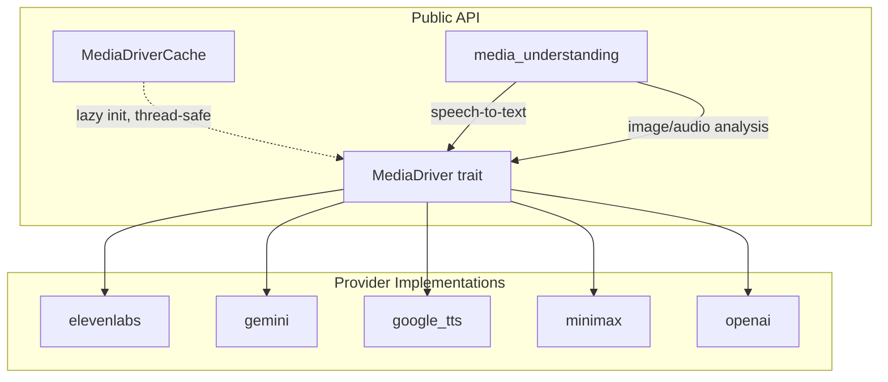

# Other — librefang-runtime-media

# librefang-runtime-media

Media generation drivers for LibreFang, providing a provider-agnostic abstraction layer for text-to-speech, image generation, video generation, and music creation. Extracted from `librefang-runtime` during the #3710 god-crate split.

## Architecture


```mermaid
graph TD
    subgraph "Public API"
        MD[MediaDriver trait]
        MDC[MediaDriverCache]
        MU[media_understanding]
    end

    subgraph "Provider Implementations"
        EL[elevenlabs]
        GM[gemini]
        GT[google_tts]
        MM[minimax]
        OA[openai]
    end

    MD --> EL
    MD --> GM
    MD --> GT
    MD --> MM
    MD --> OA
    MDC -.->|lazy init, thread-safe| MD
    MU -->|speech-to-text| MD
    MU -->|image/audio analysis| MD
```

## Module Purpose

This crate isolates all media generation logic from the main `librefang-runtime` crate. It provides:

- A unified `MediaDriver` trait that downstream code programs against, independent of any specific provider.
- Lazy-initialized, thread-safe driver caching via `MediaDriverCache`, with per-provider URL overrides.
- Concrete provider implementations for `elevenlabs`, `gemini`, `google_tts`, `minimax`, and `openai`.
- A `media_understanding` submodule that routes speech-to-text and image/audio analysis requests.

The design mirrors `librefang-llm-drivers` so that developers familiar with the LLM driver pattern can immediately understand the media driver pattern.

## Key Components

### `MediaDriver` Trait

The central abstraction. Each method corresponds to a media modality:

| Method | Modality | Return |
|--------|----------|--------|
| TTS methods | Text-to-speech | Audio data |
| Image methods | Image generation | Image data |
| Video methods | Video generation | Video data |
| Music methods | Music generation | Audio data |

Providers that do not support a given modality return a typed `NotSupported` error rather than panicking or returning a generic failure. This allows callers to fall back to alternative providers gracefully.

### `MediaDriverCache`

Provides lazy-initialization and thread-safe storage of driver instances. Uses `DashMap` internally for concurrent access without locking the entire cache. Supports per-provider URL overrides, enabling configuration to point providers at alternative endpoints (e.g., proxies or self-hosted instances).

Key behaviors:
- Drivers are initialized on first access, not at cache creation time.
- Once initialized, the same driver instance is reused for subsequent requests.
- Thread-safe: multiple async tasks can request the same driver concurrently without data races.

### `media_understanding`

Handles inbound media analysis rather than generation:

- **Speech-to-text** — routes audio through the appropriate provider for transcription.
- **Image analysis** — sends images to a provider for description or classification.
- **Audio analysis** — processes audio content beyond simple transcription.

This submodule acts as a routing layer, selecting the correct driver based on the modality and available provider configuration.

## Provider Implementations

### ElevenLabs (`elevenlabs`)

Text-to-speech provider. Voice ID validation tests serialize via `serial_test` to avoid races over the `ELEVENLABS_API_KEY` environment variable.

### Gemini (`gemini`)

Google's multimodal model, used here for media generation tasks.

### Google TTS (`google_tts`)

Google Cloud Text-to-Speech API driver. Distinct from the Gemini integration; this targets the dedicated Cloud TTS service.

### MiniMax (`minimax`)

Media generation provider supporting multiple modalities.

### OpenAI (`openai`)

OpenAI's media generation endpoints (e.g., DALL-E for images, TTS for audio).

## Dependencies

| Dependency | Purpose |
|------------|---------|
| `librefang-types` | Shared type definitions across the workspace |
| `librefang-http` | HTTP client utilities and configuration |
| `tokio` | Async runtime |
| `reqwest` | HTTP client for provider API calls |
| `serde_json` | JSON serialization for API payloads |
| `async-trait` | Async method support in trait definitions |
| `dashmap` | Lock-free concurrent hashmap for `MediaDriverCache` |
| `tracing` | Structured logging and diagnostics |
| `base64` / `hex` | Encoding utilities for media payloads |

Dev dependency `serial_test` (v3) serializes environment-mutating tests to prevent races on shared env vars like `ELEVENLABS_API_KEY`.

## Integration with LibreFang

`librefang-runtime` re-exports this crate at the historical paths `runtime::media` and `runtime::media_understanding`, gated behind the default-on `media` feature flag. Downstream call sites do not need to change imports:

```rust
// These still work after the crate split:
use librefang_runtime::media::MediaDriver;
use librefang_runtime::media_understanding;
```

The feature flag allows builds that exclude media functionality entirely (e.g., minimal deployments or WASM targets) by disabling the `media` feature on `librefang-runtime`.

## Adding a New Provider

1. Create a new module named after the provider (e.g., `my_provider.rs` or `my_provider/`).
2. Implement the `MediaDriver` trait. Return `NotSupported` for modalities the provider doesn't handle.
3. Register the provider in `MediaDriverCache` so it can be lazy-initialized from configuration.
4. Add any provider-specific types to `librefang-types` if they need to be shared across crates.

## Testing

Tests that mutate environment variables (particularly API key configuration) use the `#[serial]` attribute from `serial_test` to prevent concurrent execution:

```rust
#[cfg(test)]
mod tests {
    use serial_test::serial;

    #[test]
    #[serial]
    fn test_voice_id_validation() {
        // Mutates ELEVENLABS_API_KEY
    }
}
```

Run the full test suite with:

```bash
cargo test -p librefang-runtime-media
```