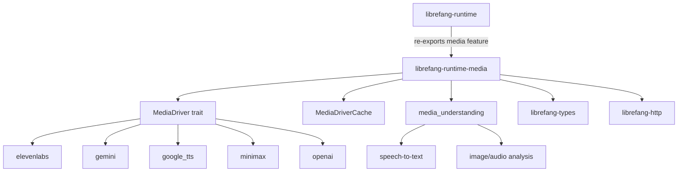

# Other — librefang-runtime-media

# librefang-runtime-media

Media generation drivers for LibreFang, providing provider-agnostic abstractions for text-to-speech, image generation, video generation, and music generation.

## Overview

This crate implements the media generation layer of LibreFang, extracted from the `librefang-runtime` god-crate during the #3710 refactor. It mirrors the driver abstraction pattern established by `librefang-llm-drivers`, but targets media modalities rather than language model inference.

The crate is re-exported by `librefang-runtime` under `runtime::media` and `runtime::media_understanding`, gated behind the default-on `media` feature flag. Downstream consumers should not need to import this crate directly.

## Architecture

```mermaid
graph TD
    A[librefang-runtime] -->|"re-exports media feature"| B[librefang-runtime-media]
    B --> C[MediaDriver trait]
    B --> D[MediaDriverCache]
    C --> E[elevenlabs]
    C --> F[gemini]
    C --> G[google_tts]
    C --> H[minimax]
    C --> I[openai]
    B --> J[media_understanding]
    J --> K[speech-to-text]
    J --> L[image/audio analysis]
    B --> M[librefang-types]
    B --> N[librefang-http]
```

## Key Components

### `MediaDriver` Trait

The central abstraction. Each provider implements this trait with per-modality methods. Modalities a provider does not support fall back to a typed `NotSupported` error, meaning callers can enumerate all available providers without handling provider-specific capability checks.

The trait is async and designed for use with `async-trait`. Implementations receive an HTTP client through `librefang-http` rather than managing their own connections.

### `MediaDriverCache`

A lazy-initializing, thread-safe cache for `MediaDriver` instances, backed by `DashMap`. It handles:

- **Lazy init**: Drivers are constructed on first access, not at startup.
- **Thread safety**: Concurrent lookups from multiple tokio tasks are safe.
- **Per-provider URL overrides**: Each cached driver can be configured with a custom base URL, enabling proxy or self-hosted deployments without code changes.

Typical usage pattern: the cache is created once at application startup, injected into services that need media generation, and drivers are retrieved by provider name as needed.

### Provider Implementations

| Provider | Module | Primary Modality |
|---|---|---|
| ElevenLabs | `elevenlabs` | Text-to-speech |
| Gemini | `gemini` | Image generation |
| Google TTS | `google_tts` | Text-to-speech |
| MiniMax | `minimax` | Image / video / music |
| OpenAI | `openai` | Image generation (DALL·E) |

Each provider module encapsulates API authentication, request serialization, response parsing, and error mapping. Providers use `reqwest` (pulled in via workspace) for HTTP calls and `serde_json` for payload handling.

### `media_understanding`

A companion module for *media analysis* — the inverse of generation. It routes:

- **Speech-to-text**: Audio input transcribed to text.
- **Image analysis**: Visual content described or classified.
- **Audio analysis**: Audio content analyzed for features.

This module delegates to the same provider infrastructure, selecting an appropriate driver based on the requested analysis type.

## Dependencies

| Crate | Role |
|---|---|
| `librefang-types` | Shared type definitions (error types, request/response structs) |
| `librefang-http` | HTTP client construction and shared request utilities |
| `tokio` | Async runtime |
| `reqwest` | HTTP client |
| `async-trait` | Async trait support for `MediaDriver` |
| `dashmap` | Concurrent map for `MediaDriverCache` |
| `tracing` | Structured logging |
| `base64` / `hex` | Encoding media payloads in API requests |

## Testing

Tests that validate ElevenLabs voice IDs mutate the `ELEVENLABS_API_KEY` environment variable and are serialized with `serial_test` to prevent races when run in parallel.

## Integration Points

- **`librefang-runtime`**: Re-exports this crate's public API at the historical paths `runtime::media` and `runtime::media_understanding`. The `media` feature flag (default-on) controls inclusion.
- **`librefang-types`**: Defines the shared error enums and request/response types that driver implementations consume and produce.
- **`librefang-http`**: Provides the configured `reqwest::Client` instances passed to drivers, ensuring consistent TLS settings, timeouts, and middleware across the application.