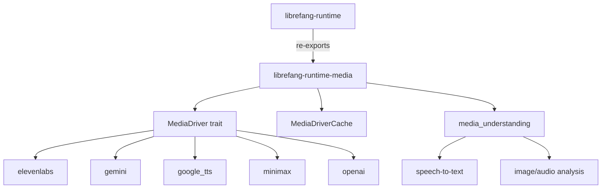
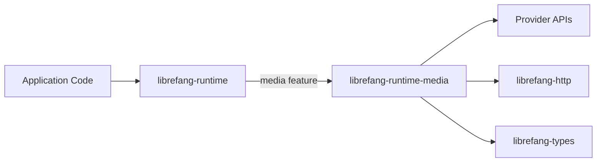

# Other — librefang-runtime-media

# librefang-runtime-media

Media generation drivers for LibreFang. Provides a provider-agnostic abstraction layer for text-to-speech, image generation, video generation, music generation, and media understanding (speech-to-text, image/audio analysis).

## Architecture

```mermaid
graph TD
    A[librefang-runtime] -->|re-exports| B[librefang-runtime-media]
    B --> C[MediaDriver trait]
    B --> D[MediaDriverCache]
    B --> E[media_understanding]
    C --> F[elevenlabs]
    C --> G[gemini]
    C --> H[google_tts]
    C --> I[minimax]
    C --> J[openai]
    E --> K[speech-to-text]
    E --> L[image/audio analysis]
```

## Purpose

This crate was extracted from `librefang-runtime` during the god-crate split (#3710 Phase 1). It encapsulates all media generation and analysis logic behind a provider-agnostic interface modeled after the patterns in `librefang-llm-drivers`.

Downstream consumers should not import this crate directly. `librefang-runtime` re-exports it at the historical paths `runtime::media` and `runtime::media_understanding` behind its default-on `media` feature flag. Existing call sites require no import changes.

## Core Components

### `MediaDriver` Trait

The central abstraction. Each media modality has its own method on the trait. Providers that do not support a given modality return a typed `NotSupported` error rather than panicking or returning a generic failure. This allows callers to attempt fallback providers or gracefully degrade.

Supported modalities:

- **TTS** — text-to-speech synthesis
- **Image** — image generation
- **Video** — video generation
- **Music** — music generation

The trait is async (`#[async_trait]`) and implementations rely on `reqwest` for HTTP communication with provider APIs.

### `MediaDriverCache`

A lazy-initialization, thread-safe cache for `MediaDriver` instances, backed by `DashMap`. Features:

- **Lazy init**: drivers are constructed on first access, not at startup.
- **Thread safety**: concurrent tasks can request the same driver without races.
- **Per-provider URL overrides**: allows pointing a provider at a custom endpoint (useful for proxies, self-hosted alternatives, or testing).

### Provider Implementations

| Provider | Module | Primary Modality | Notes |
|---|---|---|---|
| ElevenLabs | `elevenlabs` | TTS | Voice selection; API key via `ELEVENLABS_API_KEY` env var |
| Gemini | `gemini` | Image, Video | Google's multimodal model |
| Google TTS | `google_tts` | TTS | Google Cloud Text-to-Speech |
| MiniMax | `minimax` | Image, Video, Music | Multi-modal generation |
| OpenAI | `openai` | Image, TTS | DALL·E and TTS endpoints |

### `media_understanding`

A companion module handling the inverse direction — consuming media rather than generating it:

- **Speech-to-text** (transcription)
- **Image analysis** (description, classification)
- **Audio analysis**

This module routes requests to the appropriate provider based on configuration, mirroring the same driver abstraction used for generation.

## Dependencies

Key external crates used:

- **`reqwest`** / **`tokio`** — async HTTP communication with provider APIs
- **`dashmap`** — concurrent map for `MediaDriverCache`
- **`async-trait`** — trait object support for async methods
- **`serde_json`** — request/response serialization
- **`base64`** / **`hex`** — encoding for media payloads and signatures
- **`tracing`** — structured logging throughout driver operations

Internal dependencies:

- **`librefang-types`** — shared type definitions (request/response types, error types)
- **`librefang-http`** — shared HTTP client configuration and middleware

## Testing

The test suite uses `serial_test` (version 3, pinned to match the workspace) to serialize environment-mutating tests. Specifically, ElevenLabs voice ID validation tests modify `ELEVENLABS_API_KEY` and must not run concurrently to avoid race conditions.

## Integration with LibreFang

```mermaid
graph LR
    A[Application Code] --> B[librefang-runtime]
    B -->|media feature| C[librefang-runtime-media]
    C --> D[Provider APIs]
    C --> E[librefang-http]
    C --> F[librefang-types]
```

- **Import path**: Use `runtime::media` and `runtime::media_understanding` from `librefang-runtime`.
- **Feature gate**: Enabled by the default `media` feature on `librefang-runtime`.
- **No breaking changes**: The re-export preserves the historical module paths from before the extraction.

## Adding a New Provider

1. Create a new module under `src/` (e.g., `src/newprovider.rs`) and register it in `mod.rs`.
2. Implement `MediaDriver` for a struct representing the provider's client.
3. Return `NotSupported` for modalities the provider doesn't handle.
4. Add the provider variant to whatever dispatch/enum is used for provider selection.
5. Register the provider in `MediaDriverCache` so it can be lazily constructed and cached.
6. Add configuration support (API key env var, endpoint URL override) following the patterns of existing providers.