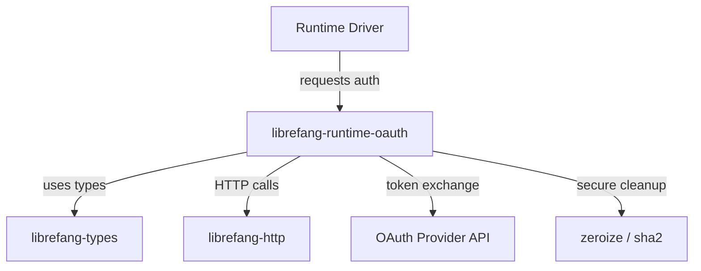

# Other — librefang-runtime-oauth

# librefang-runtime-oauth

OAuth authentication flows for LibreFang runtime drivers. Handles token acquisition and refresh for third-party AI services (ChatGPT, GitHub Copilot) using industry-standard OAuth 2.0 + PKCE mechanisms.

## Purpose

LibreFang integrates with external AI providers that require user authentication. This module isolates all OAuth logic so that runtime drivers don't need to implement their own auth flows. It provides the cryptographic primitives, HTTP exchange logic, and token lifecycle management needed to authenticate against these services securely.

## Architecture

The module sits between a runtime driver and the external OAuth provider. It generates PKCE challenges, initiates the authorization flow, exchanges authorization codes for tokens, and manages credential hygiene.

## Dependencies and Their Roles

### Internal Dependencies

| Crate | Role |
|---|---|
| `librefang-types` | Shared types for OAuth tokens, credentials, and error representations |
| `librefang-http` | HTTP client abstractions used for token exchange and refresh requests |

### Cryptographic & Security Dependencies

| Crate | Role |
|---|---|
| `sha2` | SHA-256 hashing for PKCE code challenge generation |
| `base64` | Base64url encoding of the code verifier and challenge |
| `rand` | Cryptographically secure random generation of the code verifier |
| `hex` | Hex encoding for fingerprinting and hash comparison |
| `zeroize` | Secure memory wiping of sensitive credentials (tokens, secrets) after use |

### Async & Serialization

| Crate | Role |
|---|---|
| `tokio` | Async runtime for non-blocking token exchange |
| `reqwest` | Underlying HTTP client for outbound requests to OAuth endpoints |
| `serde` / `serde_json` | Serialization of token responses and request payloads |

## OAuth Flow (PKCE)

The module implements the OAuth 2.0 Authorization Code flow with PKCE (Proof Key for Code Exchange). This avoids exposing a client secret in native/runtime environments.

### Sequence

1. **Generate code verifier** — A cryptographically random string created via `rand`.
2. **Derive code challenge** — SHA-256 hash of the verifier, Base64url-encoded using `sha2` + `base64`.
3. **Initiate authorization** — Redirect or present the user with the provider's authorization URL, including the code challenge.
4. **Exchange authorization code** — Send the received code along with the original code verifier to the token endpoint via `librefang-http` / `reqwest`.
5. **Store token** — Deserialize the JSON response (`serde_json`) into typed structures from `librefang-types`.
6. **Zero sensitive data** — The code verifier and any intermediate secrets are securely wiped using `zeroize`.

## Supported Providers

- **ChatGPT (OpenAI)** — OAuth flow for authenticating with OpenAI's API.
- **GitHub Copilot** — OAuth flow leveraging GitHub's device authorization or code flow as used by Copilot integrations.

Each provider has distinct token endpoints and scopes, but the PKCE mechanics are shared.

## Credential Hygiene

Tokens, code verifiers, and other secrets are held in types that implement `Zeroize` from the `zeroize` crate. When these values go out of scope or are explicitly cleared, their memory is overwritten, minimizing the window of exposure for sensitive credential material.

## Integration with Runtime Drivers

A runtime driver consumes this module by calling into its auth entry points (typed via `librefang-types`) to obtain valid access tokens before making API requests to the target AI service. The driver does not handle OAuth logic directly — it delegates entirely to this crate.

Error conditions (expired tokens, rejected codes, network failures) are reported via `thiserror`-derived error types, allowing drivers to surface meaningful messages or trigger re-authentication flows.