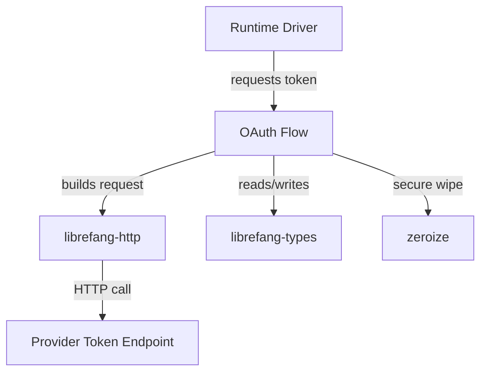

# Other — librefang-runtime-oauth

# librefang-runtime-oauth

OAuth 2.0 authentication flows for LibreFang runtime drivers, providing token acquisition and refresh for ChatGPT and GitHub Copilot backends.

## Overview

This crate encapsulates the complete OAuth lifecycle — from generating PKCE challenges to exchanging authorization codes for access tokens. It is consumed by runtime drivers that need to authenticate against third-party LLM providers (ChatGPT, GitHub Copilot) on behalf of a LibreFang user.

The module is intentionally self-contained: it holds no direct coupling to specific driver implementations. Drivers call into this crate's public API to obtain tokens, keeping authentication logic centralized and auditable.

## Architecture

**Key design decisions:**

- **PKCE-based flows** — Uses SHA-256 challenges (`sha2` + `base64`) with cryptographically random verifiers (`rand`) to protect the authorization code exchange. No client secrets are embedded in the binary.
- **Secret hygiene** — All intermediate secrets (verifiers, tokens, codes) are held in types that implement `zeroize::Zeroize`, ensuring sensitive material is cleared from memory on drop.
- **Async throughout** — All network I/O is async via `tokio`, compatible with the rest of the LibreFang runtime.

## Dependencies

| Dependency | Role in this crate |
|---|---|
| `librefang-types` | Shared OAuth-related types, error variants, token response structs |
| `librefang-http` | HTTP client abstraction; ensures consistent TLS config, proxy settings, and user-agent headers across the project |
| `reqwest` | Underlying HTTP client for token endpoint requests |
| `serde` / `serde_json` | Deserializing token responses; serializing request bodies |
| `thiserror` | Typed error enums for OAuth-specific failure modes |
| `tracing` | Structured logging of flow progress (challenge generation, token exchange, refresh) |
| `base64` | URL-safe Base64 encoding of PKCE challenges and code verifiers |
| `sha2` | SHA-256 digest for PKCE challenge derivation |
| `rand` | Cryptographically secure random generation of PKCE verifiers and state parameters |
| `zeroize` | Secure memory clearing for secrets |
| `hex` | Hex encoding of hash outputs where needed |

## Integration Points

### Downstream consumers

Runtime drivers (e.g., a ChatGPT driver or GitHub Copilot driver) depend on this crate at the workspace level. A driver typically:

1. Calls an OAuth flow entry point to kick off authorization.
2. Receives back an access token (and optional refresh token) typed from `librefang-types`.
3. Passes the token to subsequent API calls against the LLM provider.

### Upstream dependencies

- **`librefang-types`** must define the token and error types this crate produces. If adding a new provider flow, ensure the shared types include any provider-specific fields (e.g., GitHub Copilot's additional scope metadata).
- **`librefang-http`** provides the HTTP client builder. Any changes to its TLS configuration or proxy support automatically apply to OAuth requests made here.

## Adding a New Provider Flow

To add support for a new OAuth provider:

1. Define any provider-specific token or error types in `librefang-types`.
2. Implement a new flow function in this crate following the existing pattern: generate a PKCE verifier, derive the challenge, open the authorization URL, listen for the callback, and exchange the code.
3. Ensure all secret values use `zeroize`-compatible types.
4. Add `tracing` instrumentation at each major step (challenge generation, redirect received, token exchange attempted, token received).
5. Export the new flow from the crate root so drivers can import it.

## Error Handling

Errors are expressed via `thiserror`-derived enums covering:

- **Network failures** — The token endpoint was unreachable or returned a non-200 status.
- **Deserialization failures** — The provider returned an unexpected response shape.
- **PKCE/state mismatches** — The callback returned an invalid state parameter or the code exchange was rejected.
- **Expired/revoked tokens** — Refresh attempts that fail because the refresh token is no longer valid.

All errors implement `std::error::Error` and carry enough context (provider name, HTTP status, response body excerpt) to be useful in logs without leaking full secrets.

## Security Considerations

- **No secrets in logs.** Token values, code verifiers, and authorization codes are never included in `tracing` output. Logs reference only flow state transitions (e.g., "PKCE challenge generated", "token exchange succeeded").
- **Zeroize on drop.** Types wrapping secret material implement `Drop` via `zeroize` to reduce the window where secrets exist in process memory.
- **PKCE mandatory.** All flows use Proof Key for Code Exchange. Implicit grant or client-secret flows are not supported, avoiding secrets embedded in desktop/native applications.