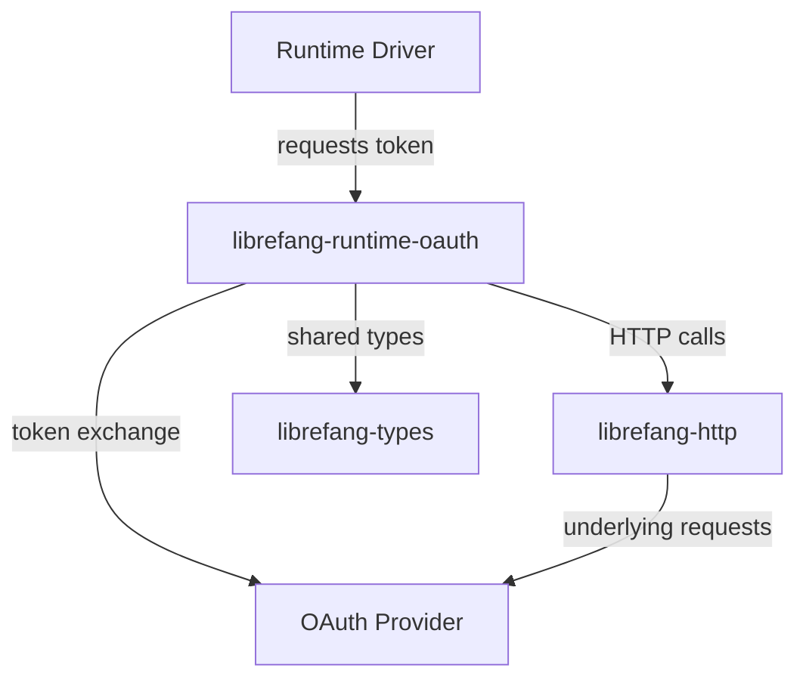

# Other — librefang-runtime-oauth

# librefang-runtime-oauth

OAuth 2.0 authentication flows for LibreFang runtime drivers, providing token acquisition and refresh for ChatGPT and GitHub Copilot backends.

## Purpose

This crate encapsulates the full OAuth lifecycle required by LibreFang's runtime drivers. It handles authorization code grants, token exchange, PKCE challenge generation, and secure credential management so that downstream drivers can authenticate against provider endpoints without reimplementing OAuth plumbing.

## When to Use This Crate

- **Runtime driver authors** who need to authenticate with ChatGPT or GitHub Copilot OAuth providers.
- **Integration tests** that require valid tokens to exercise driver endpoints.
- **Token management tooling** that refreshes or revokes credentials on behalf of a user.

## Architecture

The crate sits between a runtime driver and the OAuth provider. Drivers call into this crate to initiate a flow, and this crate uses `librefang-http` (backed by `reqwest`) for all network I/O. Shared data structures such as error types and credential shapes come from `librefang-types`.

## Key Responsibilities

### PKCE (Proof Key for Code Exchange)

The `sha2` and `base64` dependencies drive PKCE code verifier and challenge generation. Every authorization request includes a cryptographically random verifier (sourced from `rand`) and a SHA-256-derived challenge, preventing authorization code interception attacks.

### Secure Credential Handling

`zeroize` ensures that sensitive in-memory values — code verifiers, access tokens, and refresh tokens — are overwritten when dropped. This limits the window during which a memory dump or debugger could extract credentials.

### Token Lifecycle

1. **Authorization request** — constructs the provider's authorization URL with required query parameters (client ID, redirect URI, scope, state, PKCE challenge).
2. **Code exchange** — receives the authorization code from the redirect callback and posts it to the provider's token endpoint alongside the PKCE verifier.
3. **Token refresh** — when an access token expires, uses the stored refresh token to obtain a new pair without user interaction.
4. **Revocation** — optionally invalidates tokens at the provider's revocation endpoint.

### Error Handling

`thiserror` defines a focused error enum covering common OAuth failure modes: network errors, invalid grant responses, expired tokens, PKCE mismatches, and provider-specific error codes. All errors are traced through `tracing` spans for observability.

## Dependency Rationale

| Dependency | Role in This Crate |
|---|---|
| `librefang-types` | Shared credential and error types consumed by drivers |
| `librefang-http` | HTTP client abstraction used for token endpoint calls |
| `reqwest` | Underlying async HTTP client (via workspace) |
| `serde` / `serde_json` | Serialization of token responses and provider JSON bodies |
| `sha2` | SHA-256 hashing for PKCE code challenge derivation |
| `base64` | URL-safe Base64 encoding of the PKCE challenge |
| `rand` | Cryptographic RNG for state parameter and code verifier generation |
| `hex` | Hex encoding utilities for hash representation |
| `zeroize` | Secure zeroing of secret material on drop |
| `tokio` | Async runtime for all I/O-bound operations |
| `tracing` | Structured logging of flow progression and errors |
| `thiserror` | Ergonomic error type definitions |

## Integration Points

**Upstream consumers** are the runtime driver crates (`librefang-runtime-chatgpt`, `librefang-runtime-copilot`, etc.). They call into this crate at startup to obtain a valid access token, then periodically to refresh it.

**Downstream dependencies** are `librefang-types` (for shared structs) and `librefang-http` (for network calls). This crate does not depend on any LibreFang runtime driver, keeping the dependency graph acyclic.

## Security Considerations

- **State parameter**: Every authorization URL includes a random, unguessable `state` value to prevent CSRF attacks during the redirect callback.
- **PKCE**: All flows use `S256` code challenge method — the `plain` method is not supported.
- **No credential logging**: Tokens and verifiers are never logged at any trace level. Only flow events (start, success, failure reason) are emitted.
- **Zeroization**: All structs holding secret material derive or implement `Zeroize`, ensuring secrets don't linger on the heap after use.