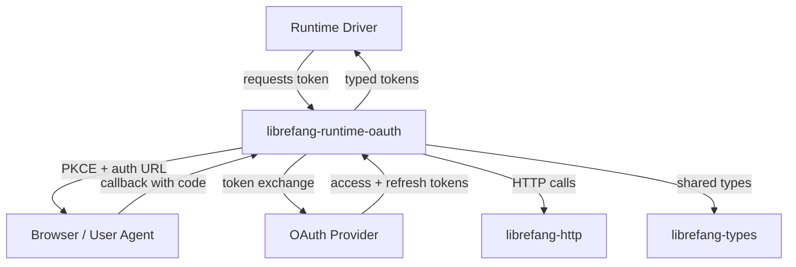

# Other — librefang-runtime-oauth

# librefang-runtime-oauth

OAuth 2.0 authentication flows for LibreFang runtime drivers, providing token acquisition and refresh for third-party AI services (ChatGPT, GitHub Copilot).

## Purpose

This module encapsulates the full OAuth lifecycle required by runtime drivers that authenticate against external providers. It isolates credential handling, PKCE generation, token exchange, and refresh logic into a dedicated crate so that drivers remain focused on request orchestration rather than authentication mechanics.

## Dependencies & What They Signal

| Dependency | Role in This Module |
|---|---|
| `librefang-types` | Shared types — likely `TokenResponse`, credential structs, error enums |
| `librefang-http` | Shared HTTP client configuration and middleware |
| `reqwest` | Outbound HTTP calls to authorization and token endpoints |
| `tokio` | Async runtime for I/O-bound OAuth exchanges |
| `serde` / `serde_json` | Serialization of token payloads and provider responses |
| `base64` / `sha2` / `hex` | PKCE code verifier/challenge generation (SHA-256 digest, base64url encoding) |
| `rand` | Cryptographically secure random generation for `state` and `code_verifier` values |
| `zeroize` | Secure memory clearing for secrets (verifiers, client secrets, tokens) |
| `thiserror` | Typed error definitions for OAuth-specific failure modes |
| `tracing` | Structured logging of flow progress and failures |

## Architecture

The module acts as a bridge between the runtime driver (which needs an access token to call an AI provider's API) and the OAuth provider's token endpoints. It does not embed a browser; it produces authorization URLs and consumes redirect callbacks.

## Key Concepts

### PKCE (Proof Key for Code Exchange)

All flows use PKCE to protect the authorization code exchange:

1. **Generate** a random `code_verifier` (high-entropy string via `rand`).
2. **Derive** the `code_challenge` by computing `SHA-256(code_verifier)` and base64url-encoding the digest (`sha2` + `base64`).
3. **Include** the `code_challenge` and `code_challenge_method=S256` in the authorization URL.
4. **Send** the original `code_verifier` during the token exchange to prove possession.

The `zeroize` dependency ensures that `code_verifier` and any client secrets are cleared from memory once the exchange completes.

### Supported Providers

- **ChatGPT (OpenAI)** — OAuth flow targeting OpenAI's authorization server.
- **GitHub Copilot** — OAuth flow targeting GitHub's device-flow or web-flow authorization.

Each provider has distinct endpoints, scopes, and token response shapes, but the underlying PKCE and token lifecycle is shared.

### Token Lifecycle

1. **Authorization request** — Build a URL the user visits to grant consent.
2. **Code exchange** — Redeem the authorization code (received via callback) for access and refresh tokens.
3. **Token refresh** — Use the refresh token to obtain a new access token when the current one expires.
4. **Secure disposal** — Zeroize all intermediate secrets.

## Error Handling

Errors are defined via `thiserror` and cover:

- Network failures during token exchange (`reqwest` errors)
- Provider-specific error responses (`invalid_grant`, `expired_token`, etc.)
- PKCE or state mismatches (possible tampering or session corruption)
- Missing or malformed configuration

All errors implement `std::error::Error` and integrate with `tracing` for structured diagnostics.

## Integration Points

### Consuming from a Runtime Driver

A runtime driver depends on this crate and calls into it to:

1. Obtain an authorization URL to present to the user.
2. Handle the callback containing the authorization code.
3. Complete the exchange and receive a typed `TokenResponse`.
4. Periodically refresh the token using the stored refresh token.

### Relationship to Other Crates

- **`librefang-types`** — This crate reuses or re-exports token and credential types rather than defining its own duplicates.
- **`librefang-http`** — HTTP calls go through the shared HTTP layer, inheriting its proxy support, timeout configuration, and TLS settings.

## Security Considerations

- **`zeroize`** is used for all secret values to minimize the window of exposure in memory.
- **`state` parameter** is randomly generated per-request and validated on callback to prevent CSRF.
- **No secrets in logs** — `tracing` spans log flow progress (e.g., "token exchange started", "token refreshed") but never log credentials, verifiers, or token values.
- **PKCE** eliminates the need to embed a `client_secret` in desktop/runtime applications where the secret cannot be safely stored.