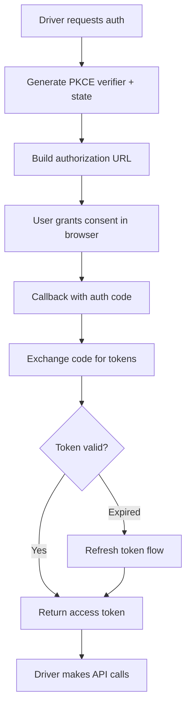

# Other — librefang-runtime-oauth

# librefang-runtime-oauth

OAuth authentication flows for LibreFang runtime drivers. This crate implements the OAuth 2.0 flows required to authenticate with AI service providers—specifically ChatGPT (OpenAI) and GitHub Copilot—so that runtime drivers can obtain and refresh access tokens.

## Purpose

LibreFang drivers interact with third-party AI APIs that require user authentication. This crate encapsulates the full OAuth lifecycle so that individual driver implementations don't need to duplicate auth logic. It handles:

- Generating PKCE code verifiers and challenges
- Managing authorization state parameters
- Token exchange after user consent
- Secure storage and rotation of tokens in memory
- Automatic token refresh before expiry

## Dependencies

The crate relies on two sibling crates for core types and HTTP transport:

| Crate | Role |
|---|---|
| `librefang-types` | Shared data types (credentials, token representations) |
| `librefang-http` | HTTP client construction and request execution |

External dependencies of note:

- **sha2, base64, hex, rand** — PKCE challenge generation and random state tokens
- **zeroize** — Secure clearing of sensitive values (secrets, tokens) from memory
- **reqwest** — Underlying HTTP client used for token endpoint calls
- **serde / serde_json** — Serialization of token responses and auth parameters
- **tracing** — Structured logging of auth flow progress (no sensitive data logged)

## OAuth Flow Architecture

## Key Concepts

### PKCE (Proof Key for Code Exchange)

All flows use PKCE to protect against authorization code interception attacks. The crate generates a cryptographically random code verifier, derives the SHA-256 challenge, and includes both in the appropriate steps. The `sha2` and `base64` dependencies handle this derivation.

### Secure Memory Handling

Access tokens, refresh tokens, and intermediate secrets are held in types that implement `Zeroize`. When these values go out of scope, their memory is overwritten, reducing the window for credential extraction.

### Token Refresh

The crate tracks token expiry and can transparently refresh access tokens using stored refresh credentials. Callers should attempt a request and, if the token is expired, invoke the refresh path rather than re-running the full authorization flow.

## Integration with LibreFang

This crate is consumed by runtime drivers (e.g., a ChatGPT driver or a GitHub Copilot driver). The typical integration pattern:

1. The driver calls into this crate to start an OAuth flow for a specific provider.
2. This crate returns an authorization URL and opens or returns it for the user.
3. After the user authenticates, the driver receives a callback with an authorization code.
4. The driver passes the code back to this crate, which exchanges it for tokens.
5. The driver stores the resulting credential and uses it for subsequent API requests via `librefang-http`.

Because the call graph shows no outgoing calls to other LibreFang crates at the module level, this crate is entirely self-contained in its logic—it produces tokens and credentials that callers then feed into other parts of the system.

## Error Handling

Errors are defined using `thiserror` and cover common OAuth failure modes:

- Network failures during token exchange
- Invalid or expired authorization codes
- Malformed responses from the provider's token endpoint
- Missing or invalid configuration (client ID, redirect URI)

All errors are structured so callers can distinguish between retryable conditions (network issues, temporary provider errors) and permanent failures (invalid credentials, user denial).

## Logging

The crate uses `tracing` spans to log the progression of OAuth flows. Logs include:

- Flow initiation and provider identification
- PKCE challenge generation (the challenge itself, never the verifier)
- Token exchange initiation and completion status
- Refresh attempts and outcomes

No secrets, authorization codes, or tokens are ever written to logs.

## Configuration

Callers provide provider-specific configuration (client ID, redirect URI, token endpoint URLs, scopes) which this crate uses to construct the appropriate requests. Configuration is expected to come from `librefang-types` or the driver's own settings, not hardcoded within this crate.