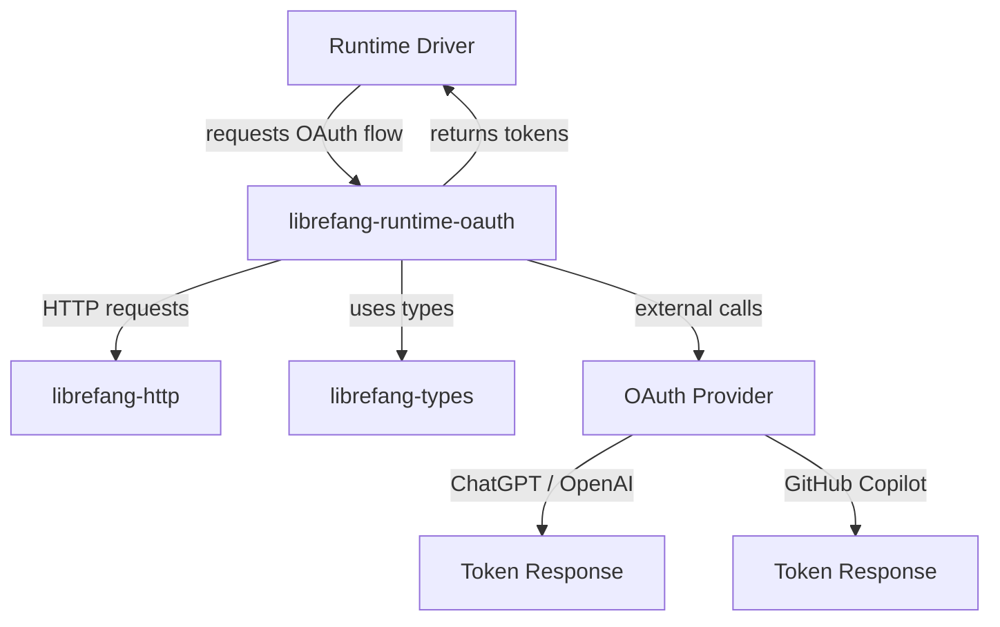

# Other — librefang-runtime-oauth

# librefang-runtime-oauth

OAuth 2.0 flow implementations for LibreFang runtime drivers. This crate provides authentication mechanisms for third-party LLM providers that require OAuth-based access, specifically ChatGPT (OpenAI) and GitHub Copilot.

## Overview

Runtime drivers in LibreFang sometimes need to authenticate against external services that use OAuth 2.0. This crate encapsulates those flows so that individual drivers don't need to implement OAuth logic themselves. It handles the full lifecycle: generating cryptographic parameters, driving the browser-based authorization flow, exchanging authorization codes for tokens, and managing token secrets in memory.

## Architecture

## Dependencies and Their Roles

The crate's dependencies reveal its security-conscious design:

| Dependency | Purpose |
|---|---|
| `librefang-types` | Shared type definitions for tokens, credentials, and OAuth-related structs |
| `librefang-http` | HTTP client abstraction used for token exchange and provider communication |
| `reqwest` | Underlying HTTP client for outbound requests to OAuth endpoints |
| `tokio` | Async runtime support for non-blocking OAuth operations |
| `serde` / `serde_json` | Serialization of OAuth request/response payloads |
| `thiserror` | Typed error definitions for OAuth-specific failure modes |
| `tracing` | Structured logging of OAuth flow progress and failures |
| `base64` | URL-safe Base64 encoding for PKCE code verifiers and challenges |
| `sha2` | SHA-256 hashing to derive PKCE code challenges from verifiers |
| `rand` | Cryptographically secure random generation for state parameters and PKCE verifiers |
| `hex` | Hex encoding utilities |
| `zeroize` | Secure memory clearing for token strings and client secrets |

## PKCE Support

The presence of `sha2`, `base64`, and `rand` together strongly indicates this crate implements OAuth 2.0 with PKCE (Proof Key for Code Exchange). PKCE is critical for public clients (like desktop applications) that cannot securely store a client secret. The flow works as follows:

1. **Generate a code verifier**: A cryptographically random string created via `rand`.
2. **Derive the code challenge**: Hash the verifier with SHA-256 (`sha2`), then Base64URL-encode it (`base64`).
3. **Authorization request**: Send the challenge to the provider's authorization endpoint.
4. **Token exchange**: Send the original verifier (not the challenge) to prove the calling application initiated the request.

## Token Security

The `zeroize` dependency ensures that sensitive values — access tokens, refresh tokens, and client secrets — are overwritten in memory when dropped. This prevents credentials from lingering in process memory longer than necessary.

## Integration Points

This crate is consumed by runtime drivers that need to authenticate with OAuth-protected services. Drivers call into this crate to initiate a flow, handle user interaction (typically a browser redirect), and receive back the credentials needed for subsequent API calls.

The crate depends on `librefang-http` for outbound network requests rather than using `reqwest` directly in most cases, maintaining consistency with the rest of the LibreFang HTTP stack. `librefang-types` provides the shared data structures returned to callers.

## Error Handling

OAuth flows can fail at multiple stages: network errors, user denial, expired codes, invalid responses, and rate limiting. Errors are defined using `thiserror` to provide structured, typed error variants that callers can match on and handle appropriately. All errors are instrumented with `tracing` spans for observability.