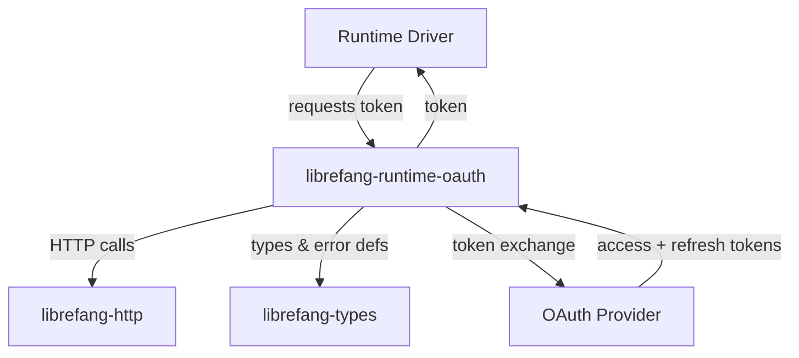

# Other — librefang-runtime-oauth

# librefang-runtime-oauth

OAuth 2.0 authentication flows for LibreFang runtime drivers, providing token acquisition and refresh for third-party AI services (ChatGPT, GitHub Copilot).

## Overview

This crate implements the OAuth 2.0 flows required by runtime drivers that connect to external AI providers. Rather than each driver implementing its own authentication logic, `librefang-runtime-oauth` centralizes the OAuth lifecycle — authorization URL generation, PKCE challenge creation, token exchange, and refresh — into reusable components.

The module targets two primary providers:

- **ChatGPT (OpenAI)** — OAuth flow for authenticating against OpenAI's API
- **GitHub Copilot** — OAuth flow using GitHub's device authorization or web application flow

## Architecture

## Key Capabilities

The dependency selection reveals the module's core responsibilities:

### PKCE-Based Authorization

The inclusion of `sha2`, `base64`, `rand`, and `hex` indicates implementation of **Proof Key for Code Exchange (PKCE)**. PKCE protects against authorization code interception attacks by requiring the client to prove possession of the original authorization request when exchanging the code for a token.

The flow involves:

1. Generating a cryptographically random code verifier (`rand`)
2. Computing a SHA-256 hash of the verifier (`sha2`)
3. Base64url-encoding the hash to produce the code challenge (`base64`)
4. Sending the challenge during authorization, then the verifier during token exchange

### Secure Token Storage

The `zeroize` dependency ensures that sensitive OAuth credentials — access tokens, refresh tokens, and code verifiers — are securely erased from memory when no longer needed. This prevents credentials from lingering in process memory after use.

### Token Refresh Management

Once an initial token is obtained, the module handles refresh automatically. Drivers receive a valid token without needing to track expiration or initiate refresh themselves.

## Dependencies Explained

| Dependency | Role |
|---|---|
| `librefang-types` | Shared types — token structures, OAuth configuration, error enums |
| `librefang-http` | HTTP client abstraction for outbound requests to OAuth endpoints |
| `reqwest` | Underlying HTTP client used for token exchange and refresh calls |
| `tokio` | Async runtime for non-blocking OAuth operations |
| `serde` / `serde_json` | Serialization of OAuth request/response bodies (JSON) |
| `thiserror` | Typed error definitions for OAuth-specific failure modes |
| `tracing` | Structured logging of OAuth flow progress for debugging |
| `base64` / `sha2` / `rand` / `hex` | PKCE challenge generation and cryptographic operations |
| `zeroize` | Secure memory cleanup for credentials |

## Integration Points

### Consumers

Runtime drivers in the LibreFang workspace consume this crate to authenticate before making API calls to their respective providers. A driver typically:

1. Calls into this module at startup or when a token expires
2. Receives an access token (and optionally caches a refresh token)
3. Attaches the token to outbound API requests

### Providers

The module depends on:

- **`librefang-types`** for configuration structs (client IDs, redirect URIs, scopes) and token representation types
- **`librefang-http`** for outbound HTTP communication with OAuth token endpoints

## Security Considerations

- **No credential logging**: The `tracing` integration should log flow progress (e.g., "starting OAuth flow", "token refreshed") without ever logging actual token values.
- **PKCE enforcement**: All authorization flows use PKCE to mitigate code interception attacks, even for confidential clients.
- **Memory hygiene**: All intermediate secrets — code verifiers, tokens, client secrets — use `zeroize`-compatible types to ensure timely memory cleanup.