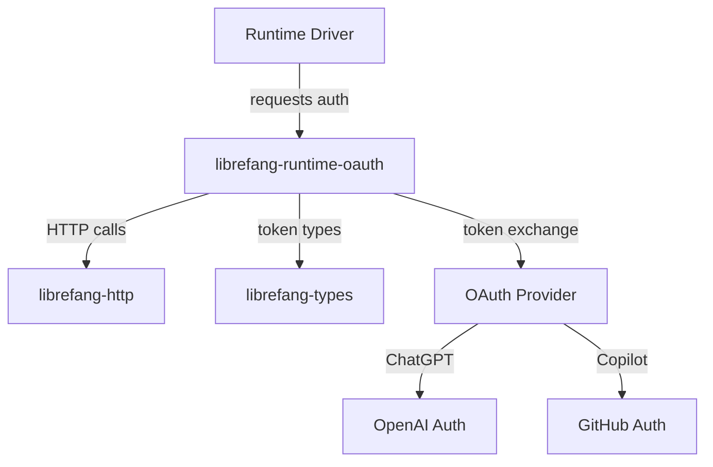

# Other — librefang-runtime-oauth

# librefang-runtime-oauth

OAuth 2.0 authentication flows for LibreFang runtime drivers, providing token acquisition and refresh for ChatGPT and GitHub Copilot backends.

## Purpose

This module encapsulates the full OAuth lifecycle required by LibreFang's AI provider drivers. Rather than scattering authentication logic across individual driver implementations, `librefang-runtime-oauth` provides a centralized, secure location for:

- Launching browser-based OAuth 2.0 authorization code flows
- Generating and verifying PKCE (Proof Key for Code Exchange) challenges
- Exchanging authorization codes for access tokens
- Refreshing expired tokens
- Securely storing and clearing credentials

## Architecture

The module sits between the runtime drivers and the external OAuth providers, using `librefang-http` as the transport layer and `librefang-types` for shared credential and error types.

## Key Dependencies and Their Roles

| Dependency | Role |
|---|---|
| `sha2`, `base64` | PKCE challenge generation — hashes the code verifier and encodes it for the authorization endpoint |
| `rand` | Cryptographically secure random generation of `state` parameters and PKCE code verifiers |
| `hex` | Hex encoding for token and hash representations |
| `zeroize` | Secure memory wiping for tokens, secrets, and code verifiers after use |
| `reqwest` | Underlying HTTP client for token exchange and refresh requests |
| `serde` / `serde_json` | Serialization of OAuth request/response payloads |
| `thiserror` | Typed error definitions for OAuth-specific failure modes |
| `tracing` | Structured logging of auth flow progress for debugging |

## OAuth Flow

The module implements the **Authorization Code Flow with PKCE**, which is the standard for native/desktop applications that cannot securely store a client secret.

1. **Generate verifier and challenge** — A random code verifier is created using `rand`, then hashed with `sha2` and base64url-encoded to produce the PKCE challenge.
2. **Build authorization URL** — The provider's authorization endpoint receives the challenge, a random `state` parameter, and the redirect URI.
3. **User authorizes** — The user completes the flow in their browser. The redirect delivers the authorization code back to LibreFang.
4. **Exchange code for token** — The authorization code, code verifier, and redirect URI are sent to the provider's token endpoint via `librefang-http`.
5. **Store tokens** — The access token (and refresh token, if provided) are stored. Secrets are held in types that implement `Zeroize` so they are cleared from memory when dropped.

## Security Considerations

- **PKCE is mandatory.** The module always uses a code verifier/challenge pair, never relying on a static client secret embedded in the binary.
- **Zeroize on drop.** Token structs containing sensitive data use the `zeroize` crate to overwrite memory when the values go out of scope, reducing exposure to memory-scraping attacks.
- **State parameter validation.** Each authorization request includes a random `state` value that is verified on callback to prevent CSRF attacks on the OAuth flow.
- **No credential logging.** The `tracing` spans intentionally omit token values, logging only flow progress (e.g., "token exchange succeeded", "refresh initiated").

## Integration Points

### Downstream consumers

Runtime drivers (such as ChatGPT or GitHub Copilot drivers) depend on this module to obtain valid access tokens before making API calls to their respective providers. Drivers should call into this module when they detect an expired or missing token.

### Upstream dependencies

- **`librefang-types`** — Provides shared credential structs, error enums, and configuration types that this module populates during the OAuth flow.
- **`librefang-http`** — Handles the actual HTTP requests for token exchange and refresh, centralizing TLS configuration, retries, and proxy support.

## Error Handling

OAuth failures are represented using `thiserror`-derived error types covering:

- Network failures during token exchange or refresh
- Invalid or expired authorization codes
- Mismatched `state` parameters (possible CSRF)
- Malformed responses from the provider
- Missing or invalid scopes in the returned token

These errors integrate with the broader LibreFang error chain so that driver consumers receive actionable information about why authentication failed.