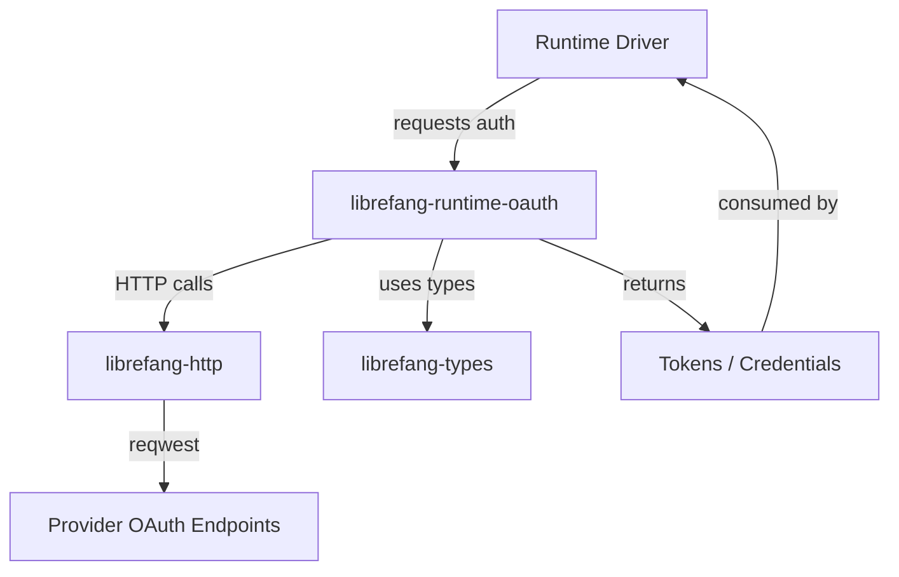

# Other — librefang-runtime-oauth

# librefang-runtime-oauth

OAuth 2.0 flow implementations for LibreFang runtime drivers, providing authentication integrations for ChatGPT and GitHub Copilot.

## Overview

This crate encapsulates all OAuth-specific logic required by LibreFang's runtime drivers. It isolates the complexity of multi-provider authentication—authorization code exchange, token refresh, PKCE generation, and secure credential handling—behind a clean boundary so that individual driver implementations remain focused on their core concerns.

## Supported Providers

| Provider | Flow | Notes |
|----------|------|-------|
| ChatGPT (OpenAI) | Device authorization / Authorization code + PKCE | Uses OpenAI's OAuth endpoints |
| GitHub Copilot | Device authorization flow | GitHub's device flow for CLI/tool integrations |

## Architecture



The module sits between runtime drivers and `librefang-http`. Drivers delegate authentication to this crate rather than implementing OAuth flows themselves.

## Key Dependencies and Their Roles

### Internal Crates

- **`librefang-types`** — Shared type definitions. OAuth token structures, credential types, and provider-specific configuration are expected to be defined or re-exported here.
- **`librefang-http`** — HTTP client abstraction. All outbound requests to OAuth endpoints are routed through this crate rather than calling `reqwest` directly, maintaining consistency with the rest of the codebase.

### Cryptographic Operations

The dependency selection reveals the security model:

| Crate | Purpose |
|-------|---------|
| `sha2` | SHA-256 hashing for PKCE code verifier challenges |
| `base64` | URL-safe Base64 encoding of PKCE verifiers and challenges |
| `rand` | Cryptographically secure random generation for `state` parameters and PKCE verifiers |
| `hex` | Hex encoding for digest representations |

### Token Security

| Crate | Purpose |
|-------|---------|
| `zeroize` | Secure memory wiping for tokens, secrets, and code verifiers after use |

This is critical for OAuth credentials—any struct holding sensitive data (access tokens, refresh tokens, client secrets) should implement `Zeroize` or use `Zeroize`-backed wrappers to ensure credentials don't linger in memory longer than necessary.

### Error Handling and Observability

- **`thiserror`** — Derive-based error types for OAuth-specific failures (token expiry, invalid grant, network errors during exchange, PKCE mismatches).
- **`tracing`** — Structured logging for auth lifecycle events (flow initiation, token acquisition, refresh attempts, errors).

## OAuth Flow Implementations

### PKCE (Proof Key for Code Exchange)

The presence of `sha2`, `base64`, and `rand` together strongly indicates PKCE support. The expected pattern:

1. Generate a cryptographically random code verifier using `rand`
2. Compute SHA-256 hash of the verifier using `sha2`
3. Base64url-encode the hash to produce the code challenge
4. Include the challenge in the authorization request
5. Present the original verifier during token exchange

PKCE prevents authorization code interception attacks, which is especially important for desktop applications like LibreFang.

### Device Authorization Flow

The GitHub Copilot integration likely uses the device authorization grant (`POST /login/device/code`), which is designed for environments that cannot open a browser or embed a web view. The flow involves:

1. Request a device code and user code from the provider
2. Present the user code (and verification URL) to the user
3. Poll the token endpoint at the provider-suggested interval using `tokio::time::sleep`
4. Continue polling until the user completes browser-based authorization or the code expires

### Token Lifecycle

Tokens returned by providers require ongoing management:

- **Storage** — Access tokens and refresh tokens held in memory with `zeroize` protection
- **Refresh** — Automatic or on-demand refresh using the refresh token grant
- **Expiry** — Tracking token expiration to proactively refresh before failure

## Integration with Runtime Drivers

Runtime drivers consume this crate to authenticate before making API calls to their respective providers. The typical integration pattern:

1. Driver initializes with a provider-specific OAuth configuration
2. Driver calls into this crate to start an auth flow
3. User completes authentication (browser redirect or device code entry)
4. This crate returns tokens to the driver
5. Driver attaches tokens to subsequent API requests
6. On 401 responses or token expiry, driver delegates refresh to this crate

## Error Scenarios

The `thiserror`-based error types are expected to cover:

| Scenario | Typical Cause |
|----------|---------------|
| Authorization denied | User declined consent in browser |
| Invalid grant | Authorization code expired or already used |
| Token refresh failure | Refresh token revoked or expired |
| Network error | OAuth endpoint unreachable |
| PKCE verification failed | Verifier/challenge mismatch |
| Device code expired | User didn't complete auth in time |
| Rate limited | Too many token requests |

## Building and Testing

```bash
# Build the crate
cargo build -p librefang-runtime-oauth

# Run tests
cargo test -p librefang-runtime-oauth

# Check for warnings and clippy issues
cargo clippy -p librefang-runtime-oauth
```

### Integration Testing

OAuth flows require live provider endpoints. Integration tests typically need:

- Valid OAuth application credentials (client ID, client secret)
- A test harness capable of intercepting browser redirects
- Or mocked HTTP responses via `librefang-http` test utilities

## Security Considerations

- **Never log tokens.** The `tracing` integration should carefully avoid emitting access tokens, refresh tokens, or code verifiers at any log level.
- **Zeroize secrets.** All intermediate values (code verifiers, client secrets, tokens) must be zeroed after use.
- **State parameter validation.** CSRF protection via `state` is essential for authorization code flows. Generate a random state, store it, and verify it matches on callback.
- **Token storage.** This crate handles in-memory token management. Persistent storage (keychain, encrypted files) is outside its scope and should be handled by consumers.