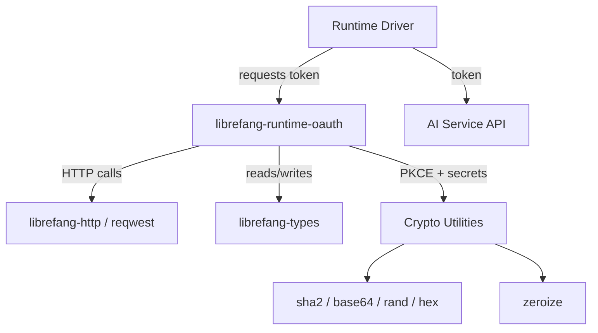

# Other — librefang-runtime-oauth

# librefang-runtime-oauth

OAuth authentication flows for LibreFang runtime drivers, providing token acquisition and refresh for third-party AI services such as ChatGPT and GitHub Copilot.

## Purpose

LibreFang integrates with proprietary AI backends that require OAuth-based authentication. This module encapsulates the complexity of those flows—PKCE generation, token exchange, refresh management, and secure credential handling—so that individual runtime drivers don't each need to reimplement the same OAuth machinery.

The crate is consumed by runtime drivers (e.g., the ChatGPT driver, the GitHub Copilot driver) as a shared dependency. Drivers call into this module to obtain valid access tokens, then pass those tokens to the HTTP layer when making API requests.

## Architecture

## Key Dependencies and Their Roles

### OAuth Protocol Support

| Dependency | Role |
|---|---|
| `sha2` | SHA-256 hashing for PKCE `code_challenge` derivation |
| `base64` | URL-safe Base64 encoding of the code verifier and challenge |
| `rand` | Cryptographically secure random generation of the `code_verifier` |
| `hex` | Hex encoding for intermediate hash representations |

These four crates together form the standard PKCE (Proof Key for Code Exchange) pipeline. The typical flow is:

1. Generate a random `code_verifier` using `rand`.
2. Hash the verifier with SHA-256 via `sha2`.
3. Base64url-encode the hash to produce the `code_challenge`.
4. Send the challenge during the authorization request; present the original verifier during the token exchange.

### Secure Credential Handling

| Dependency | Role |
|---|---|
| `zeroize` | Ensures sensitive values (tokens, secrets, verifiers) are overwritten in memory when dropped, reducing the window for memory-scraping attacks |

Any struct holding bearer tokens, refresh tokens, or client secrets should derive or implement `Zeroize` so that deallocation doesn't leave credentials in process memory.

### HTTP Communication

| Dependency | Role |
|---|---|
| `reqwest` | Underlying HTTP client for token endpoint requests |
| `librefang-http` | LibreFang's HTTP abstraction layer; provides shared client configuration, retry policies, and proxy support |
| `tokio` | Async runtime backing the HTTP calls |

Token exchange and refresh calls go through `librefang-http` where possible, ensuring consistent TLS configuration, user-agent headers, and proxy handling across the application.

### Serialization and Error Handling

| Dependency | Role |
|---|---|
| `serde` / `serde_json` | Deserializing token endpoint responses and serializing request bodies |
| `thiserror` | Ergonomic error types for OAuth-specific failure modes |
| `tracing` | Structured logging of flow progress and failures (without logging secrets) |

### Internal Dependencies

| Dependency | Role |
|---|---|
| `librefang-types` | Shared type definitions—likely includes OAuth configuration structs, token response types, or credential types used across crates |

## Integration Points

This module sits between the driver layer and the HTTP layer:

- **Upstream consumers**: Runtime drivers for ChatGPT and GitHub Copilot. A driver calls this module when it needs to authenticate before making API requests.
- **Downstream dependencies**: `librefang-http` and `reqwest` for outbound HTTP calls to OAuth token endpoints; `librefang-types` for shared data structures.

## Security Considerations

- **No credential logging**: The `tracing` integration should log flow state transitions (e.g., "starting device code flow", "token refreshed") but must never log `code_verifier`, `access_token`, or `refresh_token` values.
- **Zeroize on drop**: All intermediate and final credential values should use types that implement `Zeroize` to minimize exposure in process memory.
- **PKCE mandatory**: The dependency profile (sha2 + base64 + rand) indicates PKCE is used, which protects against authorization code interception attacks—critical for desktop/application flows where a client secret cannot be safely stored.