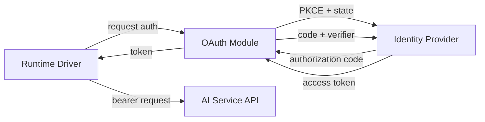

# Other — librefang-runtime-oauth

# librefang-runtime-oauth

OAuth authentication flows for LibreFang runtime drivers, providing token acquisition and refresh logic for third-party AI services (ChatGPT, GitHub Copilot).

## Purpose

This crate encapsulates the full OAuth 2.0 lifecycle required when LibreFang acts as a client to external AI providers. Rather than scattering authentication logic throughout individual runtime drivers, this module provides a centralized, self-contained implementation that drivers can delegate to.

## Scope

The crate handles two distinct OAuth integrations:

- **ChatGPT (OpenAI)** — device-code or authorization-code flow for obtaining access tokens against OpenAI's API.
- **GitHub Copilot** — the Copilot-specific OAuth dance, which routes through GitHub's identity provider and returns tokens scoped for Copilot's API endpoint.

Both flows produce the same end result: a bearer token that the calling runtime driver attaches to outbound HTTP requests via `librefang-http`.

## Architecture

```
┌─────────────────────┐
│  Runtime Driver      │
│  (ChatGPT / Copilot) │
└────────┬────────────┘
         │  calls
         ▼
┌─────────────────────────┐     ┌──────────────────┐
│ librefang-runtime-oauth │────▶│ librefang-http   │
│                         │     └──────────────────┘
│  • PKCE generation      │
│  • State + nonce        │     ┌──────────────────┐
│  • Token exchange       │────▶│ librefang-types  │
│  • Token refresh        │     └──────────────────┘
│  • Secure zeroing       │
└─────────────────────────┘
```



## Key Dependencies and Why They Matter

| Dependency | Role in This Crate |
|---|---|
| `base64`, `sha2`, `hex` | PKCE (Proof Key for Code Exchange) — generates a SHA-256 code challenge from a random code verifier, encoded as base64url or hex for the authorization request. |
| `rand` | Cryptographically-secure random generation for OAuth `state` parameters and PKCE code verifiers. |
| `zeroize` | Securely zeroes sensitive values (code verifiers, client secrets, tokens) from memory after use, preventing credential leakage in core dumps. |
| `reqwest` | Makes HTTP calls to the identity provider's token endpoints (exchanged indirectly through `librefang-http`). |
| `serde` / `serde_json` | Deserializes token responses from the provider; serializes outbound request bodies. |
| `thiserror` | Defines the crate's error types as ergonomic Rust enums. |
| `tracing` | Emits structured log events for each stage of the OAuth flow — useful for debugging failed authorizations without logging secrets. |

## OAuth Flow Walkthrough

### 1. Initialization

The calling driver invokes the OAuth module to begin a new authorization session. The module generates:

- A **code verifier** — a high-entropy random string (typically 43–128 characters).
- A **code challenge** — `BASE64URL(SHA256(code_verifier))`, sent to the provider.
- A **state** parameter — another random string, returned unchanged by the provider to prevent CSRF.

### 2. User Authorization

The module returns an authorization URL (or device-code URL, depending on the provider's flow). The driver presents this URL to the user — either by opening a browser or displaying it for manual navigation. The user authenticates with the provider and grants consent.

### 3. Token Exchange

Once the provider redirects back with an authorization code (or the device code is polled), the module exchanges it for tokens:

- Sends the code plus the original code verifier to the provider's token endpoint.
- Receives an **access token**, an optional **refresh token**, and an **expires-in** value.
- The code verifier is zeroed from memory immediately after this request.

### 4. Token Storage and Use

The resulting token is returned to the driver, which stores it (via whatever persistence mechanism the runtime uses) and attaches it as a `Bearer` header on subsequent API calls through `librefang-http`.

### 5. Token Refresh

When an access token expires, the driver calls back into this module with the stored refresh token. The module posts to the provider's token endpoint to obtain a new access token, again zeroing the old refresh token if the provider rotates it.

## Security Considerations

- **PKCE is mandatory** for these flows. The code verifier never leaves the client; only the SHA-256 challenge is transmitted during authorization. This prevents authorization code interception attacks.
- **State validation** ensures the callback originated from the same session, blocking CSRF-based token theft.
- **Zeroization** — every intermediate secret (code verifier, client secret, refresh tokens) is held in types that implement `Zeroize`, so memory is scrubbed as soon as the value is no longer needed.
- **No secret logging** — the `tracing` spans instrument each phase of the flow but intentionally omit token values and code verifiers from log output.

## Error Handling

All errors from this crate are consolidated into enums derived via `thiserror`. Expected error categories include:

- **Network errors** — the token endpoint is unreachable or returned a non-200 status.
- **Provider errors** — the provider rejected the authorization code, returned an invalid grant, or the user denied consent.
- **Deserialization errors** — the provider returned an unexpected JSON structure.
- **State mismatch** — the `state` parameter in the callback doesn't match the one generated locally.

Callers should pattern-match on these variants to decide whether to retry, re-prompt the user, or fail permanently.

## Relationship to Other Crates

```
librefang-types  ←  librefang-runtime-oauth  →  librefang-http
```

- **`librefang-types`** — Provides shared types such as credential structs, error enums, or configuration models that this crate consumes.
- **`librefang-http`** — The HTTP client layer this crate uses to make outbound requests to identity providers. By routing through `librefang-http` rather than using `reqwest` directly, all OAuth HTTP traffic inherits the workspace's proxy, TLS, and retry configuration.

Runtime drivers (e.g., a ChatGPT driver or Copilot driver) depend on this crate as a build dependency and call into it during their authentication phase. They do not need to understand the underlying OAuth mechanics — only that calling the module yields a valid bearer token or an error they must handle.