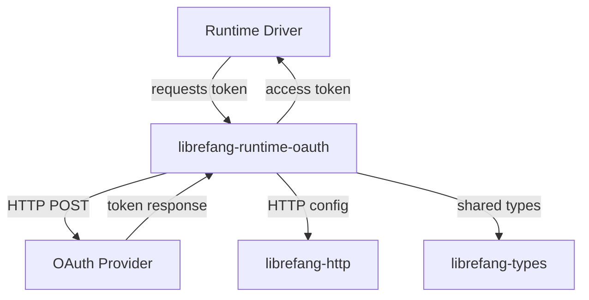

# Other — librefang-runtime-oauth

# librefang-runtime-oauth

OAuth 2.0 authentication flows for LibreFang runtime drivers. This module implements the authorization machinery required to authenticate with third-party LLM providers—specifically ChatGPT and GitHub Copilot—so that upstream runtime drivers can make authenticated API calls.

## Role in the Codebase

LibreFang wraps multiple LLM backends behind a unified interface. Some of those backends (ChatGPT, GitHub Copilot) require browser-based OAuth 2.0 flows or device-authorization flows before they can be used. This module isolates all OAuth concerns into a single crate so that runtime drivers remain focused on request/response translation.

Downstream, the runtime drivers for ChatGPT and GitHub Copilot depend on this module to obtain and refresh access tokens. Upstream, this module depends on `librefang-types` for shared data structures and `librefang-http` for HTTP client configuration.

## Dependency Rationale

The crate's dependencies reveal its implementation strategy:

| Dependency | Purpose |
|---|---|
| `reqwest` | HTTP client for token exchange requests to OAuth endpoints |
| `serde` / `serde_json` | Serialization of token responses and PKCE parameters |
| `sha2`, `base64`, `hex` | PKCE code verifier/challenge generation (SHA-256 digest, base64url encoding) |
| `rand` | Cryptographically secure random generation of code verifiers and state parameters |
| `zeroize` | Secure zeroing of sensitive credentials (tokens, secrets) in memory after use |
| `thiserror` | Typed error definitions for OAuth-specific failure modes |
| `tracing` | Structured logging of flow progress for debugging |

## Architecture

The module acts as a self-contained token broker. A runtime driver calls into this module when it needs a valid access token. The module handles the full lifecycle: checking for cached tokens, initiating an authorization flow if needed, exchanging codes for tokens, and returning the credential to the caller.

## OAuth Flow Variants

The module supports provider-specific OAuth patterns:

- **ChatGPT** — Likely uses an authorization code flow with PKCE, given the presence of `sha2`, `base64`, and `rand` for generating code verifiers and challenges. This flow requires the user to authorize in a browser, after which the module exchanges the authorization code for tokens.

- **GitHub Copilot** — GitHub's device authorization flow is the standard pattern for CLI/tool integrations. The module requests a device code, presents it to the user for verification, and polls the token endpoint until the user completes authorization.

## Security Considerations

The inclusion of `zeroize` signals that tokens and secrets are treated as sensitive data. Implementations in this module are expected to:

- Clear code verifiers, client secrets, and tokens from memory when they are no longer needed.
- Avoid logging sensitive values; `tracing` spans should capture flow state without leaking credentials.
- Use `rand` for generating unpredictable state parameters and PKCE verifiers to prevent CSRF and code interception attacks.

## Error Handling

OAuth flows can fail in many ways—network errors, expired codes, user denial, rate limiting. The `thiserror` dependency indicates that this module defines a dedicated error enum covering these cases, allowing callers to distinguish between transient failures (retryable) and permanent failures (requiring user intervention).

## Integration Points

When adding support for a new OAuth-protected provider:

1. Define the provider's token endpoints and scopes within this module.
2. Implement the appropriate flow (authorization code + PKCE, device code, or client credentials).
3. The corresponding runtime driver in the workspace then depends on this module and calls into the new flow.

The separation ensures that OAuth logic—token persistence, refresh logic, PKCE generation, polling—is not duplicated across drivers.