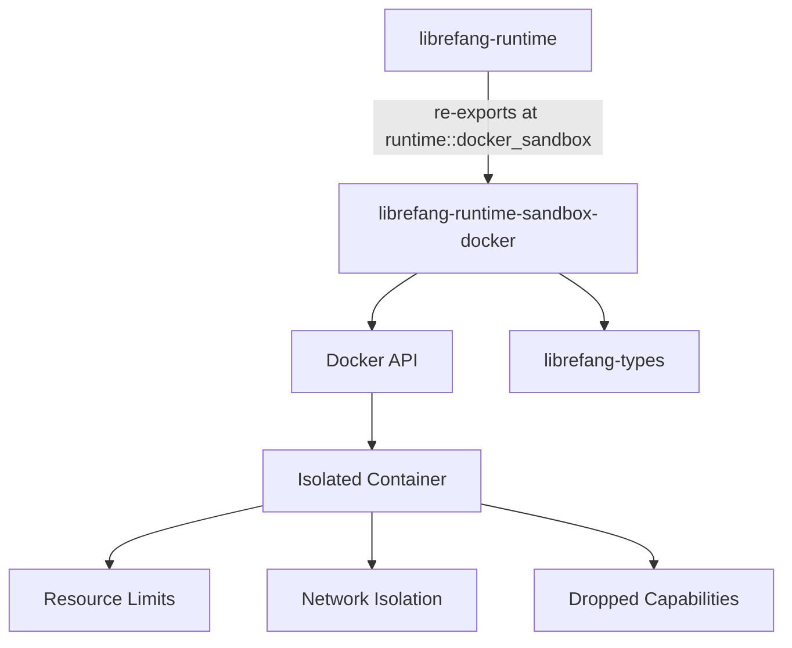

# Other — librefang-runtime-sandbox-docker

# librefang-runtime-sandbox-docker

Docker container sandbox for LibreFang tool execution. Provides OS-level isolation for agent code execution by spawning commands inside Docker containers with strict resource limits, network isolation, and capability dropping.

## Purpose

This crate was extracted from `librefang-runtime` as part of the [#3710 god-crate split](https://github.com/librefang/librefang/issues/3710). It encapsulates all Docker-based sandboxing logic, keeping it independent from the main runtime crate while maintaining backward compatibility through re-exports.

When an agent needs to execute tool code, this module ensures that execution happens within a tightly controlled Docker container rather than on the host system.

## Architecture



## Security Model

The sandbox enforces several layers of isolation:

- **Resource limits** — Containers run with strict CPU, memory, and I/O constraints to prevent runaway or malicious code from impacting the host.
- **Network isolation** — Containers have no network access by default, preventing exfiltration or lateral movement.
- **Capability dropping** — Linux capabilities are dropped to the minimum required set, reducing the container's privilege surface.
- **Shell metacharacter inspection** — User-supplied commands are inspected via the helpers module for dangerous shell metacharacters. This denylist is parity-tested against the parent crate's denylist (see `crates/librefang-runtime/tests/docker_sandbox_helpers_parity.rs`).

## Dependencies

| Crate | Purpose |
|---|---|
| `librefang-types` | Shared type definitions across the LibreFang workspace |
| `tokio` | Async runtime for container lifecycle management |
| `tracing` | Structured logging and diagnostics |
| `dashmap` | Concurrent map for tracking active containers |
| `serde_json` | JSON serialization for container configuration and results |
| `chrono` | Timestamp handling for container metadata |

## Integration with the Workspace

`librefang-runtime` re-exports this crate at its historical path (`runtime::docker_sandbox`), so downstream call sites do not need to switch imports. The re-export is gated behind the parent crate's default-on `docker-sandbox` feature flag.

To use the sandbox directly:

```rust
use librefang_runtime_sandbox_docker::DockerSandbox;
```

Or through the parent crate (recommended for existing code):

```rust
use librefang_runtime::docker_sandbox::DockerSandbox;
```

## Prerequisites

- Docker must be installed and running on the host.
- The user executing the LibreFang process needs permission to interact with the Docker daemon (typically membership in the `docker` group or equivalent).

## Related Crates

- **`librefang-runtime`** — Parent crate that re-exports this module. See `crates/librefang-runtime/README.md`.
- **`librefang-types`** — Shared type definitions consumed by this crate.

## References

- [Workspace README](../../README.md)
- Issue #3710 — God-crate split tracking issue