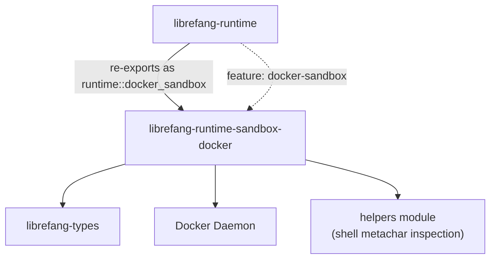

# Other — librefang-runtime-sandbox-docker

# librefang-runtime-sandbox-docker

Docker container sandbox for LibreFang tool execution. Provides OS-level isolation by spawning agent commands inside Docker containers with strict resource limits, network isolation, and capability dropping.

## Purpose

This crate implements the sandboxed execution layer for LibreFang's tool-running pipeline. When an agent needs to execute code or run a command, this module ensures that execution happens inside a Docker container rather than on the host, preventing untrusted code from accessing host resources.

Extracted from `librefang-runtime` as part of the **#3710 god-crate split**, this crate is a focused, single-responsibility module handling only Docker-based sandboxing.

## Architecture


```mermaid
graph TD
    A[librefang-runtime] -->|"re-exports as runtime::docker_sandbox"| B[librefang-runtime-sandbox-docker]
    B --> C[librefang-types]
    B --> D[Docker Daemon]
    B --> E["helpers module<br/>(shell metachar inspection)"]
    A -.->|feature: docker-sandbox| B
```

## How It Works

1. A command arrives from the agent execution pipeline
2. Shell metacharacters in user-supplied commands are inspected via the helpers module, using a denylist parity-tested against the parent crate (see `crates/librefang-runtime/tests/docker_sandbox_helpers_parity.rs`)
3. The command is dispatched to a Docker container configured with:
   - **Resource limits** — CPU and memory constraints
   - **Network isolation** — no host network access
   - **Capability dropping** — minimal Linux capabilities

## Dependencies

| Dependency | Purpose |
|---|---|
| `librefang-types` | Shared type definitions used across the workspace |
| `tokio` | Async runtime for non-blocking container operations |
| `tracing` | Structured logging and instrumentation |
| `dashmap` | Concurrent hashmap, likely for tracking active containers |
| `chrono` | Timestamp handling for container lifecycle events |
| `sha2` | SHA-2 hashing, likely for container image or layer identification |

## Integration with librefang-runtime

Downstream code does **not** import this crate directly. `librefang-runtime` re-exports it at the historical path `runtime::docker_sandbox`, preserving backward compatibility:

```rust
// Downstream code (unchanged after extraction)
use librefang_runtime::docker_sandbox::DockerSandbox;
```

The re-export is gated behind the **`docker-sandbox` feature**, which is **enabled by default** in `librefang-runtime`. Disabling this feature removes Docker sandboxing from the build.

## Feature Flag

Controlled by the parent crate's `docker-sandbox` feature (default: on). To disable:

```toml
[dependencies]
librefang-runtime = { version = "x.y.z", default-features = false }
```

## Testing

Shell metacharacter inspection parity is validated by the parent crate at:
- `crates/librefang-runtime/tests/docker_sandbox_helpers_parity.rs`

This ensures the denylist for dangerous shell characters remains consistent between this crate and the parent crate after the extraction.