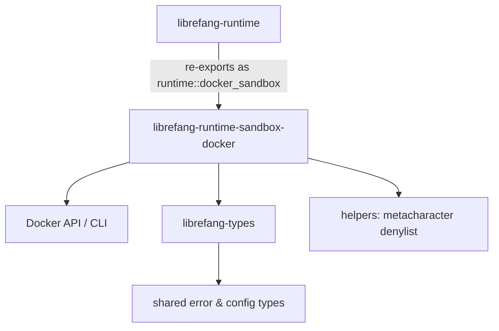

# Other — librefang-runtime-sandbox-docker

# librefang-runtime-sandbox-docker

Docker-based OS-level sandbox for executing agent tool commands inside isolated containers. Extracted from `librefang-runtime` during the #3710 god-crate split.

## Purpose

When LibreFang agents need to run external commands — shell snippets, scripts, or tool invocations — those commands must not have free rein over the host system. This crate provides a sandboxed execution environment by spawning every command inside a tightly restricted Docker container with:

- **Resource limits** — CPU and memory caps to prevent runaway processes.
- **Network isolation** — no default network access unless explicitly granted.
- **Capability dropping** — Linux capabilities are stripped to the minimum required.
- **Metacharacter inspection** — user-supplied command strings are checked against a denylist of dangerous shell metacharacters before execution.

## Architecture


```mermaid
graph TD
    A[librefang-runtime] -->|"re-exports as runtime::docker_sandbox"| B[librefang-runtime-sandbox-docker]
    B --> C[Docker API / CLI]
    B --> D[librefang-types]
    B --> E[helpers: metacharacter denylist]
    D --> F[shared error & config types]
```

The crate is consumed almost exclusively through `librefang-runtime`, which re-exports it at its historical path (`runtime::docker_sandbox`). Downstream call sites should not need to change imports.

## Integration Points

### Re-export by parent crate

`librefang-runtime` depends on this crate behind its default-on `docker-sandbox` Cargo feature. The public surface is re-exported at `runtime::docker_sandbox`, preserving backward compatibility after the extraction.

### Parity testing

Shell metacharacter inspection is parity-tested against the parent crate's denylist. The relevant test lives at:

```
crates/librefang-runtime/tests/docker_sandbox_helpers_parity.rs
```

If you add or remove a metacharacter rule, that test must continue to pass. This ensures the extracted crate's validation logic never drifts from the original.

### Dependencies

| Crate | Role |
|---|---|
| `librefang-types` | Shared error types, configuration structs, and domain types used across the workspace. |
| `tokio` | Async runtime — Docker operations (spawn, wait, stream output) are all async. |
| `tracing` | Structured logging for container lifecycle events, resource limit violations, and security denials. |
| `dashmap` | Concurrent map, likely used to track in-flight containers keyed by execution ID. |
| `chrono` | Timestamps for container start/stop events and timeout enforcement. |
| `sha2` | Hashing — used to generate deterministic container names or image layer identifiers from execution parameters. |

## Security Model

Every command runs inside a fresh (or tightly pooled) Docker container. The host is protected by multiple layers:

1. **Pre-execution validation** — the helpers module inspects the command string for shell metacharacters (e.g., command substitution, piping, redirection) on a denylist. Rejected commands are never sent to Docker.
2. **Container hardening** — containers are started with dropped capabilities, a read-only root filesystem where possible, and no new privileges.
3. **Resource caps** — memory and CPU limits are enforced by Docker cgroups, preventing resource exhaustion on the host.
4. **Network isolation** — containers run with `--network none` unless the specific tool requires network access, which must be explicitly configured.
5. **Timeout enforcement** — containers that exceed their execution deadline are killed and removed.

## Working with this crate

### When to import directly

Most consumers should use the re-export from `librefang-runtime`. Import this crate directly only if you are:

- Building a standalone test harness that doesn't need the full runtime.
- Working on the sandbox implementation itself.
- Parity-testing the helpers module.

### Feature flag

In `librefang-runtime`, the feature is called `docker-sandbox` and is enabled by default. To disable it (e.g., for environments without Docker):

```toml
librefang-runtime = { default-features = false }
```

### Running tests

Docker must be available on the host (either the daemon socket or a remote endpoint). Many integration tests will be skipped if Docker is unreachable. Check the workspace root for CI configuration that sets up the Docker daemon.

## Historical context

This crate was extracted from `librefang-runtime` as part of issue **#3710 Phase 1**, which split the monolithic runtime crate into focused, independently testable modules. The extraction preserved all existing behavior and public API paths via re-exports.