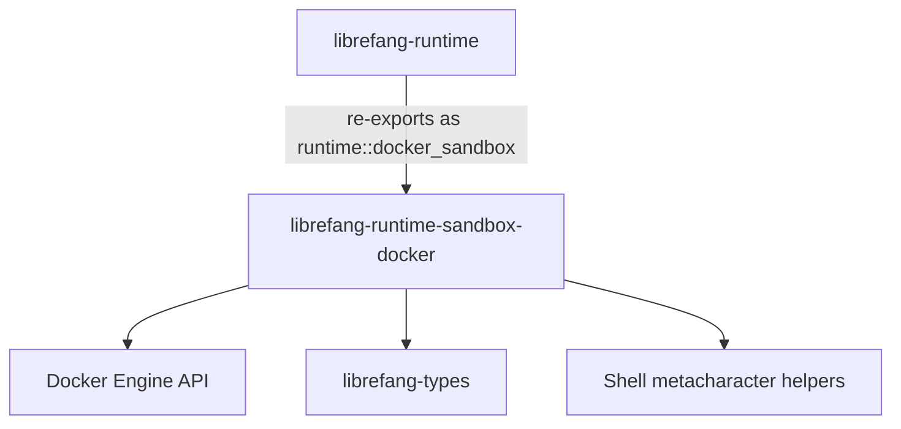

# Other — librefang-runtime-sandbox-docker

# librefang-runtime-sandbox-docker

Docker-based OS-level sandbox for executing agent tool commands within LibreFang. Provides container isolation with strict resource limits, network policies, and capability dropping to prevent untrusted code from escaping its execution environment.

## Purpose

When LibreFang agents execute tool commands, those commands run inside Docker containers rather than directly on the host. This crate manages the full lifecycle of that isolation:

- **Container provisioning** — spawning containers with constrained resources
- **Shell metacharacter inspection** — rejecting commands that contain dangerous shell characters before they reach a container
- **Resource enforcement** — CPU, memory, and wall-clock limits per execution
- **Network isolation** — preventing containers from accessing the host network or other containers
- **Capability dropping** — stripping Linux capabilities to minimize the attack surface

## Architecture

This crate was extracted from `librefang-runtime` during the #3710 god-crate decomposition. The parent crate re-exports it at the historical path `runtime::docker_sandbox`, so existing call sites require no import changes.


```mermaid
graph TD
    A[librefang-runtime] -->|"re-exports as runtime::docker_sandbox"| B[librefang-runtime-sandbox-docker]
    B --> C[Docker Engine API]
    B --> D[librefang-types]
    B --> E["Shell metacharacter helpers"]
```

## Dependencies

| Crate | Role |
|-------|------|
| `librefang-types` | Shared type definitions for sandbox configuration and results |
| `tokio` | Async runtime for container lifecycle management |
| `tracing` | Structured logging of sandbox events |
| `dashmap` | Concurrent map for tracking active containers |
| `chrono` | Timestamp handling for execution records |
| `sha2` | Hashing for container image or configuration verification |

## Integration with librefang-runtime

The crate is gated behind the `docker-sandbox` feature flag on `librefang-runtime`, which is **enabled by default**. Downstream code continues to use the re-exported path:

```rust
// No import change required — this resolves through librefang-runtime
use librefang_runtime::docker_sandbox::DockerSandbox;
```

To disable Docker sandboxing entirely, disable the feature:

```toml
[dependencies]
librefang-runtime = { version = "x.y.z", default-features = false }
```

## Shell Metacharacter Inspection

User-supplied commands are inspected for dangerous shell metacharacters before container execution. The helpers module maintains a denylist that is **parity-tested** against the parent crate's own denylist to ensure consistency:

- Test suite: `crates/librefang-runtime/tests/docker_sandbox_helpers_parity.rs`
- Any change to either denylist must be reflected in the other, enforced at CI time

This prevents injection attacks where agent-generated commands might attempt command substitution, piping, or shell expansion inside the container.

## Feature Flag

| Flag | Default | Effect |
|------|---------|--------|
| `docker-sandbox` (on `librefang-runtime`) | **on** | Compiles this crate and re-exports it |

## Background

Extracted as part of **#3710 Phase 1** — the decomposition of the monolithic `librefang-runtime` crate into focused, independently testable modules. See the [workspace README](../../README.md) and `crates/librefang-runtime/README.md` for broader context.