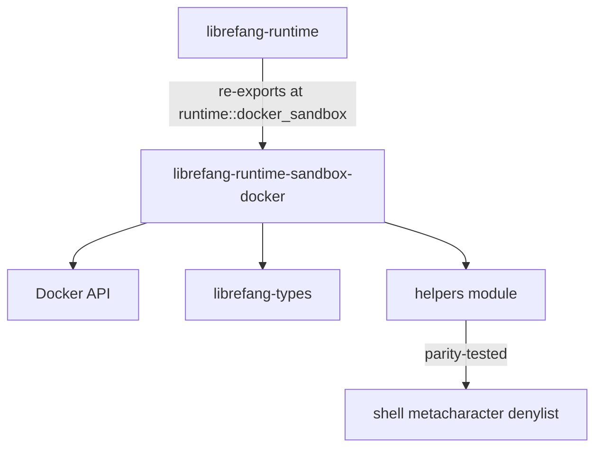

# Other — librefang-runtime-sandbox-docker

# librefang-runtime-sandbox-docker

Docker container sandbox for LibreFang tool execution. Provides OS-level isolation by spawning commands inside Docker containers with strict resource limits, network isolation, and capability dropping.

Part of the [#3710 god-crate split](https://github.com/librefang/librefang/issues/3710) — Phase 1.

## Architecture

```mermaid
graph TD
    A[librefang-runtime] -->|"re-exports at runtime::docker_sandbox"| B[librefang-runtime-sandbox-docker]
    B --> C[Docker API]
    B --> D[librefang-types]
    B --> E[helpers module]
    E -->|"parity-tested"| F[shell metacharacter denylist]
```

## Where This Fits

This crate was extracted from `librefang-runtime` as a standalone module. The parent crate re-exports it at the historical path `runtime::docker_sandbox`, so downstream call sites do not need to change imports.

It is gated behind the `docker-sandbox` feature flag on `librefang-runtime`, which is **enabled by default**.

### Integration Points

| Direction | Crate | Path / Mechanism |
|-----------|-------|------------------|
| Re-exported by | `librefang-runtime` | `runtime::docker_sandbox` |
| Feature flag | `librefang-runtime` | `docker-sandbox` (default-on) |
| Parity tests | `librefang-runtime/tests/` | `docker_sandbox_helpers_parity.rs` |
| Depends on | `librefang-types` | Shared type definitions |

## Security Model

The sandbox enforces several layers of isolation:

- **Resource limits** — CPU and memory constraints on spawned containers
- **Network isolation** — Containers run without network access
- **Capability dropping** — Linux capabilities are stripped from container processes
- **Shell metacharacter inspection** — User-supplied commands are vetted against a denylist via the helpers module

The shell metacharacter denylist is parity-tested against the parent crate's implementation in `crates/librefang-runtime/tests/docker_sandbox_helpers_parity.rs` to ensure consistent behavior across both locations.

## Dependencies

| Dependency | Purpose |
|------------|---------|
| `librefang-types` | Shared type definitions for the LibreFang workspace |
| `tokio` | Async runtime for container lifecycle management |
| `tracing` | Structured logging and instrumentation |
| `dashmap` | Concurrent hashmap for tracking active containers |
| `chrono` | Timestamp handling for container metadata |
| `sha2` | SHA hashing — likely for container image or config digesting |

## Contributing

When modifying this crate, ensure:

1. The helpers module remains parity-tested with the parent crate — run `docker_sandbox_helpers_parity.rs` in `librefang-runtime/tests/`.
2. The re-export path `runtime::docker_sandbox` in `librefang-runtime` continues to work.
3. Feature flag semantics (`docker-sandbox`, default-on) are preserved.
4. All new shell metacharacter rules are added to both this crate and the parity test.

## References

- [Workspace README](../../README.md)
- [librefang-runtime README](../librefang-runtime/README.md)