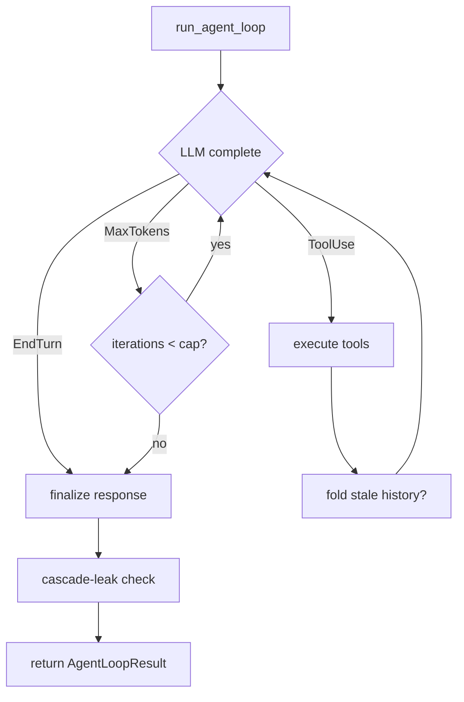

# Other — librefang-runtime-src

# librefang-runtime — Agent Loop Test Suite

The `agent_loop::tests` module validates the core agent loop's iteration semantics, response handling, tool execution, and safety guards. The tests are organized into four submodules, each exercising a distinct concern through mock LLM drivers and in-memory sessions.

## Module Layout

```
agent_loop/tests/
├── mod.rs           # Unit tests for helpers, constants, sanitizers, guards
├── integration.rs   # End-to-end async tests with mock LLM drivers
├── recovery.rs      # Text-to-tool-call pattern recovery edge cases
├── sender.rs        # Sender prefix injection, PII filter ordering
└── utilities.rs     # Session trimming, history resolution, tool-call metrics
```

## Architecture Overview

The agent loop (`run_agent_loop` / `run_agent_loop_streaming`) is the central orchestration point. It:

1. Sends a user message through an `LlmDriver`
2. Inspects the response for `StopReason` (EndTurn, ToolUse, MaxTokens)
3. Executes tool calls and feeds results back to the driver
4. Repeats until EndTurn or an iteration cap is hit



The test suite pins the behavior of every branching point in this flow.

## Mock Driver Infrastructure

Integration tests rely on mock `LlmDriver` implementations that simulate specific LLM response patterns without network calls. Each driver uses an `AtomicU32` call counter to vary responses across iterations.

| Driver | Behavior | Purpose |
|--------|----------|---------|
| `NormalDriver` | Single `EndTurn` with text | Baseline sanity check |
| `EmptyAfterToolUseDriver` | Iter 0: `ToolUse`, iter 1: empty `EndTurn` | Reproduces empty-after-tool bug |
| `FailThenTextDriver` | Iter 0: `ToolUse`, iter 1: text `EndTurn` | Recovery after tool failure |
| `AlwaysFailingToolDriver` | Every iter: `ToolUse` for nonexistent tool | Triggers `RepeatedToolFailures` cap |
| `EmptyMaxTokensDriver` | Every iter: empty `MaxTokens` | Triggers max continuations fallback |
| `EmptyThenNormalDriver` | Iter 0: empty `EndTurn`, iter 1: text | Tests one-shot retry on empty first response |
| `AlwaysEmptyDriver` | Every iter: empty `EndTurn` | Verifies fallback when retry also fails |
| `DirectiveDriver` | Configurable text + stop reason | Reply-directive preservation tests |
| `MultiToolCycleDriver` | N tool-use rounds then `EndTurn` | History-fold integration |
| `FoldSummaryDriver` | Fixed summary text | Deterministic aux-LLM fold summarization |
| `TextToolCallDriver` | Text with `<function=...>` tags, no `tool_calls` | Text-to-tool-call recovery E2E |

All integration tests construct sessions via `MemorySubstrate::open_in_memory` and call `run_agent_loop` or `run_agent_loop_streaming` with these drivers and a `test_manifest()` agent configuration.

## Key Test Categories

### Empty Response Guards (`integration.rs`, `mod.rs`)

When the LLM returns no text content, the loop must not surface empty strings to users. The `finalize_end_turn_text` function implements a three-tier fallback:

1. **Final text present** → use it directly
2. **Final text empty + accumulated buffer non-empty** → use accumulated buffer from prior iterations
3. **Both empty** → emit a canned guard message ("Task completed" if tools ran, "empty response" if not)

Tests verify this for both `run_agent_loop` and `run_agent_loop_streaming`, including after tool-use cycles and under `MaxTokens` overflow.

### Text-to-Tool-Call Recovery (`recovery.rs`)

Some providers (notably Groq/Llama) output tool calls as inline text instead of structured `ToolUse` content blocks. The `recover_text_tool_calls` function scans LLM output for nine recognized patterns:

| # | Pattern | Example |
|---|---------|---------|
| 1 | `<function=NAME>{JSON}</function>` | `<function=web_search>{"query":"rust"}</function>` |
| 2 | `<function>NAME{JSON}</function>` | `<function>web_search{"query":"rust"}</function>` |
| 3 | `<tool>NAME{JSON}</tool>` | `<tool>exec{"command":"ls"}</tool>` |
| 4 | `` `NAME {JSON}` `` (backtick-wrapped) | `` `exec {"command":"pwd"}` `` |
| 5 | Markdown code block with `NAME {JSON}` | `` ```\nexec {"command":"ls"}\n``` `` |
| 6 | `[TOOL_CALL]...[/TOOL_CALL]` with JSON or arrow syntax | Issue #354 format |
| 7 | `◁...▸` XML-style delimiters (Qwen3) | `◁{"name":"exec",...}▸` |
| 8 | Bare JSON tool call object | `{"name":"exec", "arguments":{...}}` |
| 9 | `<function name="..." parameters="..."/>` (XML attributes) | Self-closing variant |

Recovered calls are matched against the registered `ToolDefinition` list — unknown tools and invalid JSON are silently rejected. Duplicate detection across patterns prevents the same call from being promoted twice.

Helper functions under test include:
- `parse_dash_dash_args` — parses `{--key "value", --flag}` arrow syntax from pattern 6
- `parse_json_tool_call_object` — extracts name/arguments from `{"name":..., "arguments":...}` objects, supporting `"function"` and `"parameters"` field aliases

### Cascade Leak Detection (`integration.rs`, `mod.rs`)

The cascade-leak guard prevents the LLM from echoing back conversation metadata (envelope headers, turn frames like "User asked: ... I responded: ...") as if it were a real reply. The `is_cascade_leak` function counts structural markers:

- **Structural markers**: `[Group message from X]`, `[In risposta a: "Y"]`, `[Forwarded]`, `[Stranger]`, `[User]`
- **Turn frames**: `User asked:`, `I responded:`
- **Thematic headers**: `## Calendar`, `## Tasks`

Two or more structural markers, or one structural + one turn frame, triggers the leak guard. The response is silently dropped (`result.silent = true`, `result.response = ""`). Crucially, thematic headers alone are **not** flagged — a response like "## Calendar\n...\n## Tasks\n..." is legitimate content.

The `sanitize_for_memory` function strips known envelope prefixes from inbound user messages before they are persisted, preventing legacy memory rows from continuously re-triggering the guard.

The test suite verifies cascade-leak handling across four paths:
- Non-streaming `EndTurn`
- Streaming `EndTurn`
- Streaming `ToolUse` (the leak guard must prevent tool execution even when stop reason is `ToolUse`)
- Streaming `MaxTokens`

### Sender Prefix Logic (`sender.rs`)

For group conversations and DM channels, the agent loop prepends a sender identity prefix (`[Alice]: `) to the user message before sending it to the LLM. This gives the model context about who is speaking.

Key functions:
- **`sanitize_sender_label`** — strips injection characters (`]`, `:`, `[`, newlines) from display names, truncates to 64 characters, falls back to `"user"` on empty/all-invalid input
- **`build_sender_prefix`** — constructs `[display_name]: ` or `[user_id]: `, with channel-specific carve-outs for `webui`, `cron`, and `autonomous` (system channels where identity is a placeholder)
- **`build_automation_marker_prefix`** — adds `[Scheduled trigger]` or `[Autonomous trigger]` markers for non-human invocation channels

The prefix is applied **after** PII redaction, so display names survive the filter while message body content is redacted normally.

### History Folding (`integration.rs`)

The `maybe_fold_stale_tool_results` function replaces old tool-result messages with compact `[history-fold]` stubs to keep the context window manageable. The test exercises the full pipeline:

- **`MultiToolCycleDriver`** generates 10 tool-use rounds, driving the message history past the `fold_after_turns` threshold
- **`FoldSummaryDriver`** provides deterministic aux-LLM summaries
- The test asserts that at least one `ToolResult` block in the primary driver's received messages starts with `[history-fold]`

A dedicated persistence test verifies that fold rewrites are:
1. Applied to the working message clone
2. Replayed onto `session.messages` (the durable store)
3. Accompanied by `mark_messages_mutated()` advancing `messages_generation`
4. Idempotent — a second fold pass on already-folded messages does not rewrite again

### Silent Response Contract (`mod.rs`)

The `build_silent_agent_loop_result` constructor enforces that `silent == true` implies `response == ""`. No sentinel string (not even `NO_REPLY`) ever escapes the runtime as visible text. A grep-guard test (`silent_response_single_source_of_truth`) ensures the `NO_REPLY` literal appears only in an allow-listed set of source files, preventing ad-hoc checks from diverging from the canonical `silent_response::is_silent_response` detector.

### Tool Resolution and Caching (`mod.rs`)

`resolve_request_tools` implements lazy tool loading: when the available tool pool exceeds `LAZY_TOOLS_THRESHOLD` and `tool_load` is present, only a subset is sent to the LLM. If `tool_load` is absent, the function falls back to the full eager list — otherwise non-native tools would be silently stripped with no recovery path.

`ResolvedToolsCache` (`Arc<Vec<ToolDefinition>>`) avoids re-cloning the resolved list on every iteration. The cache invalidates when `session_loaded_tools` grows (a new tool was loaded mid-turn) but stays stable when the input hasn't changed, verified via `Arc::ptr_eq`.

### Hallucinated Action Detection (`mod.rs`)

`looks_like_hallucinated_action` catches LLM claims of completing domain operations that it did not actually perform. Detection covers:

- **English**: "I've created the file...", "I've sent the message...", "Order has been placed."
- **Italian present perfect** (`ho` + past participle): "Ho registrato la spesa...", "Ho inviato il messaggio..."
- **Italian impersonal passive**: "Il messaggio è stato inviato.", "Operazione completata."

Neutral phrasing ("Vuoi che registri questa spesa?") and common-but-ambiguous words ("fatto") are intentionally excluded to avoid false positives that would burn an in-loop iteration.

### Progress Text Leak Detection (`mod.rs`)

`is_progress_text_leak` identifies short LLM outputs that are progress indicators leaked through the text channel — e.g., "Let me check that..." or "Processing..." with an ellipsis terminator. The guard only fires for text under 120 characters ending in `...` or `…`. Longer responses with ellipsis endings are treated as legitimate content.

### Accumulated Text Buffer (`mod.rs`)

`push_accumulated_text` manages a bounded buffer that accumulates text across iterations. The buffer:
- Joins entries with `\n\n`
- Caps at `ACCUMULATED_TEXT_MAX_BYTES`
- Preserves the existing prefix when truncating (the initial content stays intact)
- Short-circuits additional pushes once sealed at the cap

## Test Helpers

- **`test_manifest()`** — returns a minimal `AgentManifest` with name `"test-agent"` and a basic system prompt
- **`fake_tool(name)`** — creates a `ToolDefinition` with a trivial JSON schema
- **`cascade_leak_fixture()`** — provides a pre-configured `(MemorySubstrate, Session, AgentManifest, Arc<dyn LlmDriver>)` tuple for cascade-leak tests
- **`resolve_max_iterations(manifest_cap, opts_cap)`** — mirrors the loop's iteration cap resolution: manifest > options > `MAX_ITERATIONS` default

## Constants Under Test

| Constant | Value | Location |
|----------|-------|----------|
| `MAX_ITERATIONS` | `AutonomousConfig::DEFAULT_MAX_ITERATIONS` | `agent_loop/types.rs` |
| `DEFAULT_MAX_HISTORY_MESSAGES` | 60 | history module |
| `ACCUMULATED_TEXT_MAX_BYTES` | defined in `message.rs` | bounded buffer cap |
| `MAX_RETRIES` | 3 | retry module |
| `BASE_RETRY_DELAY_MS` | 1000 | retry module |
| `LAZY_TOOLS_THRESHOLD` | defined in `tool_resolution` | lazy mode trigger |
| `MIN_HISTORY_MESSAGES` | defined in `history` | minimum messages to preserve |

## Integration with the Wider Codebase

The test module depends on:

- **`librefang-memory`** — `MemorySubstrate::open_in_memory` for session storage without disk I/O
- **`librefang-types`** — `AgentManifest`, `Session`, `ToolDefinition`, `ContentBlock`, `StopReason`, `TokenUsage`, `CompletionRequest`/`CompletionResponse`, privacy and tool-results config types
- **`crate::aux_client::AuxClient`** — secondary LLM client for history-fold summarization
- **`crate::pii_filter::PiiFilter`** — redaction engine applied before sender prefix injection
- **`crate::history_fold`** — `FoldConfig`, `maybe_fold_stale_tool_results`
- **`crate::silent_response`** — `ENVELOPE_LINE_PREFIXES`, `ENVELOPE_STANDALONE_MARKERS`, cascade-leak detection constants
- **`crate::reply_directives`** — `DirectiveSet` for `[[reply:...]]` and `[[@current]]` parsing