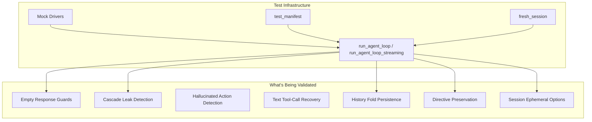

# Other — librefang-runtime-src

# Agent Loop Test Suite (`librefang-runtime/src/agent_loop/tests/`)

## Overview

This is the test module for the agent loop — the core iterative conversation engine that drives LLM completion, tool execution, response assembly, and session persistence. The tests validate correctness guards for edge cases that have caused production incidents: empty responses, cascade leaks, hallucinated actions, and lost metadata across streaming/non-streaming paths.

The test suite is organized into four submodules:

| Module | Focus |
|---|---|
| `mod.rs` | Unit tests for utilities, sanitizers, leak detectors, tool resolution caching, and invariant guards |
| `integration.rs` | End-to-end integration tests with mock LLM drivers driving `run_agent_loop` and `run_agent_loop_streaming` |
| `recovery.rs` | Exhaustive coverage of text-to-tool-call recovery across 9+ model-specific output patterns |
| `sender.rs` / `utilities.rs` | Message preparation, session repair, tool staging, and proactive memory (not shown in source) |

## Architecture


```mermaid
graph TD
    subgraph "Test Infrastructure"
        MD[Mock Drivers]
        TM[test_manifest]
        FS[fresh_session]
        RAL["run_agent_loop / run_agent_loop_streaming"]
    end

    subgraph "What's Being Validated"
        ER[Empty Response Guards]
        CL[Cascade Leak Detection]
        HF[Hallucinated Action Detection]
        TF[Text Tool-Call Recovery]
        HR[History Fold Persistence]
        DP[Directive Preservation]
        SP[Session Ephemeral Options]
    end

    MD --> RAL
    TM --> RAL
    FS --> RAL
    RAL --> ER
    RAL --> CL
    RAL --> DP
    RAL --> SP
    RAL --> HR
```

## Mock Driver Infrastructure

All integration tests inject mock `LlmDriver` implementations that return deterministic `CompletionResponse` values without network calls. Each driver simulates a specific LLM misbehavior.

### Available Mock Drivers

| Driver | Behavior | Tests |
|---|---|---|
| `NormalDriver` | Returns `"Hello from the agent!"` with `EndTurn` | Sanity baseline — normal responses pass through unchanged |
| `EmptyAfterToolUseDriver` | Call 0: `ToolUse` with no text. Call 1: empty `EndTurn` | Empty response after tool-use cycle returns fallback, not empty string |
| `EmptyMaxTokensDriver` | Always returns empty content with `MaxTokens` | Max continuations cap returns fallback message |
| `EmptyThenNormalDriver` | Call 0: empty `EndTurn`. Call 1: normal text | Iteration-0 empty response retry logic |
| `AlwaysEmptyDriver` | Always returns empty `EndTurn` | Fallback when retry also fails |
| `AlwaysFailingToolDriver` | Always emits tool call for unregistered tool | `RepeatedToolFailures` circuit breaker |
| `FailThenTextDriver` | Call 0: tool call. Call 1: text response | Loop retries after tool failure |
| `DirectiveDriver` | Returns configurable text with `[[reply:...]]` directives | Directive parsing in `EndTurn` and `MaxTokens` paths |
| `NotifyOwnerThenMaxTokensDriver` | Call 0: `notify_owner` tool. Call 1+: `MaxTokens` (optional tool calls) | Owner notice, `actual_provider`, session persistence with continuations |
| `CascadeLeakTimedOutDriver` | Streams text then returns `LlmError::TimedOut` | Cascade leak suppression of timeout partial text |
| `MultiToolCycleDriver` | N tool-use rounds then `EndTurn`; records all `CompletionRequest` messages | History fold stub appearance in LLM request |
| `FoldSummaryDriver` | Returns deterministic fold summary | Aux driver for history fold summarization |

All drivers use `AtomicU32` call counters for thread-safe state tracking in async contexts.

### Helper Functions

- **`test_manifest()`** — Returns a minimal `AgentManifest` with a test agent name and system prompt.
- **`fresh_session()`** — Creates a new in-memory `Session` with fresh IDs and no messages.
- **`fake_tool(name)`** — Creates a `ToolDefinition` with a JSON object schema.
- **`notify_owner_tool_definition()`** — Returns the `notify_owner` tool definition used in owner-notice tests.
- **`run_streaming_for_test()`** — Wraps `run_agent_loop_streaming` with sensible defaults for test ergonomics.

## Key Behaviors Validated

### Empty Response Guards

The agent loop must never return an empty string to the caller. `finalize_end_turn_text` implements a three-way fallback:

1. **Final text non-empty** → use it (accumulated buffer ignored)
2. **Final text empty + accumulated non-empty** → use accumulated buffer
3. **Both empty** → emit canned guard message:
   - Tools were executed → `"Task completed"`
   - No tools → `"empty response"` message

Tests cover this for both `run_agent_loop` and `run_agent_loop_streaming` paths, including the iteration-0 retry that gives the LLM a second chance before emitting the fallback.

### Cascade Leak Detection

`is_cascade_leak` detects when the LLM leaks internal conversation structure (envelope markers like `[Group message from ...]` plus turn frames like `User asked:` / `I responded:`) into its output. The detector requires **two or more** structural markers to trip — single markers and thematic-only headers (`## Calendar`, `## Tasks`) are legitimate and must not trigger false positives.

Key properties:
- Envelope prefixes (`ENVELOPE_LINE_PREFIXES`) are a subset of cascade structural markers — ensures `sanitize_for_memory` and the leak guard agree
- Thematic headers alone are legitimate (prevents false positives on help replies)
- The guard fires in both streaming and non-streaming paths, including when `stop_reason` is `ToolUse`
- Timeout partial text (`LlmError::TimedOut` with `partial_text`) is also suppressed when the cascade leak fires — no `TextDelta` events reach the caller

### Hallucinated Action Detection

`looks_like_hallucinated_action` catches when the LLM claims to have completed a domain action (file creation, message sending, payment booking) without actually calling a tool. It covers:

- **English**: `"I've created..."`, `"Successfully modified..."`, `"I've sent the message..."`
- **Italian present perfect**: `"Ho registrato..."`, `"Ho inviato..."`, `"Ho prenotato..."`
- **Italian impersonal**: `"è stato inviato"`, `"Operazione completata"`

Neutral text (`"Vuoi che registri questa spesa?"`) must never trigger — a false positive wastes an in-loop retry iteration.

### Reply Directive Preservation

Directives (`[[reply:msg_id]]`, `[[@current]]`) must survive through all response paths:
- Normal `EndTurn` — directives parsed, stripped from visible text
- `MaxTokens` partial — directives preserved even in short-circuited single-iteration path
- Streaming `MaxTokens` — identical preservation as non-streaming
- Streaming empty + `MaxTokens` — directives absent (correct, since no text to parse)

### Session Persistence and Ephemeral Options

Session saves respect three modes:

| Option | Persists Session? |
|---|---|
| Default | ✅ Yes |
| `incognito: true` | ❌ No |
| `is_fork: true` | ❌ No |

Tests verify persisted sessions contain the original user message, assistant partial, and (when continuations ran) the `"Please continue."` prompt — all verified against the in-memory `MemorySubstrate`.

### History Fold Persistence (Issue #4866)

`maybe_fold_stale_tool_results` must:
1. Rewrite stale `ToolResult` blocks in the working clone with `[history-fold]` stubs
2. **Replay the same rewrites onto `session.messages`** (the durable record)
3. Advance `messages_generation` via `mark_messages_mutated()` so `save_session_async` detects the mutation
4. Preserve every original `tool_use_id` — pairing invariant
5. **Skip rewriting on subsequent calls** (the `is_already_folded` short-circuit) — without this, every turn refolds from scratch

### Tool Resolution and Caching

`ResolvedToolsCache` provides `Arc<[ToolDefinition]>` caching with lazy/eager mode:

- **Lazy mode** (tool count > `LAZY_TOOLS_THRESHOLD` + `tool_load` present): trims to session-loaded tools
- **Eager fallback**: if `tool_load` is absent from the pool, returns full list regardless of threshold
- **Cache identity**: stable inputs return the same `Arc` (verified via `Arc::ptr_eq`)
- **Cache invalidation**: growing `session_loaded_tools` rebuilds the cache in lazy mode; non-lazy mode never rebuilds on session growth

### Text Tool-Call Recovery

`recover_text_tool_calls` parses tool calls from LLM text output when models fail to use proper structured tool-use fields. Supports 9+ patterns:

| Pattern | Example | Origin |
|---|---|---|
| `<function=NAME>JSON</function>` | `<function=web_search>{"query":"rust"}</function>` | Groq/Llama |
| `<function>NAME{JSON}</function>` | `<function>web_search{"query":"x"}</function>` | Variant format |
| `<tool>NAME{JSON}</tool>` | `<tool>exec{"command":"ls"}</tool>` | Alternative tag |
| Markdown code block | `` ```json\nweb_search {"query":"x"}\n``` `` | Some models |
| Backtick-wrapped | `` `exec {"command":"pwd"}` `` | Inline code |
| `[TOOL_CALL]...[/TOOL_CALL]` with JSON or arrow syntax | Issue #354 format | |
| `<Qwen-style tags>` | Issue #332 format | Qwen3 |
| Bare JSON object | `{"name":"exec","arguments":{...}}` | Fallback |
| XML attribute style | `<function name="..." parameters="..." />` | XML-structured output |

All patterns validate against the registered tool allowlist — unknown tools are silently rejected. Duplicate recovery across patterns is prevented. The parser handles nested JSON, stringified args, whitespace variants, and edge cases (unclosed tags, missing brackets).

## Constants Verified by Tests

| Constant | Value | Purpose |
|---|---|---|
| `MAX_ITERATIONS` | Matches `AutonomousConfig::DEFAULT_MAX_ITERATIONS` | Per-turn iteration cap |
| `MAX_RETRIES` | 3 | LLM retry attempts |
| `BASE_RETRY_DELAY_MS` | 1000 | Retry backoff base |
| `DEFAULT_MAX_HISTORY_MESSAGES` | 60 | History window size |
| `ACCUMULATED_TEXT_MAX_BYTES` | (defined in `message` module) | Buffer growth cap |

## Invariant Guards

### `silent_result_has_empty_response`

When `result.silent == true`, `result.response` must be `""`. No sentinel string ever escapes the runtime as visible text. Enforced by `build_silent_agent_loop_result`.

### `silent_response_single_source_of_truth`

A grep-guard test that enforces the literal `NO_REPLY` appears only in an explicit allow-list of files. Any new occurrence must either delegate to the canonical `silent_response::is_silent_response` detector or be added to the allow-list with rationale. This prevents divergent silent-detection logic from accumulating across the codebase.

### `envelope_prefixes_are_a_subset_of_cascade_structural_markers`

Every envelope that `sanitize_for_memory` strips must also be detectable by `is_cascade_leak`. Without this invariant, a legacy memory row containing an envelope would keep tripping the leak guard without ever being repaired.

## Adding New Tests

1. **For a new mock driver**: implement `LlmDriver` with `AtomicU32` call counting. Place the struct in `integration.rs` if used by multiple tests, or inline in the test function if single-use.

2. **For testing a new response path**: use `run_agent_loop` for non-streaming, `run_streaming_for_test` for streaming. Both accept the same mock driver infrastructure. Pass `&[]` for tools when testing tool-free paths.

3. **For new text recovery patterns**: add tests in `recovery.rs` following the existing pattern — create a `Vec<ToolDefinition>`, call `recover_text_tool_calls(text, &tools)`, assert on the returned calls. Verify both valid and unknown-tool rejection.

4. **For session persistence tests**: use `MemorySubstrate::open_in_memory(0.01)` and verify via `memory.get_session(session.id)` after the loop completes.