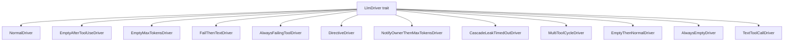

# Other — librefang-runtime-src

# Agent Loop Test Suite (`librefang-runtime/src/agent_loop/tests/`)

## Purpose

This directory contains the unit and integration tests for the agent loop — the core execution engine that drives LLM completions, tool execution, history management, and response finalization. The tests verify correctness of:

- Empty-response fallback behavior
- Max-tokens continuation and session persistence
- Tool-call recovery from malformed LLM output
- Cascade-leak detection and suppression
- History-fold integration with session persistence
- Silent-response handling (`NO_REPLY`, progress-text leaks)
- Reply-directive parsing (`[[reply:...]]`, `[[@current]]`)
- Resolved-tools cache invalidation
- Ephemeral session modes (incognito, fork)
- Sender-prefix construction and sanitization

## Module Structure

| File | Scope |
|------|-------|
| `mod.rs` | Unit tests for pure functions, constant invariants, cache behavior, cascade-leak detection, text sanitization, hallucinated-action detection |
| `integration.rs` | End-to-end integration tests with mock `LlmDriver` implementations driving `run_agent_loop` / `run_agent_loop_streaming` |
| `recovery.rs` | Exhaustive tests for all nine text-to-tool-call recovery patterns |
| `sender.rs` | Tests for sender-prefix construction, message injection, and context trimming |
| `utilities.rs` | Tests for staged tool-use turns, session save behavior, and helper utilities |

## Mock Driver Architecture

Integration tests inject mock `LlmDriver` implementations to control LLM behavior deterministically. Each driver simulates a specific scenario:


```mermaid
graph TD
    LlmDriver[LlmDriver trait]
    LlmDriver --> NormalDriver
    LlmDriver --> EmptyAfterToolUseDriver
    LlmDriver --> EmptyMaxTokensDriver
    LlmDriver --> FailThenTextDriver
    LlmDriver --> AlwaysFailingToolDriver
    LlmDriver --> DirectiveDriver
    LlmDriver --> NotifyOwnerThenMaxTokensDriver
    LlmDriver --> CascadeLeakTimedOutDriver
    LlmDriver --> MultiToolCycleDriver
    LlmDriver --> EmptyThenNormalDriver
    LlmDriver --> AlwaysEmptyDriver
    LlmDriver --> TextToolCallDriver
```

### Driver Catalog

| Driver | Behavior | Used For |
|--------|----------|----------|
| `NormalDriver` | Returns fixed text with `EndTurn` | Sanity check: normal responses pass through unchanged |
| `EmptyAfterToolUseDriver` | Call 0: `ToolUse` with no text; Call 1: `EndTurn` with empty content | Verifying fallback text when LLM goes silent after a tool cycle |
| `EmptyMaxTokensDriver` | Always returns empty content with `MaxTokens` | Hitting `MAX_CONTINUATIONS` cap and asserting fallback message |
| `FailThenTextDriver` | Call 0: tool call to unregistered tool; Call 1: normal text | Verifying retry after tool failure |
| `AlwaysFailingToolDriver` | Always emits `ToolUse` for `nonexistent_tool` | Triggering `RepeatedToolFailures` circuit breaker |
| `DirectiveDriver` | Returns configurable text and `StopReason` | Testing `[[reply:...]]` and `[[@current]]` directive preservation |
| `NotifyOwnerThenMaxTokensDriver` | Call 0: `notify_owner` tool; subsequent: `MaxTokens` partial text | Verifying `owner_notice` and `actual_provider` survive max-tokens path |
| `CascadeLeakTimedOutDriver` | Streams text with structural markers, then returns `TimedOut` error | Asserting cascade-leak guard suppresses partial text on timeout |
| `MultiToolCycleDriver` | Configurable N tool-use rounds then `EndTurn`; records all `CompletionRequest` messages | History-fold integration: verifying `[history-fold]` stubs appear in LLM requests |
| `EmptyThenNormalDriver` | Call 0: empty `EndTurn`; Call 1: normal text | One-shot retry recovery for iteration-0 empty responses |
| `AlwaysEmptyDriver` | Always returns empty `EndTurn` | Verifying fallback when retry also produces empty response |

## Test Categories

### 1. Empty Response Guards

The loop must never surface an empty string to the caller. `finalize_end_turn_text` implements a three-way fallback:

1. **Final text present** → use it (accumulated buffer ignored)
2. **Final text empty, accumulated buffer non-empty** → use accumulated buffer
3. **Both empty** → emit canned guard message ("Task completed" if tools ran, "empty response" otherwise)

Tests: `test_empty_response_after_tool_use_returns_fallback`, `test_empty_response_max_tokens_returns_fallback`, `test_empty_first_response_retries_and_recovers`, `test_empty_first_response_fallback_when_retry_also_empty`, and streaming equivalents.

### 2. Cascade-Leak Detection

The cascade-leak guard prevents LLM-generated framing text (envelope prefixes like `[Group message from Alice]`, turn-frame markers like `User asked: ... I responded: ...`) from escaping to users. Detection requires **two or more structural markers** — a single marker or thematic-only headers (`## Calendar`) are legitimate.

Key invariant: `result.silent == true` implies `result.response.is_empty()`. No sentinel string ever reaches the caller.

Tests: `is_cascade_leak_trips_on_two_or_more_markers`, `thematic_headers_alone_are_legitimate`, `cascade_leak_guard_drops_endturn_in_non_streaming_path`, `cascade_leak_guard_drops_endturn_in_streaming_path`, `cascade_leak_guard_aborts_tool_use_stop_reason_in_streaming_path`, `cascade_leak_guard_suppresses_timeout_partial_text_delta_in_streaming_path`.

### 3. History Fold Persistence

`maybe_fold_stale_tool_results` rewrites stale tool-result entries into compact `[history-fold]` stubs. The integration test verifies:

- The working message clone carries fold stubs
- `session.messages` is also rewritten (regression for issue #4866 — without this, every turn refolds from scratch)
- `messages_generation` advances so `save_session_async` detects the mutation
- All original `tool_use_id` values are preserved (pairing invariant)
- A second call on already-folded session is a no-op (generation stays the same)

Test: `maybe_fold_stale_tool_results_persists_rewrites_to_session_messages`, `test_history_fold_stub_appears_in_llm_request_after_enough_tool_cycles`.

### 4. Text-to-Tool-Call Recovery

When models output tool calls as prose instead of structured `tool_calls` fields, `recover_text_tool_calls` extracts them using nine pattern matchers:

| Pattern | Syntax | Example |
|---------|--------|---------|
| 1 | `<function=NAME>{JSON}</function>` | `<function=web_search>{"query":"rust"}</function>` |
| 2 | `<function>NAME{JSON}</function>` | `<function>web_search{"query":"rust"}</function>` |
| 3 | `<tool>NAME{JSON}</tool>` | `<tool>exec{"command":"ls"}</tool>` |
| 4 | Markdown code block | `` ```exec {"command":"ls"}` `` |
| 5 | Backtick-wrapped | `` `exec {"command":"ls"}` `` |
| 6 | `[TOOL_CALL]...[TOOL_CALL]` | `[TOOL_CALL]\n{"name":"exec","arguments":{...}}\n[/TOOL_CALL]` |
| 7 | `tiche...tugri` XML-like (Qwen3) | `tiche\n{"name":"exec","arguments":{...}}\ntugri` |
| 8 | Bare JSON object | `{"name":"exec","arguments":{"command":"ls"}}` |
| 9 | XML-attribute self-closing | `<function name="exec" parameters="{...}" />` |

All patterns validate tool names against the registered `available_tools` list and skip unknown tools or invalid JSON. Deduplication prevents the same call from matching multiple patterns.

Tests in `recovery.rs` cover each pattern individually, plus edge cases: nested JSON, surrounding text, unclosed tags, missing brackets, empty JSON objects, mixed valid/invalid calls, stringified arguments, escaped quotes, arrow syntax, and cross-pattern deduplication.

### 5. Ephemeral Session Modes

When `LoopOptions` has `incognito: true` or `is_fork: true`, session persistence is suppressed on max-tokens overflow. The tests verify both streaming and non-streaming paths:

```rust
for (label, opts, should_persist) in [
    ("default", LoopOptions::default(), true),
    ("incognito", LoopOptions { incognito: true, .. }, false),
    ("fork", LoopOptions { is_fork: true, .. }, false),
]
```

Tests: `test_max_tokens_session_save_respects_ephemeral_options`, `test_max_tokens_session_save_respects_ephemeral_options_on_continuation`, and streaming equivalents.

### 6. Resolved Tools Cache

`ResolvedToolsCache` avoids re-cloning the full tool list on idle iterations. Key invariants:

- **Stable input** → same `Arc` returned (`Arc::ptr_eq` check)
- **Growing `session_loaded_tools`** → cache rebuilds with new tool included
- **Lazy mode off** → cache never rebuilds on `session_loaded` growth

Additionally, `resolve_request_tools` must fall back to the eager list when `tool_load` is absent from the pool (regression for PR #3047 — without this, non-native tools silently disappear).

### 7. Silent Response Single-Source-of-Truth

A grep-guard test (`silent_response_single_source_of_truth`) enforces that the `NO_REPLY` literal appears only in an explicit allow-list of files. Any new occurrence must either delegate to `silent_response::is_silent_response` or be added to the allow-list with rationale.

### 8. Message Sanitization

`sanitize_for_memory` strips known envelope prefixes (`[Group message from ...]`, `[In risposta a: ...]`, `[Forwarded]`, `[Stranger from ...]`) before persisting to memory. This prevents legacy memory rows from tripping the cascade-leak guard on future reads.

Invariant verified: every envelope prefix stripped by the sanitizer is also detected by `is_cascade_leak`.

### 9. Hallucinated-Action Detection

`looks_like_hallucinated_action` catches LLM claims of completed domain operations (file writes, message sends, transaction registrations, calendar bookings) that were never actually executed. Covers English present-perfect ("I've sent"), English passive ("Message has been sent"), Italian present-perfect ("Ho registrato"), and Italian impersonal passive ("Il messaggio è stato inviato").

### 10. Reply Directives

Directive parsing (`[[reply:msg_id]]`, `[[@current]]`) must survive across all exit paths: normal `EndTurn`, `MaxTokens` partial, streaming, and max-continuations overflow. The agent loop strips directives from the response text and populates `result.directives`.

## Helper Functions

### `test_manifest()`

Returns a minimal `AgentManifest` with name `"test-agent"` and a basic system prompt. Shared across all integration tests.

### `fake_tool(name)`

Creates a minimal `ToolDefinition` with the given name, suitable for tool-registry tests.

### `fresh_session()`

Creates a new empty `Session` with fresh IDs, used in streaming and non-streaming integration tests.

### `run_streaming_for_test(...)`

Thin wrapper around `run_agent_loop_streaming` that hides the many `None` parameters for the unused optional subsystems (media engine, Docker config, process manager, etc.).

### `assert_saved_max_tokens_session(...)`

Asserts that a persisted session contains expected messages after max-tokens overflow, checking for original user message, partial assistant text, and optional continuation prompt.

## Key Constants Verified

| Constant | Expected Value | Verified By |
|----------|---------------|-------------|
| `MAX_ITERATIONS` | `AutonomousConfig::DEFAULT_MAX_ITERATIONS` | `test_max_iterations_constant` |
| `DEFAULT_MAX_HISTORY_MESSAGES` | 60 | `test_max_history_messages_constant` |
| `MAX_RETRIES` | 3 | `test_retry_constants` |
| `BASE_RETRY_DELAY_MS` | 1000 | `test_retry_constants` |

## Adding New Tests

1. **Unit tests** for pure functions go in `mod.rs`. Use the existing pattern of direct function calls and assertions.

2. **Integration tests** requiring an LLM driver go in `integration.rs`. Create a new mock driver implementing `LlmDriver`, then call `run_agent_loop` or `run_streaming_for_test` with it. Use `test_manifest()` and `fresh_session()` for setup.

3. **Recovery pattern tests** go in `recovery.rs`. Create a tool list with `fake_tool()`, construct the text pattern, call `recover_text_tool_calls`, and assert on the returned `Vec<ToolCall>`.

4. When adding new mock drivers, use `AtomicU32` for call counting (as all existing drivers do) to ensure thread-safety even though tests run sequentially.