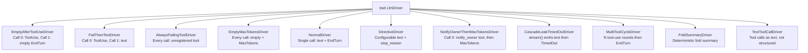

# Other — librefang-runtime-src

# librefang-runtime Test Suite: Agent Loop

## Overview

This module contains the complete test suite for the agent loop — the core iterative execution engine that drives LLM conversations, tool invocations, and response assembly. The tests span unit-level helper validation, integration-level loop behavior, and recovery-edge-case coverage for malformed tool call output.

The test suite lives under `librefang-runtime/src/agent_loop/tests/` and is organized into four submodules:

| File | Scope |
|------|-------|
| `mod.rs` | Unit tests for internal helpers, detectors, caches, and grep-guards |
| `integration.rs` | End-to-end agent loop tests using mock LLM drivers |
| `recovery.rs` | Edge-case tests for text-to-tool-call pattern recovery |
| `sender.rs` | Message sender prefix resolution tests |
| `utilities.rs` | General utility function tests |

---

## Test Infrastructure

### Mock LLM Drivers

Integration tests rely on composable mock implementations of the `LlmDriver` trait. Each mock simulates a specific LLM behavior pattern using an `AtomicU32` call counter to vary responses across iterations.


```mermaid
graph TD
    LlmDriver[trait LlmDriver]
    LlmDriver --> EmptyAfterToolUseDriver["EmptyAfterToolUseDriver<br/>Call 0: ToolUse, Call 1: empty EndTurn"]
    LlmDriver --> FailThenTextDriver["FailThenTextDriver<br/>Call 0: ToolUse, Call 1: text"]
    LlmDriver --> AlwaysFailingToolDriver["AlwaysFailingToolDriver<br/>Every call: unregistered tool"]
    LlmDriver --> EmptyMaxTokensDriver["EmptyMaxTokensDriver<br/>Every call: empty + MaxTokens"]
    LlmDriver --> NormalDriver["NormalDriver<br/>Single call: text + EndTurn"]
    LlmDriver --> DirectiveDriver["DirectiveDriver<br/>Configurable text + stop_reason"]
    LlmDriver --> NotifyOwnerThenMaxTokensDriver["NotifyOwnerThenMaxTokensDriver<br/>Call 0: notify_owner tool, then MaxTokens"]
    LlmDriver --> CascadeLeakTimedOutDriver["CascadeLeakTimedOutDriver<br/>stream() emits text then TimedOut"]
    LlmDriver --> MultiToolCycleDriver["MultiToolCycleDriver<br/>N tool-use rounds then EndTurn"]
    LlmDriver --> FoldSummaryDriver["FoldSummaryDriver<br/>Deterministic fold summary"]
    LlmDriver --> TextToolCallDriver["TextToolCallDriver<br/>Tool calls as text, not structured"]
```

Key driver behaviors:

- **EmptyAfterToolUseDriver** — Reproduces the bug where the LLM returns an empty response after a tool-use cycle. First call emits a `ToolUse` stop reason with no text; second call returns `EndTurn` with empty content.
- **AlwaysFailingToolDriver** — Every iteration emits a call to a nonexistent tool (`nonexistent_tool`), triggering the `RepeatedToolFailures` circuit breaker after `MAX_CONSECUTIVE_ALL_FAILED` consecutive failures.
- **NotifyOwnerThenMaxTokensDriver** — Simulates a multi-step scenario: first call invokes `notify_owner` (a registered tool), then subsequent calls return `MaxTokens` with partial text. An optional `final_tool_calls` flag controls whether continuation iterations also emit tool calls.
- **CascadeLeakTimedOutDriver** — Implements only the `stream()` method (the `complete()` path is marked unreachable). Emits a `TextDelta` containing structural markers, then returns `LlmError::TimedOut` with a partial text that also contains leak markers.
- **MultiToolCycleDriver** — Emits `N` tool-use rounds targeting the meta-tool `tool_search`, then finishes with `EndTurn`. Records all `CompletionRequest` message lists it receives for assertion.

### Shared Fixtures

**`test_manifest()`** — Produces a minimal `AgentManifest` with name `"test-agent"` and a basic system prompt. All integration tests use this as the baseline configuration.

**`fresh_session()`** — Creates a new in-memory `Session` with fresh IDs, no messages, and no model override.

**`fake_tool(name)`** — Constructs a `ToolDefinition` with a placeholder JSON schema, used for tool registration in tests.

**`cascade_leak_fixture()`** — Shared setup for cascade-leak tests: returns a `(MemorySubstrate, Session, AgentManifest, Arc<dyn LlmDriver>)` tuple with a `DirectiveDriver` configured to emit two structural markers.

### Loop Entry Points

Tests invoke the agent loop through two entry points:

- **`run_agent_loop`** — Non-streaming (synchronous) path. Tests pass a large number of `None` parameters for unused subsystems (media engine, Docker config, hooks, etc.) along with the mock driver and `LoopOptions`.
- **`run_streaming_for_test`** — Streaming path wrapper that calls `run_agent_loop_streaming` with an `mpsc::Sender<StreamEvent>`. Tests can inspect emitted events by draining the receiver after the loop completes.

---

## Integration Test Coverage

### Empty Response Guards

Three critical scenarios where the LLM produces no usable text:

| Test | Driver | Scenario | Expected Behavior |
|------|--------|----------|-------------------|
| `test_empty_response_after_tool_use_returns_fallback` | `EmptyAfterToolUseDriver` | ToolUse → empty EndTurn | Non-empty fallback containing "Permission denied" or "Task completed" |
| `test_empty_response_max_tokens_returns_fallback` | `EmptyMaxTokensDriver` | Repeated empty MaxTokens | Non-empty fallback containing "token limit" |
| `test_normal_response_not_replaced_by_fallback` | `NormalDriver` | Normal text EndTurn | Exact original text passes through unchanged |

The empty-first-response retry logic is also tested:

- **`test_empty_first_response_retries_and_recovers`** — Uses `EmptyThenNormalDriver`: iteration 0 returns empty `EndTurn`, triggering a one-shot retry; iteration 1 returns normal text. Asserts `iterations == 2` and correct recovered text.
- **`test_empty_first_response_fallback_when_retry_also_empty`** — Uses `AlwaysEmptyDriver`: both iterations return empty `EndTurn`. Asserts fallback message containing "empty response" (no-tools-executed variant).

### Reply Directive Preservation

The `DirectiveDriver` produces responses containing inline directives like `[[reply:msg_123]]` and `[[@current]]`. Tests verify that the loop strips these markers from the visible response text while preserving them in the `result.directives` field:

- **`test_success_response_preserves_reply_directives`** — EndTurn with directives: response = `"Visible reply"`, `reply_to = Some("msg_123")`, `current_thread = true`.
- **`test_max_tokens_partial_response_preserves_reply_directives`** — MaxTokens with directives: verifies short-circuit on iteration 1 (issue #2310 fix) and directive survival through the MaxTokens continuation path.
- **Streaming variants** — `test_streaming_max_continuations_with_directives_preserves_reply_directives` and `test_streaming_max_continuations_return_preserves_reply_directives` verify the same invariants on the streaming path.

### Owner Notice and Provider Tracking

The `NotifyOwnerThenMaxTokensDriver` exercises the `notify_owner` tool integration:

- **`test_max_tokens_owner_notice_and_actual_provider_survive_non_streaming`** — Asserts `result.owner_notice` contains the formatted `"[NOTIFY] handoff_needed: ..."` string and `result.actual_provider` carries the `"fallback-b"` value from the driver's second call.
- **`test_streaming_max_tokens_owner_notice_and_actual_provider_survive_result`** — Same assertions on the streaming path, plus verification that a `StreamEvent::OwnerNotice` was emitted on the channel.

### Session Persistence and Ephemeral Modes

Session save behavior is parameterized across three `LoopOptions` variants:

| Label | Options | Should Persist |
|-------|---------|---------------|
| `default` | `LoopOptions::default()` | ✅ |
| `incognito` | `incognito: true` | ❌ |
| `fork` | `is_fork: true` | ❌ |

Two test matrices cover this:

- **`test_max_tokens_session_save_respects_ephemeral_options`** — Non-continuation case (no tool calls in MaxTokens responses). Verifies the `"Please continue."` prompt is **absent** from persisted messages.
- **`test_max_tokens_session_save_respects_ephemeral_options_on_continuation`** — Continuation case (tool calls present in MaxTokens responses, hitting `MAX_CONTINUATIONS + 1` iterations). Verifies the continuation prompt **is present** when persisted.

Streaming equivalents (`test_streaming_max_tokens_session_save_respects_ephemeral_options` and its continuation variant) assert the same invariants.

Helper `assert_saved_max_tokens_session` validates persisted session contents:
- Original user message present
- MaxTokens assistant partial present
- Continuation prompt presence matches expectation

### History Fold Integration

**`test_history_fold_stub_appears_in_llm_request_after_enough_tool_cycles`** — Drives the loop through 10 `tool_search` cycles with `fold_after_turns=3` and `fold_min_batch_size=1`. The `MultiToolCycleDriver` records all `CompletionRequest` messages. The test asserts that at least one `ToolResult` block in a received request starts with `"[history-fold]"`, proving the fold path replaced stale tool results before the final LLM call.

**`maybe_fold_stale_tool_results_persists_rewrites_to_session_messages`** — Regression test for issue #4866 (axis 2). Verifies five invariants:

1. **Working copy folded** — The returned message list contains ≥8 fold stubs.
2. **Session durable copy folded** — `session.messages` carries the same stubs (without this, every turn re-folds from scratch).
3. **Generation advanced** — `session.messages_generation` incremented, ensuring `save_session_async` detects the mutation.
4. **tool_use_id pairing preserved** — All 10 original tool_use_ids remain in `session.messages`.
5. **Second-call no-op** — Re-running fold on an already-folded session does NOT advance `messages_generation`.

### Cascade Leak Detection

The cascade-leak guard prevents the agent from echoing back conversational context (envelopes, turn frames) that leaked into the LLM's context window.

**Non-streaming and streaming end-turn drops:**
- `cascade_leak_guard_drops_endturn_in_non_streaming_path`
- `cascade_leak_guard_drops_endturn_in_streaming_path`

Both use `cascade_leak_fixture()` with an emoji-only inbound message and a `DirectiveDriver` emitting two structural markers (`[Group message from Alice]` + `User asked: ... \n I responded: ...`). Assert `result.silent == true` and `result.response.is_empty()`.

**ToolUse stop-reason abort (M-2 regression):**
- `cascade_leak_guard_aborts_tool_use_stop_reason_in_streaming_path` — When the incremental cascade-leak guard fires mid-stream but the driver's final `ContentComplete` carries `StopReason::ToolUse`, the loop must NOT proceed to tool execution. Asserts silent drop with no tool invocation (empty tool registry ensures any execution would fail).

**Timeout partial text suppression:**
- `cascade_leak_guard_suppresses_timeout_partial_text_delta_in_streaming_path` — Uses `CascadeLeakTimedOutDriver` which emits `TextDelta` with structural markers then times out. Asserts the timeout error propagates but **no `TextDelta` events** were emitted on the stream channel — the cascade leak guard suppresses the partial text to prevent leaking context.

---

## Unit Test Coverage

### `push_accumulated_text` — Bounded Text Accumulation

Tests for the text buffer that accumulates partial responses across continuations:

- **Append with separator** — Second push joins with `"\n\n"`.
- **Cap enforcement** — Buffer sealed at exactly `ACCUMULATED_TEXT_MAX_BYTES`; prefix preserved; subsequent pushes ignored.
- **Empty initial** — No leading separator on first push.
- **Under-cap accumulation** — Many small pushes below the cap grow normally.

### `finalize_end_turn_text` — Three-Way Fallback

| Condition | Behavior |
|-----------|----------|
| Final text non-empty | Use final text, ignore accumulated buffer |
| Final text empty, accumulated non-empty | Use accumulated buffer |
| Both empty, tools executed | Guard message containing "Task completed" |
| Both empty, no tools | Guard message containing "empty response" |

### Tool Resolution and Caching

**`resolve_request_tools`** fallback logic:
- When the tool pool exceeds `LAZY_TOOLS_THRESHOLD` but does **not** include `tool_load`, lazy mode must bypass and return the full eager list (regression for PR #3047 — otherwise non-native tools silently disappear).

**`ResolvedToolsCache`** behavior:
- **Stable input reuses Arc** — Same pool + session_loaded → `Arc::ptr_eq` returns true.
- **Growing session_loaded rebuilds** — Adding a tool via `tool_load` invalidates the cache and includes the new tool.
- **Non-lazy mode never rebuilds** — When lazy mode is off, `session_loaded` changes are ignored.

### Sentinel Detection

**`is_no_reply`** — Detects the `NO_REPLY` token (with whitespace tolerance), `[no reply needed]` bracketed form, and bare `no reply needed` (exact match only). Multi-line prose ending with "no reply needed" intentionally does not match.

**`is_progress_text_leak`** — Catches ellipsis-terminated progress text like `"Waiting for the script to complete..."`. Over 120 characters, even with ellipsis, is treated as real content.

**`silent_response_single_source_of_truth`** — A grep-guard test that runs `grep -rln --include=*.rs NO_REPLY` across `crates/` and asserts the literal only appears in an explicit allow-list of files. Any new file using the literal must be added to the list or delegate to the canonical `is_silent_response` detector.

### Memory Sanitization

**`sanitize_for_memory`** strips known message envelope prefixes:
- `[Group message from X]`, `[In risposta a: "Y"]`, `[Replying to: "Y"]`
- `[Stranger from +39...]`, `[Forwarded]`, `[User]`

Key invariants tested:
- Inline brackets (not starting a line) are preserved.
- Envelope-only input returns `None` (prevents half-empty memory rows).
- Leading whitespace before envelopes is tolerated.
- The `:\"` variant (no space after colon) is handled.
- **Subset invariant**: every `ENVELOPE_LINE_PREFIXES` and `ENVELOPE_STANDALONE_MARKERS` entry must also be detected by `is_cascade_leak`, preventing unrepaired legacy memories.

### Cascade Leak Detection

**`is_cascade_leak`** requires ≥2 structural markers (envelope prefixes + turn frames). Thematic headers alone (`## Calendar`, `## Tasks`) are explicitly exempted — they represent legitimate help replies (houko-flagged false positive). Single markers in clean text do not trip.

### Hallucinated Action Detection

**`looks_like_hallucinated_action`** catches first-person claims of completed actions without tool backing:

- **English**: `"I've created the file"`, `"I've sent the message"`, `"Order has been placed."`
- **Italian present perfect**: `"Ho registrato la spesa"`, `"Ho inviato il messaggio"`, `"Ho bonificato 500 euro"`
- **Italian impersonal**: `"Il messaggio è stato inviato"`, `"Operazione completata"`, `"Bonifico effettuato"`

Neutral text like questions and conditional offers (`"Vuoi che registri questa spesa?"`) must not trigger.

**`user_message_has_action_intent`** — Companion function that checks whether the user's original message actually requested the claimed action, used to avoid false positives on the corrective retry path.

---

## Recovery Test Coverage (Text-to-Tool-Call Patterns)

The `recover_text_tool_calls` function extracts structured tool invocations from free-form LLM text output. This is critical for models (Groq/Llama, Qwen) that emit tool calls as prose rather than structured `tool_calls` fields.

### Supported Patterns

| Pattern | Example | Test |
|---------|---------|------|
| `<function=NAME>JSON</function>` | `<function=web_search>{"query":"rust"}</function>` | `test_recover_text_tool_calls_basic` |
| `<function>NAME{JSON}</function>` | `<function>web_fetch{"url":"https://x.com"}</function>` | `test_recover_variant2_basic` |
| `<tool>NAME{JSON}</tool>` | `<tool>exec{"command":"ls"}</tool>` | `test_recover_tool_tag_variant` |
| Markdown code block | ```` ```\nexec {"command": "ls"}\n``` ```` | `test_recover_markdown_code_block` |
| Backtick-wrapped | `` `exec {"command":"pwd"}` `` | `test_recover_backtick_wrapped` |
| `[TOOL_CALL]...[/TOOL_CALL]` | `[TOOL_CALL]\n{"name":"shell_exec",...}\n[/TOOL_CALL]` | `test_recover_tool_call_block_json` |
| `JsonObject JsonObject` (Qwen3) | `("{\"name\":\"shell_exec\",...}")` | `test_recover_tool_call_xml_basic` |
| Bare JSON object | `{"name":"shell_exec","arguments":{...}}` | `test_recover_bare_json_tool_call` |
| XML attribute style | `<function name="..." parameters="..." />` | `test_recover_xml_attribute_basic` |

### Deduplication

When the same tool call appears in multiple patterns, it is extracted only once (`test_recover_no_duplicates_across_patterns`).

### Validation Rules

- **Unknown tools rejected** — Only tools present in the provided `&[ToolDefinition]` are accepted.
- **Invalid JSON skipped** — Malformed JSON is silently ignored.
- **Unclosed tags skipped** — Missing `</function>` or `[/TOOL_CALL]` prevents extraction (though bare JSON fallback may still recover the call).
- **Bare JSON deprioritized** — When structured tags are present, bare JSON extraction is skipped to avoid double-extraction (`test_recover_bare_json_skipped_when_tags_found`).

### Helper Functions

**`parse_dash_dash_args`** — Parses `{--key "value", --flag}` syntax into a JSON map. Handles quoted values, unquoted values, and boolean flags.

**`parse_json_tool_call_object`** — Extracts tool name and arguments from a JSON object, accepting `"name"`/`"function"` as the name field and `"arguments"`/`"parameters"` as the args field. Supports stringified (double-encoded) argument values.

---

## Constants Verified by Tests

| Constant | Value | Test |
|----------|-------|------|
| `MAX_ITERATIONS` | `AutonomousConfig::DEFAULT_MAX_ITERATIONS` | `test_max_iterations_constant` |
| `DEFAULT_MAX_HISTORY_MESSAGES` | 60 | `test_max_history_messages_constant` |
| `MAX_RETRIES` | 3 | `test_retry_constants` |
| `BASE_RETRY_DELAY_MS` | 1000 | `test_retry_constants` |

---

## Silent Response Contract

The test `silent_result_has_empty_response` enforces a critical invariant: when `result.silent == true`, `result.response` must be `""`. No sentinel string (including `NO_REPLY`) may ever escape the runtime as visible text. The shared constructor `build_silent_agent_loop_result` enforces this.

---

## Adding New Tests

When adding integration tests:

1. **Choose or create a mock driver** — Implement `LlmDriver` with `AtomicU32`-based call counting. Keep driver logic minimal and deterministic.
2. **Use shared fixtures** — `test_manifest()`, `fresh_session()`, and `fake_tool()` reduce boilerplate.
3. **Test both paths** — Many behaviors (empty response fallback, directive preservation, cascade leak) must work identically on both `run_agent_loop` and `run_agent_loop_streaming`. Add both variants.
4. **Update the grep-guard allow-list** — If a new file references the `NO_REPLY` literal, add it to the `silent_response_single_source_of_truth` allow-list with a rationale comment.
5. **Use `tool_search` for multi-cycle tests** — The meta-tool succeeds against an empty registry, avoiding the `MAX_CONSECUTIVE_ALL_FAILED` circuit breaker that would abort the loop prematurely.