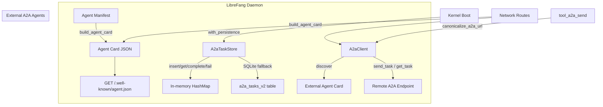

# Other — librefang-runtime-src

# librefang-runtime — A2A Protocol Module

## Overview

The `a2a` module implements Google's **A2A (Agent-to-Agent) Protocol**, enabling LibreFang agents to interoperate with external agent frameworks. It provides:

- **Agent Cards** — JSON capability manifests served at `/.well-known/agent.json` that describe what a LibreFang agent can do
- **Task coordination** — a structured unit-of-work exchange pattern (`tasks/send`, `tasks/get`, `tasks/cancel`) for cross-agent communication
- **Discovery** — boot-time fetching of external agents' cards to populate the known-agent registry
- **Persistent task tracking** — an in-memory + SQLite store that survives restarts


```mermaid
graph TD
    subgraph "LibreFang Daemon"
        A[Agent Manifest] -->|build_agent_card| B[Agent Card JSON]
        B --> C["GET /.well-known/agent.json"]
        D[A2aTaskStore] -->|insert/get/complete/fail| E["In-memory HashMap"]
        D -->|SQLite fallback| F["a2a_tasks_v2 table"]
        G[A2aClient] -->|discover| H["External Agent Card"]
        G -->|send_task / get_task| I["Remote A2A Endpoint"]
    end
    subgraph "External A2A Agents"
        H
        I
    end
    J[Kernel Boot] -->|with_persistence| D
    K["Network Routes"] --> G
    K -->|build_agent_card| B
    L["tool_a2a_send"] -->|canonicalize_a2a_url| G
```

---

## Data Model

### AgentCard

Served at `/.well-known/agent.json` per the A2A specification. Built from a LibreFang `AgentManifest` via `build_agent_card`.

| Field | Description |
|---|---|
| `name` | Agent display name |
| `description` | Human-readable description |
| `url` | Agent endpoint URL (`{base_url}/a2a`) |
| `version` | Protocol version (from `librefang_types::VERSION`) |
| `capabilities` | Streaming, push notifications, state transition history flags |
| `skills` | List of `AgentSkill` descriptors (one per tool in the manifest) |
| `default_input_modes` / `default_output_modes` | Content types (defaults to `["text"]`) |

### A2aTask

The core unit of work exchanged between agents. Tracks status, conversation messages, artifacts, and provenance metadata.

| Field | Description |
|---|---|
| `id` | Unique task identifier |
| `session_id` | Optional session for conversation continuity |
| `status` | Current `A2aTaskStatus` (wrapped to handle both string and object JSON forms) |
| `messages` | Conversation history (`Vec<A2aMessage>`) |
| `artifacts` | Outputs produced by the task (`Vec<A2aArtifact>`) |
| `agent_id` | Local agent that processed this task |
| `caller_a2a_agent_id` | External caller's identity (from `X-A2A-Agent-ID` header) |

### Task Status Lifecycle

```
Submitted → Working → Completed
                     → Failed
                     → Cancelled
                     → InputRequired → (caller provides input) → Working → ...
```

The `A2aTaskStatusWrapper` accepts two JSON encodings:
- **Bare string**: `"completed"`
- **Object form**: `{"state": "completed", "message": null}`

Both normalize to the same `A2aTaskStatus` via `wrapper.state()`.

### Messages and Artifacts

**`A2aMessage`** — a conversation turn with a `role` (`"user"` or `"agent"`) and a list of `A2aPart` content blocks:

- `A2aPart::Text` — plain text content
- `A2aPart::File` — base64-encoded file with MIME type
- `A2aPart::Data` — structured JSON data with MIME type

**`A2aArtifact`** — a task output, carrying optional `name`, `description`, `metadata`, `index`, `last_chunk` (for streaming), and a `parts` vector of `A2aPart`.

---

## A2aTaskStore

An in-memory + SQLite store that tracks task lifecycle across `tasks/send`, `tasks/get`, and `tasks/cancel` operations.

### Construction

```rust
// In-memory only, capacity 1000
let store = A2aTaskStore::new(1000);

// Custom TTL
let store = A2aTaskStore::with_ttl(500, Duration::from_secs(3600));

// Persistent (used by kernel boot)
let store = A2aTaskStore::with_persistence(1000, Path::new("/data/a2a_tasks.db"));
```

`with_persistence` is called from `boot_with_config` during kernel startup. It:
1. Opens/creates the SQLite database with WAL journal mode
2. Creates the `a2a_tasks_v2` schema (drops any legacy v1 table)
3. Prunes rows older than 7 days
4. Loads the most recent `max_tasks` rows into memory

### Eviction Policy

Applied lazily on every `insert`:

1. **TTL sweep** — removes all tasks whose `updated_at` exceeds `task_ttl` (default 24 hours), regardless of status. This prevents `Working`/`InputRequired` tasks from accumulating indefinitely.
2. **Capacity eviction** — if still at capacity after TTL sweep, evicts the oldest terminal-state task (`Completed`/`Failed`/`Cancelled`), falling back to the oldest task overall.

Persistence writes happen **before** eviction, so a task is always in SQLite even if it's immediately evicted from memory.

### SQLite Fallback on Read

`get(task_id)` first checks the in-memory map. On a miss, it queries the `a2a_tasks_v2` table directly. This ensures tasks evicted from memory (e.g., after a restart that loaded fewer rows than the DB contains) remain queryable by pollers.

### Key Operations

| Method | Description |
|---|---|
| `insert(task)` | Insert/upsert a task, trigger eviction, persist to SQLite |
| `get(task_id)` | Retrieve a task (memory → SQLite fallback) |
| `update_status(task_id, status)` | Transition a task's status, persist |
| `complete(task_id, response, artifacts)` | Append response message + artifacts, set `Completed` |
| `fail(task_id, error_message)` | Append error message, set `Failed` |
| `cancel(task_id)` | Set `Cancelled` |

### Database Schema

```sql
CREATE TABLE a2a_tasks_v2 (
    id                  TEXT PRIMARY KEY,
    status              TEXT NOT NULL,          -- JSON-serialized A2aTaskStatusWrapper
    session_id          TEXT,
    messages_json       TEXT NOT NULL,          -- JSON array of A2aMessage
    artifacts_json      TEXT NOT NULL,          -- JSON array of A2aArtifact
    agent_id            TEXT,
    caller_a2a_agent_id TEXT,
    created_at          INTEGER NOT NULL,       -- UNIX timestamp
    updated_at          INTEGER NOT NULL        -- UNIX timestamp
);
```

Persistence is best-effort: every in-memory mutation succeeds, but SQLite write failures log a `warn!` and degrade to in-memory-only behavior for the affected row.

---

## A2aClient

HTTP client for discovering and interacting with external A2A agents. Designed around per-request `reqwest::Client` instances to enable DNS pinning and SSRF protection.

### Construction

```rust
// Empty SSRF allowlist
let client = A2aClient::new();

// With allowlist (for private-network agents)
let client = A2aClient::new_with_allowlist(vec!["192.168.1.0/24".into()]);
```

Created by network route handlers (`a2a_send_external_inner`, `a2a_discover_external`, `a2a_external_task_status`) with the daemon's configured SSRF allowlist.

### SSRF Protection (Bug #3563)

Every outbound request:

1. Resolves DNS via `web_fetch::check_ssrf` to validate addresses against private IP ranges
2. Pins the resolved IPs via `ClientBuilder::resolve` so the HTTP stack cannot re-resolve to a different IP (closes DNS-rebinding TOCTOU window)
3. Sets redirect policy to `Policy::none` — no redirects are followed. A 3xx response surfaces as an error. This prevents redirect-based SSRF where the original hostname passes validation but the redirect target resolves to an internal IP.

### Response Size Capping (Bug #3785)

All remote responses are streamed through `read_capped_body`:

- **Agent Cards**: capped at 256 KiB (`MAX_AGENT_CARD_BYTES`)
- **Task payloads**: capped at 1 MiB (`MAX_A2A_TASK_BYTES`)
- Enforced both via `Content-Length` header check (upfront rejection) and per-chunk accumulation (mid-stream abort)
- Transport decompression is disabled to prevent gzip bombs from bypassing the byte count

### URL Canonicalization (Bug #3786)

`canonicalize_a2a_url(url)` normalizes peer URLs for trust-list comparison:

- Strips fragments and empty query strings
- Lowercases scheme and host
- Drops default ports (80 for HTTP, 443 for HTTPS)
- Returns `None` for URLs without a host

Used by trust insertion (`a2a_approve_external`), static seeding, and the gate at `/api/a2a/send` so cosmetic URL variations don't bypass or falsely deny access.

### Methods

| Method | A2A Method | Description |
|---|---|---|
| `discover(url)` | `GET /.well-known/agent.json` | Fetch and parse an external agent's card |
| `send_task(url, message, session_id)` | JSON-RPC `tasks/send` | Send a user message to an external agent, returns `A2aTask` |
| `get_task(url, task_id)` | JSON-RPC `tasks/get` | Poll task status from an external agent |

All methods send a `User-Agent: LibreFang/{version} A2A` header.

---

## Discovery at Boot

`discover_external_agents(agents)` is called from `start_background_agents` during kernel boot. It iterates over configured `ExternalAgent` entries, fetches each agent's card via `A2aClient::discover`, and returns `(canonical_url, AgentCard)` pairs. Failures are logged but do not prevent boot.

```rust
// In config.toml
[a2a]
enabled = true

[[a2a.external_agents]]
name = "other-agent"
url = "https://other.example.com"
```

---

## Exposing LibreFang Agents

`build_agent_card(manifest, base_url)` converts a LibreFang `AgentManifest` into an A2A `AgentCard`:

- Each tool in `manifest.capabilities.tools` becomes an `AgentSkill` with `id` = tool name
- Capabilities: streaming=true, push_notifications=false, state_transition_history=true
- URL: `{base_url}/a2a`

Called by `a2a_agent_card` (serves `/.well-known/agent.json`) and `a2a_list_agents`.

---

## Integration with the Daemon

| Caller | Module Function | Purpose |
|---|---|---|
| `boot_with_config` | `A2aTaskStore::with_persistence` | Create persistent task store at startup |
| `start_background_agents` | `discover_external_agents` | Fetch external agent cards at boot |
| `a2a_agent_card` route | `build_agent_card` | Serve agent card to external peers |
| `a2a_list_agents` route | `build_agent_card` | List all agents with their cards |
| `a2a_send_external_inner` route | `A2aClient::new_with_allowlist`, `send_task`, `canonicalize_a2a_url` | Forward tasks to external agents |
| `a2a_discover_external` route | `A2aClient::discover`, `canonicalize_a2a_url` | On-demand agent discovery |
| `a2a_external_task_status` route | `A2aClient::get_task`, `canonicalize_a2a_url` | Poll external task status |
| `a2a_approve_external` route | `canonicalize_a2a_url` | Trust-list URL normalization |
| `tool_a2a_send` | `canonicalize_a2a_url` | Agent-tool A2A URL matching |