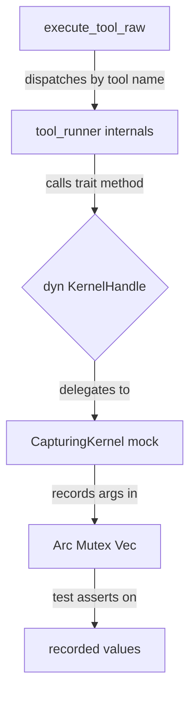

# Other — librefang-runtime-tests

# librefang-runtime-tests

Integration tests for the `librefang-runtime` crate. These tests exercise runtime subsystems that require real trait dispatch, configuration resolution, or tracing subscriber setup — things that unit tests within the library crates cannot easily validate in isolation.

## Test Files and Coverage Areas

### `instrument_span_fields.rs`

Verifies tracing span field propagation from `run_agent_loop`'s `#[instrument]` annotation to child events.

The production daemon sets a baseline `EnvFilter` of `librefang_runtime=warn`. This creates a subtle interaction: an `INFO`-level span created by `#[instrument]` (the default level) is **dropped** by the filter, meaning `agent.id` and `session.id` fields silently vanish from all log events emitted inside the agent loop. The fix is `#[instrument(level = "warn", ...)]`.

Three tests pin this behavior:

| Test | Purpose |
|------|---------|
| `warn_inside_agent_span_includes_agent_and_session_ids` | Confirms fields propagate when the subscriber has no filter |
| `info_span_is_dropped_under_warn_target_filter` | Reproduces the bug: INFO spans lose their fields under a `warn` filter |
| `warn_span_survives_warn_target_filter_and_carries_fields` | Confirms the production fix: WARN-level spans survive |

Each test constructs a `CaptureWriter` that buffers formatted output into an `Arc<Mutex<Vec<u8>>>`, installs a temporary `tracing_subscriber::registry`, and asserts on the captured string.

### `mcp_oauth_integration.rs`

Tests OAuth discovery, token lifecycle, and auth-state serialization for MCP (Model Context Protocol) server connections.

**Discovery tests:**

- `test_discover_fallback_to_config` — When remote `.well-known` discovery fails (unreachable URL), `discover_oauth_metadata` falls back to `McpOAuthConfig` values.
- `test_discover_fails_without_any_source` — With no remote endpoint and no config, discovery returns an error.

**Provider wiring regression test:**

- `test_http_connect_calls_oauth_provider_load_token` — Catches the bug where `oauth_provider: None` was passed in `connect_mcp_servers`. A `TrackingOAuthProvider` records whether `load_token` is called during `McpConnection::connect` against a nonexistent HTTP endpoint.

**Token lifecycle tests** (using `InMemoryOAuthProvider`):

- `test_provider_store_then_load` — Store then load round-trips the access token.
- `test_provider_clear_removes_token` — `clear_tokens` deletes the stored token.
- `test_provider_clear_is_isolated` — Clearing one server's tokens does not affect another.
- `test_provider_reauthorize_after_clear` — The sequence store → clear → store with a new token works.

**Auth state serialization tests:**

- `test_auth_state_lifecycle` — Validates `NeedsAuth → PendingAuth → Authorized → NeedsAuth` round-trips through serde, ensuring the dashboard always has a valid state to render.
- `test_needs_auth_serializes_differently_from_pending_auth` — Regression test for a UI bug where the dashboard showed "Authorizing..." before the user clicked Authorize.

### `tool_exec_backend_selection.rs`

Tests the configuration → resolution → backend construction pipeline described in issue #3332.

```
config.toml [tool_exec].kind  ──┐
                                 ├─→ resolve_backend_kind ─→ build_backend ─→ trait object
agent.toml tool_exec_backend  ──┘
```

**Resolution tests:**

- `default_kernel_config_resolves_to_local` — Default `KernelConfig` produces `BackendKind::Local`.
- `config_toml_kind_local_loads` / `config_toml_kind_docker_loads` — TOML parsing produces the correct `BackendKind`.
- `agent_manifest_override_wins_over_global` — Per-agent `tool_exec_backend` overrides the global config.
- `agent_manifest_no_field_falls_back_to_global` — `None` in the manifest falls back to the config value.

**Backend construction tests:**

- `build_backend_local_dispatches_to_local_impl` / `build_backend_docker_dispatches_to_docker_impl` — `build_backend` returns a trait object whose `kind()` matches the requested backend.
- `build_backend_ssh_without_subtable_or_feature_errors` / `build_backend_daytona_without_subtable_or_feature_errors` — SSH and Daytona backends error when their required configuration subtables are missing.

**End-to-end test:**

- `end_to_end_local_dispatch_runs_command` (Unix only) — Full pipeline from empty config through `resolve_backend_kind`, `build_backend`, and `run_command`, asserting `echo end-to-end-3332` produces the expected stdout.

### `tool_runner_agent_event.rs`

Tests `agent_send`, `agent_list`, and `event_publish` tool dispatch through `execute_tool_raw`.

Uses a `CapturingKernel` mock that implements all `KernelHandle` role traits, recording calls on `AgentControl` and `EventBus` while stubbing everything else with `"not implemented"` errors.

**Key tests:**

- `agent_send_forwards_target_agent_id_and_message` — Validates that `agent_id` and `message` from the tool input reach `AgentControl::send_to_agent`.
- `agent_send_self_is_refused_to_avoid_deadlock` — Self-sends are rejected at the dispatcher level before reaching the kernel, preventing deadlock on the per-agent message lock.
- `agent_list_renders_kernel_provided_agents` / `agent_list_when_no_agents_running_returns_friendly_string` — The output string contains agent IDs and names; an empty list produces a user-friendly message.
- `event_publish_forwards_event_type_and_payload` — Event type and payload reach `EventBus::publish_event`.
- `event_publish_missing_event_type_errors_without_invoking_kernel` — Validation short-circuits before the kernel call.

### `tool_runner_forwarding.rs`

Tests that `memory_store`, `memory_recall`, and `memory_list` correctly forward the calling user's `sender_id` as the `peer_id` parameter to `MemoryAccess` trait methods.

The `CapturingKernel` mock records the `peer_id: Option<&str>` argument on each memory call. Tests cover both the `Some(sender_id)` and `None` cases, plus a cross-call isolation test (`test_sender_id_not_leaked_between_calls`) that makes three sequential calls with different contexts and asserts the recorded peer IDs match each call's context.

### `tool_runner_forwarding_task_cron.rs`

Tests `task_post`, `task_status`, and `cron_create` tool dispatch.

**Task tests:**

- `test_task_post_forwards_caller_as_created_by` — The `caller_agent_id` from `ToolExecContext` is forwarded as `created_by` to `TaskQueue::task_post`.
- `test_task_post_forwards_none_created_by` — When no caller is set, `None` is forwarded.

**Cron tests:**

- `test_cron_create_injects_sender_peer_id` — The `sender_id` from context is injected as `peer_id` in the cron job JSON.
- `test_cron_create_preserves_existing_peer_id` — An explicit `peer_id` in the tool input is not overwritten.
- `test_cron_create_forwards_caller_as_agent_id` — The `caller_agent_id` is forwarded as the `agent_id` parameter to `CronControl::cron_create`.

**Task status test:**

- `test_task_status_projects_six_canonical_fields` — `task_status` calls `TaskQueue::task_get` and projects the full task row down to exactly six fields: `status`, `result`, `title`, `assigned_to`, `created_at`, `completed_at`.
- `test_task_status_not_found_returns_message` — When `task_get` returns `None`, the tool returns a non-error "not found" message.
- `test_task_status_missing_task_id_errors` — Missing `task_id` parameter produces an error before reaching the kernel.

## Mock Kernel Pattern

Three test files (`tool_runner_agent_event.rs`, `tool_runner_forwarding.rs`, `tool_runner_forwarding_task_cron.rs`) share a common mock pattern:



Each file defines its own `CapturingKernel` struct that implements all role traits in the `KernelHandle` composition. Traits relevant to the test record their arguments into `Arc<Mutex<Vec<_>>>` buffers; all other trait methods return `"not implemented"` errors. The `make_ctx` helper constructs a `ToolExecContext` with the mock kernel and the desired `caller_agent_id` / `sender_id`.

## Running

```bash
# All runtime integration tests
cargo test -p librefang-runtime --test '*'

# Specific test file
cargo test -p librefang-runtime --test tool_runner_forwarding

# Single test
cargo test -p librefang-runtime --test tool_exec_backend_selection -- end_to_end_local_dispatch_runs_command
```

The `end_to_end_local_dispatch_runs_command` test is gated behind `#[cfg(unix)]` and `#[tokio::test]`.