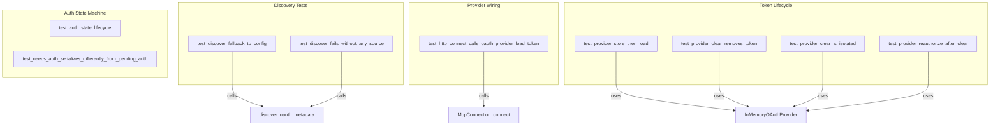

# Other — librefang-runtime-tests

# librefang-runtime-tests — MCP OAuth Integration

## Purpose

This module contains integration tests that validate the OAuth authentication flow for MCP (Model Context Protocol) server connections. It guards against regressions in three critical areas:

1. **OAuth metadata discovery** — ensuring fallback behavior when remote discovery fails
2. **Provider wiring** — confirming the OAuth provider is actually invoked during connection attempts (not silently `None`)
3. **Token lifecycle** — verifying store/load/clear semantics and server-level isolation
4. **Auth state machine** — asserting correct serialization of `McpAuthState` transitions, which drives the dashboard UI

Several tests were written specifically to prevent regressions from past bugs (documented inline).

---

## Test Architecture



---

## Mock Implementations

The tests define two mock implementations of `McpOAuthProvider`:

### `TrackingOAuthProvider`

Records whether `load_token` was called via an `AtomicBool`. Returns `None` from `load_token` to force a 401 failure. Used exclusively by `test_http_connect_calls_oauth_provider_load_token` to prove the provider is wired into the connection path.

### `InMemoryOAuthProvider`

Stores tokens in a `tokio::sync::Mutex<HashMap<String, OAuthTokens>>`. Implements the full `McpOAuthProvider` trait with real read/write/delete semantics. Used by all token lifecycle tests.

---

## Test Descriptions

### OAuth Metadata Discovery

| Test | What it verifies |
|---|---|
| `test_discover_fallback_to_config` | When the server at the given URL is unreachable, `discover_oauth_metadata` falls back to values from `McpOAuthConfig` (auth_url, token_url, client_id). |
| `test_discover_fails_without_any_source` | When no server is reachable and no config is provided, the function returns an error containing `"OAuth metadata"`. |

### Provider Wiring (Regression Guard)

**`test_http_connect_calls_oauth_provider_load_token`**

This is a regression test for a bug where `oauth_provider: None` was passed in the kernel's `connect_mcp_servers`, silently disabling the entire OAuth flow. The test:

1. Creates a `McpServerConfig` with an `Http` transport pointing at `127.0.0.1:1` (guaranteed unreachable)
2. Attaches a `TrackingOAuthProvider`
3. Calls `McpConnection::connect`
4. Asserts the connection fails (expected)
5. **Asserts `load_token_called` is `true`** — proving the provider was consulted, not silently skipped

### Token Lifecycle

All tests in this group use `InMemoryOAuthProvider`.

| Test | What it verifies |
|---|---|
| `test_provider_store_then_load` | `load_token` returns `None` initially, then returns the stored access token after `store_tokens` is called. |
| `test_provider_clear_removes_token` | After `clear_tokens`, `load_token` returns `None` for that server URL. |
| `test_provider_clear_is_isolated` | Clearing tokens for server A does not affect tokens stored for server B. Token storage is keyed by server URL. |
| `test_provider_reauthorize_after_clear` | The full sequence store → clear → store works, and the second store returns the new token. Validates re-authorization after revocation. |

### Auth State Machine

These are synchronous tests (no `#[tokio::test]`) that verify `McpAuthState` serialization.

**`test_auth_state_lifecycle`**

Validates the full state machine:

```
NeedsAuth → PendingAuth → Authorized → NeedsAuth (after revoke)
```

Each transition is verified by serializing to JSON and checking the `"state"` discriminator field. The final assertion confirms that after revocation, the state is `NeedsAuth` (not missing), ensuring the "Authorize" button appears in the dashboard.

**`test_needs_auth_serializes_differently_from_pending_auth`**

Regression test for a bug where the dashboard showed "Authorizing..." at boot before the user clicked Authorize. Verifies that `NeedsAuth` serializes to `"needs_auth"` and `PendingAuth` serializes to `"pending_auth"` — two distinct values.

---

## Key Types Referenced

| Type | Location | Role |
|---|---|---|
| `McpOAuthConfig` | `librefang_types::config` | Static OAuth configuration (auth_url, token_url, client_id, scopes) |
| `McpAuthState` | `librefang_runtime::mcp_oauth` | State machine enum: `NeedsAuth`, `PendingAuth { auth_url }`, `Authorized { expires_at, tokens }` |
| `OAuthTokens` | `librefang_runtime::mcp_oauth` | Token data: `access_token`, `refresh_token`, `token_type`, `expires_in`, `scope` |
| `McpOAuthProvider` | `librefang_runtime::mcp_oauth` | Async trait: `load_token`, `store_tokens`, `clear_tokens` |
| `McpServerConfig` | `librefang_runtime::mcp` | Full server config including transport, headers, OAuth provider and config |
| `McpConnection` | `librefang_runtime::mcp` | Connection handler that invokes the OAuth provider on 401 |

---

## Running

```bash
# All tests in this file
cargo test -p librefang-runtime --test mcp_oauth_integration

# Only auth state tests (synchronous, no network)
cargo test -p librefang-runtime --test mcp_oauth_integration -- test_auth_state

# Only token lifecycle tests
cargo test -p librefang-runtime --test mcp_oauth_integration -- test_provider
```

The provider wiring test (`test_http_connect_calls_oauth_provider_load_token`) attempts a TCP connection to `127.0.0.1:1` which will fail immediately — no external network dependency is required.