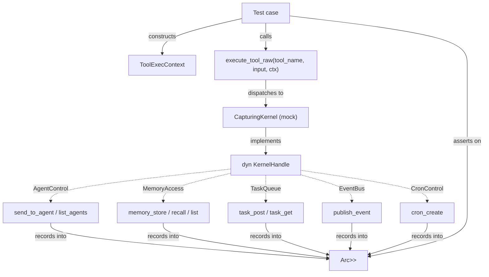

# Other — librefang-runtime-tests

# librefang-runtime-tests

Integration test suite for `librefang-runtime`. Tests exercise the crate's public APIs end-to-end without requiring a live kernel, LLM driver, or external services. The tests live under `librefang-runtime/tests/` and are compiled as separate crates by Cargo's integration test harness.

## Test Files and Coverage

| File | Concern | Key APIs under test |
|------|---------|-------------------|
| `instrument_span_fields.rs` | Tracing span field propagation | `tracing::span`, `EnvFilter` |
| `mcp_oauth_integration.rs` | MCP OAuth discovery & token lifecycle | `McpOAuthProvider`, `McpAuthState`, `discover_oauth_metadata` |
| `tool_exec_backend_selection.rs` | Tool-exec backend dispatch | `resolve_backend_kind`, `build_backend`, `BackendKind` |
| `tool_runner_agent_event.rs` | Agent & event tool dispatch | `execute_tool_raw` via `agent_send`, `agent_list`, `event_publish` |
| `tool_runner_forwarding.rs` | Memory tool forwarding | `execute_tool_raw` via `memory_store`, `memory_recall`, `memory_list` |
| `tool_runner_forwarding_task_cron.rs` | Task & cron tool dispatch | `execute_tool_raw` via `task_post`, `task_status`, `cron_create` |

## Architecture

The tool-runner tests share a common mock-kernel pattern. A `CapturingKernel` struct implements the full `KernelHandle` role-trait composition from `librefang-kernel-handle`. Each test file specializes the mock: traits relevant to the test record invocations into `Arc<Mutex<Vec<...>>>` capture logs, while all other traits return stub errors.



### ToolExecContext Construction

Every tool-runner test builds a `ToolExecContext` with a helper function (`make_ctx`) that wires an `Arc<dyn KernelHandle>` and relevant IDs:

```rust
fn make_ctx<'a>(
    kernel: &'a Arc<dyn KernelHandle>,
    sender_id: Option<&'a str>,
    caller_agent_id: Option<&'a str>,
) -> ToolExecContext<'a>
```

Fields like `mcp_connections`, `web_ctx`, `browser_ctx`, `media_engine`, etc. are set to `None` because the tests under test here don't exercise those code paths.

## Test Details by File

### instrument_span_fields.rs

Validates that `agent.id` and `session.id` set as `#[instrument]` fields on `run_agent_loop` propagate to child events. Rather than spinning up a real agent loop, tests construct equivalent spans by hand and use a `CaptureWriter` to intercept formatted output.

Three scenarios:

- **`warn_inside_agent_span_includes_agent_and_session_ids`** — Verifies both fields appear in a non-compact formatted event inside the span.
- **`info_span_is_dropped_under_warn_target_filter`** — Confirms that `INFO`-level spans are filtered out when the subscriber uses `EnvFilter::new("warn")`, justifying the `level = "warn"` override on `run_agent_loop`'s `#[instrument]`.
- **`warn_span_survives_warn_target_filter_and_carries_fields`** — Confirms that `WARN`-level spans survive the warn filter and fields propagate to events.

### mcp_oauth_integration.rs

Tests MCP OAuth discovery, provider wiring, token lifecycle, and auth-state serialization.

**Discovery tests:**
- `test_discover_fallback_to_config` — When the server is unreachable, `discover_oauth_metadata` falls back to `McpOAuthConfig` values.
- `test_discover_fails_without_any_source` — With no server and no config, discovery returns an error.

**OAuth provider wiring (regression):**
- `test_http_connect_calls_oauth_provider_load_token` — Catches the bug where `oauth_provider: None` was silently passed in `connect_mcp_servers`. Uses `TrackingOAuthProvider` which records whether `load_token` was invoked during a failed HTTP MCP connection.

**Token lifecycle via `InMemoryOAuthProvider`:**
- `test_provider_store_then_load` — Store then load returns the token.
- `test_provider_clear_removes_token` — Clear removes the stored token.
- `test_provider_clear_is_isolated` — Clearing one server doesn't affect another.
- `test_provider_reauthorize_after_clear` — Store → clear → store works (re-authorization).

**Auth state serialization:**
- `test_auth_state_lifecycle` — Validates the full lifecycle: `NeedsAuth` → `PendingAuth` → `Authorized` → `NeedsAuth` (after revoke). Regression test ensuring revoke produces `NeedsAuth` (showing the Authorize button), not a removed/null state.
- `test_needs_auth_serializes_differently_from_pending_auth` — Ensures `NeedsAuth` and `PendingAuth` serialize to distinct `"state"` values, preventing the dashboard from showing "Authorizing..." before the user clicks Authorize.

### tool_exec_backend_selection.rs

Tests the dispatch path from `config.toml` + `agent.toml` → `resolve_backend_kind` → `build_backend` → trait-object dispatch (issue #3332).

**Resolution precedence:**
- `default_kernel_config_resolves_to_local` — Default `KernelConfig` gives `BackendKind::Local`.
- `agent_manifest_override_wins_over_global` — Per-agent `tool_exec_backend` overrides global config.
- `agent_manifest_no_field_falls_back_to_global` — When `tool_exec_backend` is `None`, global config wins.

**TOML parsing:**
- `config_toml_kind_local_loads` / `config_toml_kind_docker_loads` — Verifies `[tool_exec] kind = "..."` parses correctly.

**Backend construction:**
- `build_backend_local_dispatches_to_local_impl` — Local always succeeds.
- `build_backend_docker_dispatches_to_docker_impl` — Docker builds even without a running daemon.
- `build_backend_ssh_without_subtable_or_feature_errors` / `build_backend_daytona_without_subtable_or_feature_errors` — Missing config returns an error.

**End-to-end (Unix only):**
- `end_to_end_local_dispatch_runs_command` — Full pipeline from TOML parse through `build_backend` to `run_command("echo end-to-end-3332")`, verifying stdout.

### tool_runner_agent_event.rs

Tests `agent_send`, `agent_list`, and `event_publish` dispatch through `execute_tool_raw` (issue #3696). Uses a `CapturingKernel` that records sends and events.

**agent_send:**
- `agent_send_forwards_target_agent_id_and_message` — Verifies `AgentControl::send_to_agent` receives the correct `agent_id` and `message`.
- `agent_send_self_is_refused_to_avoid_deadlock` — Self-send is rejected before reaching the kernel (prevents deadlock on the per-agent message lock).

**agent_list:**
- `agent_list_renders_kernel_provided_agents` — Output contains both IDs and names from `list_agents`.
- `agent_list_when_no_agents_running_returns_friendly_string` — Empty list returns a user-friendly "no agents" message, not an error.

**event_publish:**
- `event_publish_forwards_event_type_and_payload` — Verifies `EventBus::publish_event` receives the correct `event_type` and `payload`.
- `event_publish_missing_event_type_errors_without_invoking_kernel` — Validation short-circuits before calling `publish_event`.

### tool_runner_forwarding.rs

Tests that `memory_store`, `memory_recall`, and `memory_list` forward the `sender_id` from `ToolExecContext` as the `peer_id` argument to `MemoryAccess` trait methods.

Key behaviors verified:
- `sender_id: Some("user-42")` → `peer_id: Some("user-42")` for all three tools.
- `sender_id: None` → `peer_id: None` for all three tools.
- `sender_id_not_leaked_between_calls` — Sequential calls with different `sender_id` values maintain isolation; each call records only its own sender.

### tool_runner_forwarding_task_cron.rs

Tests `task_post`, `task_status`, and `cron_create` dispatch through `execute_tool_raw`.

**task_post:**
- `test_task_post_forwards_caller_as_created_by` — `caller_agent_id` is forwarded as `created_by`.
- `test_task_post_forwards_none_created_by` — When `caller_agent_id` is `None`, `created_by` is `None`.

**cron_create:**
- `test_cron_create_injects_sender_peer_id` — `sender_id` from context is injected as `peer_id` in the cron job JSON if not already present.
- `test_cron_create_preserves_existing_peer_id` — If the input already has a `peer_id`, it is preserved (not overwritten).
- `test_cron_create_forwards_caller_as_agent_id` — `caller_agent_id` is forwarded as the `agent_id` parameter to `CronControl::cron_create`.

**task_status:**
- `test_task_status_projects_six_canonical_fields` — Returns exactly `status`, `result`, `title`, `assigned_to`, `created_at`, `completed_at` from the full task row.
- `test_task_status_not_found_returns_message` — Missing task returns a "not found" message (not an error result).
- `test_task_status_missing_task_id_errors` — Missing `task_id` parameter returns an error.

## Running

```bash
# All integration tests for this crate
cargo test -p librefang-runtime

# Single file
cargo test -p librefang-runtime --test instrument_span_fields
cargo test -p librefang-runtime --test mcp_oauth_integration
cargo test -p librefang-runtime --test tool_exec_backend_selection
cargo test -p librefang-runtime --test tool_runner_agent_event
cargo test -p librefang-runtime --test tool_runner_forwarding
cargo test -p librefang-runtime --test tool_runner_forwarding_task_cron

# Single test case
cargo test -p librefang-runtime --test tool_runner_agent_event -- agent_send_self_is_refused
```

## Adding New Tool Dispatch Tests

To test a new tool through `execute_tool_raw`:

1. Add the trait method to the existing `CapturingKernel` in the relevant file (or create a new test file if it's a distinct tool family).
2. Record calls into an `Arc<Mutex<Vec<...>>>` inside the trait implementation.
3. Build a `ToolExecContext` via `make_ctx`, populating only the fields the tool reads.
4. Call `execute_tool_raw(tool_id, "tool_name", &json_input, &ctx).await`.
5. Assert on both the return value (`result.is_error`, `result.content`) and the captured calls.

For the mock kernel, only implement the traits the tool under test actually calls. All other `KernelHandle` traits should return stub errors (`Err("not implemented".into())`) so that accidental calls surface as test failures rather than silent no-ops.