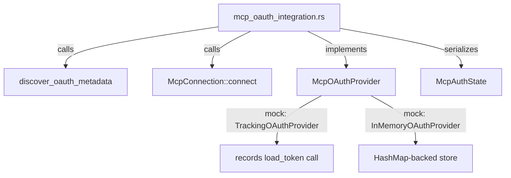

# Other — librefang-runtime-tests

# librefang-runtime-tests — MCP OAuth Integration

## Purpose

This test module validates the OAuth integration layer for MCP (Model Context Protocol) server connections. It covers three distinct areas:

1. **OAuth metadata discovery** — ensuring fallback behavior when remote discovery fails
2. **Provider wiring regression** — proving the `oauth_provider` is actually invoked during HTTP MCP connections, not silently `None`
3. **Token lifecycle** — store, load, clear, isolation, and re-authorization flows
4. **Auth state machine** — correct serialization of `McpAuthState` variants across the lifecycle

Several tests are explicitly marked as regression tests for specific bugs (e.g., `oauth_provider: None` passed in kernel's `connect_mcp_servers`, revoking removing auth state entirely).

## Architecture



## Mock Providers

The tests define two mock implementations of `McpOAuthProvider`:

### `TrackingOAuthProvider`

A minimal stub that records whether `load_token` was invoked (via an `AtomicBool`). It returns `None` from `load_token` to force a 401 failure, and no-ops for `store_tokens`/`clear_tokens`.

**Used by:** `test_http_connect_calls_oauth_provider_load_token`

### `InMemoryOAuthProvider`

A fully functional in-memory provider backed by a `tokio::sync::Mutex<HashMap<String, OAuthTokens>>`. Supports the complete token lifecycle: store, load, and clear with per-server isolation.

**Used by:** `test_provider_store_then_load`, `test_provider_clear_removes_token`, `test_provider_clear_is_isolated`, `test_provider_reauthorize_after_clear`

## Test Catalog

### OAuth Metadata Discovery

| Test | What it verifies |
|------|-----------------|
| `test_discover_fallback_to_config` | When remote discovery fails (nonexistent host), `discover_oauth_metadata` falls back to the provided `McpOAuthConfig` and returns correct `authorization_endpoint`, `token_endpoint`, and `client_id`. |
| `test_discover_fails_without_any_source` | When remote discovery fails **and** no config is provided, the function returns an error containing `"OAuth metadata"`. |

### Provider Wiring Regression

| Test | What it verifies |
|------|-----------------|
| `test_http_connect_calls_oauth_provider_load_token` | When `McpConnection::connect` is called with an HTTP transport pointing to a nonexistent server, the `oauth_provider`'s `load_token` method **must** be called. This catches the regression where `oauth_provider: None` was passed in `connect_mcp_servers`, silently disabling OAuth. |

### Token Lifecycle

| Test | What it verifies |
|------|-----------------|
| `test_provider_store_then_load` | `store_tokens` followed by `load_token` returns the stored access token. Initially, no token exists. |
| `test_provider_clear_removes_token` | `clear_tokens` removes the token for a given server URL. |
| `test_provider_clear_is_isolated` | Clearing tokens for one server does not affect another server's tokens. |
| `test_provider_reauthorize_after_clear` | The full cycle `store → clear → store` works. After revocation, re-authorization with a new token succeeds. |

### Auth State Serialization

| Test | What it verifies |
|------|-----------------|
| `test_auth_state_lifecycle` | The state transitions `NeedsAuth → PendingAuth → Authorized → NeedsAuth` all serialize correctly. After revocation, state returns to `needs_auth` (not removed), ensuring the dashboard shows an "Authorize" button. |
| `test_needs_auth_serializes_differently_from_pending_auth` | `NeedsAuth` serializes to `"needs_auth"` and `PendingAuth` to `"pending_auth"`. These must differ to prevent the dashboard from showing "Authorizing..." before the user clicks Authorize. |

## Dependencies on Other Modules

- **`librefang_runtime::mcp_oauth`** — provides `discover_oauth_metadata`, `McpOAuthProvider` trait, `OAuthTokens`, and `McpAuthState`
- **`librefang_runtime::mcp`** — provides `McpConnection`, `McpServerConfig`, `McpTransport`
- **`librefang_types::config`** — provides `McpOAuthConfig`

## Running

```bash
cargo test -p librefang-runtime --test mcp_oauth_integration
```

Note: `test_http_connect_calls_oauth_provider_load_token` attempts a real TCP connection to `127.0.0.1:1`. It will fail at the transport level, which is the intended behavior — the test only checks that `load_token` was called before that failure propagated.