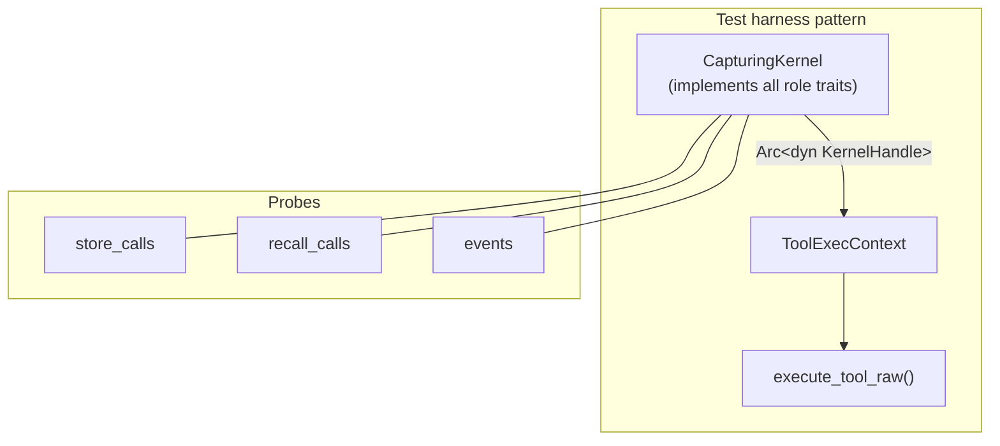

# Other — librefang-runtime-tests

# librefang-runtime-tests

Integration and regression tests for the `librefang-runtime` crate. These tests exercise real dispatch paths, security boundaries, and behavioural contracts that unit tests inside the library crates cannot reach in isolation.

## Architecture

Every test file targets a specific seam in the runtime. The dominant pattern is a **mock-kernel harness**: a hand-written struct implementing the full `dyn KernelHandle` composition (all role traits from `librefang-kernel-handle::prelude`), where the traits under test record their arguments into `Arc<Mutex<Vec<_>>>` probes and everything else returns `"not implemented"` errors. This lets `execute_tool_raw` run against a real `ToolExecContext` with a real trait object, exercising the actual dispatch and validation logic end-to-end.

## Test files

### `docker_sandbox_helpers_parity.rs`

**Purpose:** Prevent silent security drift between the canonical `contains_shell_metacharacters` denylist and its duplicate-by-design copy in `librefang-runtime-sandbox-docker`.

The docker-sandbox crate carries an inlined copy of `helpers` to avoid a circular dependency on `librefang-runtime`. If a CVE fix extends the canonical denylist, the docker `exec` path must not silently accept payloads that the local subprocess sandbox now rejects.

- **`contains_shell_metacharacters_parity`** — enumerates every metacharacter class (command substitution, chaining, pipes, redirection, brace expansion, background, process substitution, null/newline) plus quoting edge cases and clean commands. Asserts both implementations return identical `Option<&str>` results and reason strings.
- **`safe_truncate_str_parity`** — length-class coverage across UTF-8 byte-width boundaries (ASCII, 2-byte é, 3-byte 中, 4-byte 𝄞) at and around truncation boundaries.

Gated on `#![cfg(feature = "docker-sandbox")]`.

### `instrument_span_fields.rs`

**Purpose:** Pin the tracing behaviour that `run_agent_loop`'s `#[instrument(level = "warn", ...)]` must satisfy under the production daemon's `librefang_runtime=warn` env-filter directive.

Uses a `CaptureWriter` that buffers formatted output into an `Arc<Mutex<Vec<u8>>>` so assertions can inspect the actual rendered text.

Three tests form a chain:

1. **`warn_inside_agent_span_includes_agent_and_session_ids`** — a `warn!` event inside an `info_span!` with `agent.id` and `session.id` fields must surface both fields in the captured output.
2. **`info_span_is_dropped_under_warn_target_filter`** — reproduces the production `EnvFilter::new("warn")` and proves that an INFO-level span gets dropped, confirming *why* the workaround exists.
3. **`warn_span_survives_warn_target_filter_and_carries_fields`** — proves the WARN-level span workaround actually propagates fields to downstream events.

### `mcp_oauth_integration.rs`

**Purpose:** Integration tests for MCP OAuth discovery, provider wiring, and the auth-state lifecycle.

**Discovery tests:**
- `test_discover_fallback_to_config` — when the remote server is unreachable, discovery falls back to `McpOAuthConfig` values.
- `test_discover_fails_without_any_source` — no remote and no config must error.

**Provider wiring (regression):**
- `test_http_connect_calls_oauth_provider_load_token` — a `TrackingOAuthProvider` mock proves that `McpConnection::connect` actually calls `load_token` when an HTTP MCP server returns 401. This catches the regression where `oauth_provider: None` was passed in `connect_mcp_servers`.

**Token lifecycle (via `InMemoryOAuthProvider`):**
- `test_provider_store_then_load` — round-trip store → load.
- `test_provider_clear_removes_token` — clear removes the stored token.
- `test_provider_clear_is_isolated` — clearing one server does not affect another.
- `test_provider_reauthorize_after_clear` — store → clear → store works (re-authorization after revocation).

**Auth state machine:**
- `test_auth_state_lifecycle` — `NeedsAuth → PendingAuth → Authorized → NeedsAuth` serialises correctly at each step. Regression lock for the bug where revoke left no state, hiding the "Authorize" button.
- `test_needs_auth_serializes_differently_from_pending_auth` — prevents the dashboard from showing "Authorizing..." at boot before user action.

### `streaming_cascade_leak.rs`

**Purpose:** Regression lock on the incremental cascade-leak detection guard inside `stream_with_retry`'s `forward_task`.

Because `forward_task` is a private `tokio::spawn` closure, these tests replicate the exact accumulation + channel-forwarding pattern using the public `is_cascade_leak` and `StreamEvent` types.

**Note:** The replicated `run_forward_task` omits the 128 KB rolling-window cap and UTF-8 boundary walk from production. If those change, the facsimile must be updated and new tests added for the rolling-window path.

Key tests:
- `text_delta_tokens_are_suppressed_after_leak_detection` — after `is_cascade_leak` fires, the triggering delta and all subsequent `TextDelta` events are swallowed.
- `non_text_events_forwarded_after_leak` — `ContentComplete`, `ToolUseStart`, etc. continue to be forwarded; only text is suppressed.
- `tool_use_stop_reason_still_sets_cascade_leak_aborted` — even when the final `ContentComplete` carries `StopReason::ToolUse`, `cascade_leak_aborted` remains `true`. The caller must treat the entire turn as a silent drop.
- `leak_fires_when_markers_split_across_deltas` — structural markers split across streaming chunks still trigger detection.
- `clean_stream_does_not_abort` — no false positives on clean streams.

### `tool_exec_backend_selection.rs`

**Purpose:** End-to-end tests for the tool-exec backend resolution path: `config.toml → KernelConfig → AgentManifest → resolve_backend_kind → build_backend → trait dispatch`.

- Config parsing (`kind = "local"`, `kind = "docker"` from TOML).
- Resolution precedence: agent manifest override wins over global config; no override falls back to global.
- `build_backend` dispatch: Local and Docker always build; SSH and Daytona error without subtable/feature.
- `end_to_end_local_dispatch_runs_command` (Unix only): full round-trip from TOML parse through to `backend.run_command("echo ...")` with exit code and stdout assertion.

### `tool_runner_agent_event.rs`

**Purpose:** Tests for `agent_send`, `agent_list`, and `event_publish` tool dispatch through `execute_tool_raw`.

Uses a `CapturingKernel` that records `SentMessage` and `PublishedEvent` structs.

- `agent_send_forwards_target_agent_id_and_message` — both fields reach `AgentControl::send_to_agent`.
- `agent_send_self_is_refused_to_avoid_deadlock` — self-send errors before reaching the kernel (prevents per-agent lock deadlock).
- `agent_list_renders_kernel_provided_agents` — output includes agent IDs and names.
- `agent_list_when_no_agents_running_returns_friendly_string` — empty list is not an error.
- `event_publish_forwards_event_type_and_payload` — both fields reach `EventBus::publish_event`.
- `event_publish_missing_event_type_errors_without_invoking_kernel` — validation short-circuits before the kernel call.

### `tool_runner_forwarding.rs`

**Purpose:** Verifies that `sender_id` (the attributed user/peer) is correctly forwarded as `peer_id` to the memory substrate through `memory_store`, `memory_recall`, and `memory_list`.

Tests each tool with and without a `sender_id`, plus a cross-call isolation check (`test_sender_id_not_leaked_between_calls`) that proves three sequential calls with different identities each record the correct peer.

### `tool_runner_forwarding_task_cron.rs`

**Purpose:** Tests for `task_post`, `cron_create`, and `task_status` tool dispatch.

- `task_post` forwards `caller_agent_id` as `created_by`.
- `cron_create` injects `sender_id` as `peer_id` in the job JSON (but preserves an existing `peer_id` if the caller provides one), and forwards `caller_agent_id` as the first argument to `CronControl::cron_create`.
- `task_status` projects exactly six canonical fields (`status`, `result`, `title`, `assigned_to`, `created_at`, `completed_at`) from the full task row. Missing task returns a not-found message rather than an error. Missing `task_id` input errors.

### `tool_runner_memory_acl.rs`

**Purpose:** Regression coverage for the per-user `UserMemoryAccess` ACL enforcement at the tool dispatch boundary (#5139). Before the fix, a restricted user could drive `memory_store`/`wiki_write` through the agent and reach cross-user shared state.

Uses an `AclKernel` with a configurable `acl: Option<UserMemoryAccess>` returned from `memory_acl_for_sender`.

ACL fixtures:
- `viewer_acl()` — read proactive + wiki, no writes.
- `user_acl()` — read/write kv:* + wiki.

Tests assert **side effects**, not just tool return values: denied writes must leave the substrate call log empty.

Key tests:
- Restricted user: `memory_store` denied and does not land, `memory_recall` denied and does not read, `memory_list` denied and does not enumerate, `wiki_write` denied, `wiki_get`/`wiki_search` denied when wiki not in ACL.
- Allowed user: store/recall/list/wiki round-trips succeed.
- No ACL (`None`): preserves pre-RBAC behaviour (all calls land).
- `wiki_write_provenance_separates_channel_and_sender` (#5179 P1): provenance frontmatter must carry `channel` (transport) and `sender` (user) as distinct fields, plus `agent` and `at` timestamp.

### `tool_runner_workflow_readonly.rs`

**Purpose:** Tests for `workflow_list` and `workflow_status` tool dispatch.

Uses a `WorkflowStubKernel` returning controlled `WorkflowSummary` and `WorkflowRunSummary` data.

- Schema tests verify both tools appear in `builtin_tool_definitions` with correct `input_schema` shapes.
- `workflow_list` returns entries sorted by name, includes all fields (`id`, `name`, `description`, `step_count`), handles empty lists, and produces byte-identical output across repeated calls.
- `workflow_status` maps all fields correctly (`run_id`, `workflow_id`, `workflow_name`, `state`, `started_at`, `completed_at`, `output`, `error`, `step_count`, `last_step_name`). Unknown run returns a not-found error. Invalid UUID returns an error. Missing `run_id` returns an error.

### `tool_runner_workflow_write.rs`

**Purpose:** Tests for `workflow_start` and `workflow_cancel` tool dispatch.

Uses a `WorkflowWriteStubKernel` with configurable `start_run_id` and `cancel_result` (Ok / NotFound / AlreadyTerminal).

- Schema tests for both tool definitions.
- `workflow_start` returns the run ID, does not block on completion, handles missing `workflow_id`, and produces deterministic output.
- `workflow_cancel` validates UUID format before calling the kernel (invalid UUID errors immediately), handles not-found and already-terminal states, and succeeds for cancellable runs.

## Common patterns

### Constructing `ToolExecContext`

Every tool-runner test builds a `ToolExecContext` via a `make_ctx` helper. The context carries:

| Field | Typical test value |
|---|---|
| `kernel` | `Some(Arc<dyn KernelHandle>)` wrapping the mock |
| `caller_agent_id` | `Some("test-agent")` or test-specific agent ID |
| `sender_id` | `Some("user-42")` or `None` |
| `channel` | `Some("telegram")` or `None` |
| All others | `None` / `0` / defaults |

### Mock kernel trait coverage

Every mock kernel must implement **all** role traits from `librefang-kernel-handle::prelude` to satisfy `dyn KernelHandle`. Traits not under test return errors or no-ops:

- `AgentControl`, `MemoryAccess`, `WikiAccess`, `TaskQueue`, `EventBus`, `KnowledgeGraph`, `CronControl`, `ApprovalGate`, `HandsControl`, `A2ARegistry`, `ChannelSender`, `PromptStore`, `WorkflowRunner`, `GoalControl`, `ToolPolicy`, `CatalogQuery`, `ApiAuth`, `SessionWriter`, `AcpFsBridge`, `AcpTerminalBridge`

When adding a new role trait, all existing mock kernels must be updated to implement it (even as a no-op) or the tests will fail to compile.