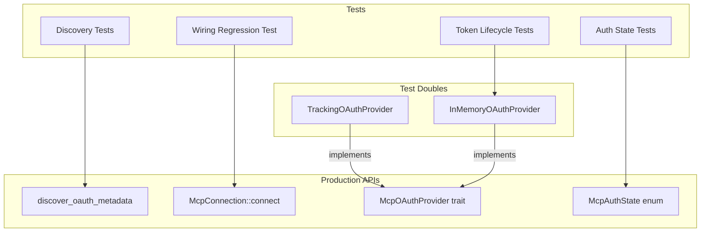

# Other — librefang-runtime-tests

# librefang-runtime-tests — MCP OAuth Integration Tests

## Purpose

This test module validates the MCP (Model Context Protocol) OAuth subsystem end-to-end: metadata discovery, provider wiring into the connection layer, token lifecycle management, and auth-state serialization. Several tests are explicit regression guards against bugs that previously broke the OAuth flow silently.

## Scope

The module lives in `librefang-runtime/tests/mcp_oauth_integration.rs` and exercises two public API surfaces:

| Surface | Crate path | What's tested |
|---|---|---|
| OAuth discovery & types | `librefang_runtime::mcp_oauth::*` | `discover_oauth_metadata`, `McpAuthState`, `OAuthTokens` |
| MCP connection wiring | `librefang_runtime::mcp::{McpConnection, McpServerConfig, McpTransport}` | Provider invocation on 401 |

External config type `librefang_types::config::McpOAuthConfig` is consumed but not defined here.

## Architecture



## Test Doubles

The module defines two mock `McpOAuthProvider` implementations to avoid vault/external dependencies.

### `TrackingOAuthProvider`

Records whether `load_token` was invoked (via `AtomicBool`). Returns `None` for `load_token` so that the connection proceeds to fail — the test only cares that the provider was *called*, not that it produced a token. Used exclusively by the wiring regression test.

### `InMemoryOAuthProvider`

Stores `OAuthTokens` in a `tokio::sync::Mutex<HashMap<String, OAuthTokens>>`. Fully functional store/load/clear semantics scoped per server URL. Used by all token lifecycle tests.

## Test Reference

### OAuth Metadata Discovery

#### `test_discover_fallback_to_config`

When `discover_oauth_metadata` cannot reach the server's well-known endpoint (e.g. the host is nonexistent), it must fall back to values supplied in `McpOAuthConfig`. Verifies that the returned metadata's `authorization_endpoint`, `token_endpoint`, and `client_id` match the config.

#### `test_discover_fails_without_any_source`

When no server is reachable *and* no `McpOAuthConfig` is provided, `discover_oauth_metadata` must return an error containing `"OAuth metadata"`.

### Provider Wiring

#### `test_http_connect_calls_oauth_provider_load_token`  *(regression)*

**Catches:** The bug where `oauth_provider: None` was passed in the kernel's `connect_mcp_servers`, silently disabling OAuth for all HTTP MCP servers.

Connects to `http://127.0.0.1:1/nonexistent-mcp` (port 1 — guaranteed unreachable) with a `TrackingOAuthProvider` attached. The connection is expected to fail, but `load_token` **must** have been called. If it wasn't, the provider was dropped or never wired in.

### Token Lifecycle

All use `InMemoryOAuthProvider`.

| Test | Flow | Asserts |
|---|---|---|
| `test_provider_store_then_load` | store → load | Returns the stored access token; initially `None` |
| `test_provider_clear_removes_token` | store → clear → load | Token absent after clear |
| `test_provider_clear_is_isolated` | store A + store B → clear A → load B | Clearing A does not affect B |
| `test_provider_reauthorize_after_clear` | store v1 → clear → store v2 → load | Returns v2, proving clear doesn't corrupt state |

### Auth State Serialization

#### `test_auth_state_lifecycle` *(regression)*

**Catches:** The bug where revoking a token removed the `McpAuthState` entirely, causing the dashboard to lose the "Authorize" button.

Validates the round-trip: `NeedsAuth` → `PendingAuth` (with `auth_url`) → `Authorized` → `NeedsAuth` (after revoke). Each intermediate state is serialized to JSON and checked for the correct `"state"` discriminator.

#### `test_needs_auth_serializes_differently_from_pending_auth` *(regression)*

**Catches:** The bug where the dashboard showed "Authorizing…" at boot before the user clicked Authorize.

Asserts that `McpAuthState::NeedsAuth` serializes to `{"state": "needs_auth"}` and `McpAuthState::PendingAuth` serializes to `{"state": "pending_auth"}` — distinct values, so the frontend can render them differently.

## Running

```sh
# All integration tests in this module
cargo test -p librefang-runtime --test mcp_oauth_integration

# A single test
cargo test -p librefang-runtime --test mcp_oauth_integration test_auth_state_lifecycle
```

All tests are `#[tokio::test]` async except the two serialization tests, which are synchronous `#[test]`. No external services or network access are required — discovery tests hit intentionally nonexistent hosts to trigger fallback/error paths, and the wiring test targets `127.0.0.1:1`.