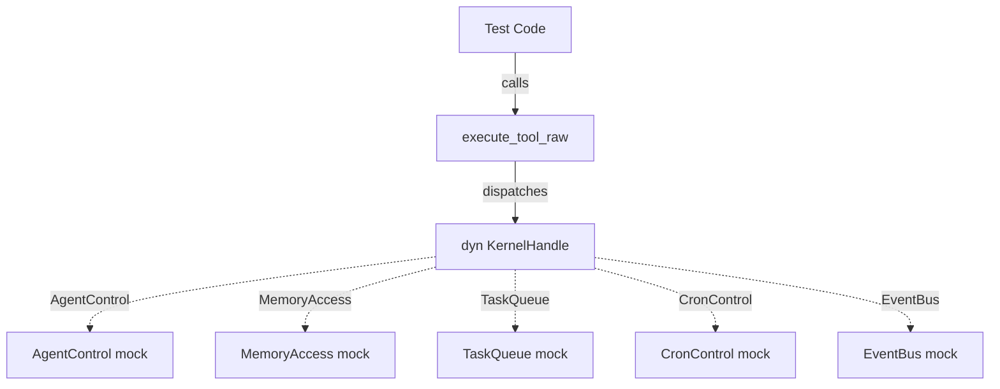

# Other — librefang-runtime-tests

# librefang-runtime-tests

Integration tests for the `librefang-runtime` crate, organized into four files covering MCP OAuth flows and tool-runner dispatch through `execute_tool_raw`.

## Overview

These tests verify that the runtime correctly wires internal subsystems to the tool execution layer. There are two distinct testing concerns:

1. **Tool dispatch** — ensuring `execute_tool_raw` forwards the right parameters to the correct kernel trait methods when agents invoke built-in tools.
2. **MCP OAuth** — verifying OAuth metadata discovery fallback, token lifecycle through mock providers, and auth-state serialization for the dashboard.

All tests use **mock kernels** that implement the full `KernelHandle` trait composition, stubbing unused traits and recording calls on the ones under test.

## Test Files

### `mcp_oauth_integration.rs`

Tests for the MCP OAuth subsystem (`librefang_runtime::mcp_oauth`).

**OAuth metadata discovery:**

| Test | What it verifies |
|---|---|
| `test_discover_fallback_to_config` | When the well-known endpoint is unreachable, `discover_oauth_metadata` falls back to the `McpOAuthConfig` values for `auth_url`, `token_url`, and `client_id`. |
| `test_discover_fails_without_any_source` | With no config and no discovery endpoint, the function returns an error containing `"OAuth metadata"`. |

**OAuth provider wiring (regression tests):**

These tests guard against the bug where `oauth_provider: None` was silently passed in `connect_mcp_servers`, disabling the entire OAuth flow.

| Test | What it verifies |
|---|---|
| `test_http_connect_calls_oauth_provider_load_token` | `McpConnection::connect` calls `McpOAuthProvider::load_token` when an HTTP server returns 401. Uses `TrackingOAuthProvider` which records invocations via `AtomicBool` flags. |

**Token lifecycle (`InMemoryOAuthProvider`):**

| Test | What it verifies |
|---|---|
| `test_provider_store_then_load` | `store_tokens` followed by `load_token` returns the stored access token. |
| `test_provider_clear_removes_token` | `clear_tokens` deletes the token; subsequent `load_token` returns `None`. |
| `test_provider_clear_is_isolated` | Clearing tokens for one server does not affect another server's tokens. |
| `test_provider_reauthorize_after_clear` | The store → clear → store transition works (simulates revoke then re-authorize). |

**Auth state serialization (`McpAuthState`):**

| Test | What it verifies |
|---|---|
| `test_auth_state_lifecycle` | The state machine transitions `NeedsAuth` → `PendingAuth` → `Authorized` → `NeedsAuth` serialize to distinct `"state"` values. Guards against the bug where revoking removed the state entirely, hiding the "Authorize" button. |
| `test_needs_auth_serializes_differently_from_pending_auth` | `NeedsAuth` and `PendingAuth` produce different `"state"` JSON values, preventing the dashboard from showing "Authorizing..." before the user clicks Authorize. |

#### Mock providers

Two mock `McpOAuthProvider` implementations are defined:

- **`TrackingOAuthProvider`** — records whether `load_token` and `store_oauth_metadata` were called (via `AtomicBool`). Returns `None` for tokens to force a 401 flow.
- **`InMemoryOAuthProvider`** — stores tokens in a `tokio::sync::Mutex<HashMap<String, OAuthTokens>>`. Used for CRUD lifecycle tests.

---

### `tool_runner_agent_event.rs`

Tests for `agent_send`, `agent_list`, and `event_publish` tool dispatch.

| Test | What it verifies |
|---|---|
| `agent_send_forwards_target_agent_id_and_message` | `agent_send` calls `AgentControl::send_to_agent` with the correct `agent_id` and `message`. |
| `agent_send_self_is_refused_to_avoid_deadlock` | Self-send is rejected with an error *before* `send_to_agent` is invoked, preventing deadlock on the per-agent message lock. |
| `agent_list_renders_kernel_provided_agents` | `agent_list` includes both agent IDs and names from `KernelHandle::list_agents` in its output string. |
| `agent_list_when_no_agents_running_returns_friendly_string` | An empty agent list returns a non-error result containing wording like "no agents" or "0 agents". |
| `event_publish_forwards_event_type_and_payload` | `event_publish` calls `EventBus::publish_event` with the exact `event_type` string and `payload` JSON value. |
| `event_publish_missing_event_type_errors_without_invoking_kernel` | Missing `event_type` in input returns an error *without* calling `publish_event`. |

---

### `tool_runner_forwarding.rs`

Tests for memory tool dispatch, specifically verifying that `sender_id` from `ToolExecContext` is correctly forwarded as the `peer_id` parameter to `MemoryAccess` methods.

| Test | What it verifies |
|---|---|
| `test_memory_store_forwards_sender_id_as_peer_id` | `memory_store` passes `ctx.sender_id` as `peer_id` to `MemoryAccess::memory_store`. |
| `test_memory_store_forwards_none_when_no_sender` | When `sender_id` is `None`, `peer_id` is also `None`. |
| `test_memory_recall_forwards_sender_id_as_peer_id` | Same forwarding for `memory_recall`. |
| `test_memory_recall_forwards_none_when_no_sender` | Same `None` forwarding for `memory_recall`. |
| `test_memory_list_forwards_sender_id_as_peer_id` | Same forwarding for `memory_list`. |
| `test_memory_list_forwards_none_when_no_sender` | Same `None` forwarding for `memory_list`. |
| `test_sender_id_not_leaked_between_calls` | Sequential calls with different `sender_id` values (including `None`) each pass their own value — no state leakage. |

---

### `tool_runner_forwarding_task_cron.rs`

Tests for task and cron tool dispatch.

**Task tools:**

| Test | What it verifies |
|---|---|
| `test_task_post_forwards_caller_as_created_by` | `task_post` passes `ctx.caller_agent_id` as `created_by` to `TaskQueue::task_post`. |
| `test_task_post_forwards_none_created_by` | When `caller_agent_id` is `None`, `created_by` is also `None`. |
| `test_task_status_projects_six_canonical_fields` | `task_status` returns exactly six fields: `status`, `result`, `title`, `assigned_to`, `created_at`, `completed_at` — projecting from the full task row. |
| `test_task_status_not_found_returns_message` | A missing task ID returns a non-error result containing `"not found"`. |
| `test_task_status_missing_task_id_errors` | Missing `task_id` in input returns an error without calling `task_get`. |

**Cron tools:**

| Test | What it verifies |
|---|---|
| `test_cron_create_injects_sender_peer_id` | `cron_create` injects `ctx.sender_id` as `peer_id` into the job JSON when not already present. |
| `test_cron_create_preserves_existing_peer_id` | If the input already contains a `peer_id`, it is not overwritten. |
| `test_cron_create_forwards_caller_as_agent_id` | `cron_create` passes `ctx.caller_agent_id` as the `agent_id` parameter to `CronControl::cron_create`. |

## Architecture



All test files share the same mock-kernel pattern:

1. A `CapturingKernel` struct implements every trait in the `KernelHandle` composition.
2. Unused trait methods return errors (`"not implemented"`) or use default impls.
3. The trait under test records call arguments into `Arc<Mutex<Vec<_>>>` handles.
4. The test asserts on both the `execute_tool_raw` return value and the captured call arguments.

This pattern ensures tests can verify:
- **Output correctness** — the tool returns the right result/error to the agent.
- **Input forwarding** — the kernel method was called with the correct parameters.
- **Short-circuit behavior** — validation failures reject the call *before* the kernel method is invoked.

## Key types from other crates

| Type | Crate | Role |
|---|---|---|
| `execute_tool_raw` | `librefang_runtime::tool_runner` | The function under test for tool dispatch |
| `ToolExecContext` | `librefang_runtime::tool_runner` | Carries `kernel`, `caller_agent_id`, `sender_id`, and other context into tool execution |
| `KernelHandle` (trait composition) | `librefang_kernel_handle` | Supertrait composed of `AgentControl`, `MemoryAccess`, `TaskQueue`, `CronControl`, `EventBus`, and others |
| `McpConnection`, `McpServerConfig`, `McpTransport` | `librefang_runtime::mcp` | MCP connection types used in the OAuth wiring test |
| `McpOAuthProvider` | `librefang_runtime::mcp_oauth` | Trait for OAuth token storage; mocked as `TrackingOAuthProvider` and `InMemoryOAuthProvider` |
| `discover_oauth_metadata` | `librefang_runtime::mcp_oauth` | OAuth metadata discovery with config fallback |
| `McpAuthState` | `librefang_runtime::mcp_oauth` | Enum for dashboard auth-state machine |
| `OAuthTokens` | `librefang_types::oauth` | Token struct with `access_token`, `refresh_token`, `token_type`, `expires_in`, `scope` |

## Running

```bash
# All runtime tests
cargo test -p librefang-runtime

# Just the MCP OAuth integration tests
cargo test -p librefang-runtime --test mcp_oauth_integration

# Just the tool dispatch tests
cargo test -p librefang-runtime --test tool_runner_agent_event
cargo test -p librefang-runtime --test tool_runner_forwarding
cargo test -p librefang-runtime --test tool_runner_forwarding_task_cron
```