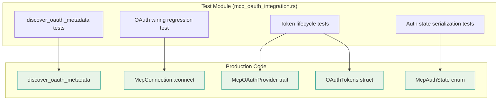

# Other — librefang-runtime-tests

# librefang-runtime/tests/mcp_oauth_integration

Integration tests for MCP (Model Context Protocol) OAuth discovery, provider wiring, token lifecycle, and auth state serialization.

## Purpose

This test module validates two critical areas of the MCP OAuth system:

1. **OAuth provider integration** — ensuring the OAuth provider is correctly wired into the MCP connection layer and not silently dropped.
2. **Token lifecycle correctness** — store, load, clear, isolation, and re-authorization behavior through the `McpOAuthProvider` trait.

Several tests are explicitly marked as **regression tests**, guarding against specific historical bugs.

## Test Categories

### OAuth Metadata Discovery

These tests exercise `discover_oauth_metadata` from `librefang-runtime`'s `mcp_oauth` module.

| Test | What it verifies |
|---|---|
| `test_discover_fallback_to_config` | When the remote `.well-known` endpoint is unreachable, the function falls back to values supplied in `McpOAuthConfig` and returns a valid `OAuthMetadata` with the configured `auth_url`, `token_url`, and `client_id`. |
| `test_discover_fails_without_any_source` | When no remote metadata is available **and** no `McpOAuthConfig` is provided, the function returns an error containing `"OAuth metadata"`. |

### OAuth Provider Wiring Regression

**`test_http_connect_calls_oauth_provider_load_token`**

This is a regression test for a bug where `oauth_provider: None` was passed in the kernel's `connect_mcp_servers` function, silently disabling the entire OAuth flow. The test:

1. Creates a `TrackingOAuthProvider` (see mock providers below) that atomically records whether `load_token` was called.
2. Configures an `McpConnection` targeting `127.0.0.1:1` (guaranteed connection failure) with the tracking provider.
3. Asserts the connection fails (expected).
4. **Critically**, asserts that `load_token` was called on the provider, proving the provider reference survived into the connection layer and wasn't replaced with `None`.

### Token Lifecycle Tests

These tests use the `InMemoryOAuthProvider` mock to validate the `McpOAuthProvider` trait contract without a vault dependency.

| Test | Flow | Assertion |
|---|---|---|
| `test_provider_store_then_load` | `load` (empty) → `store` → `load` | Initially returns `None`; after store, returns the exact access token. |
| `test_provider_clear_removes_token` | `store` → `load` (present) → `clear` → `load` | Token present before clear, absent after. |
| `test_provider_clear_is_isolated` | `store` for A and B → `clear` A → `load` B | Clearing A's tokens does not affect B's tokens. |
| `test_provider_reauthorize_after_clear` | `store` v1 → `clear` → `store` v2 → `load` | After revocation, re-authorization stores a new token that loads correctly (state transition: `tok_v1` → gone → `tok_v2`). |

### Auth State Serialization

Two synchronous tests validate the `McpAuthState` enum's serialization behavior:

| Test | What it verifies |
|---|---|
| `test_auth_state_lifecycle` | Full lifecycle: `NeedsAuth` → `PendingAuth` → `Authorized` → `NeedsAuth` (after revoke). Each state serializes with the correct `"state"` JSON key. The final state after revocation is `NeedsAuth`, ensuring the "Authorize" button reappears in the dashboard. |
| `test_needs_auth_serializes_differently_from_pending_auth` | Regression test: `NeedsAuth` and `PendingAuth` produce different `"state"` values (`"needs_auth"` vs `"pending_auth"`), preventing the dashboard from showing "Authorizing..." before the user initiates authorization. |

## Mock Providers

### `TrackingOAuthProvider`

A minimal `McpOAuthProvider` implementation that uses an `AtomicBool` to record whether `load_token` was invoked. Used exclusively by the wiring regression test.

- `load_token` — sets the flag to `true`, returns `None` (forces 401 failure).
- `store_tokens` — no-op, returns `Ok(())`.
- `clear_tokens` — no-op, returns `Ok(())`.

Thread-safe via `AtomicBool` with `Ordering::SeqCst`.

### `InMemoryOAuthProvider`

A fully functional in-memory `McpOAuthProvider` backed by a `tokio::sync::Mutex<HashMap<String, OAuthTokens>>`. Used by all token lifecycle tests.

- `load_token` — returns the stored `access_token` for the given server URL, or `None`.
- `store_tokens` — inserts or replaces the token entry for the server URL.
- `clear_tokens` — removes the entry for the server URL only (isolation guaranteed by HashMap key).

## Dependencies



## Running

```bash
# All tests in this module
cargo test -p librefang-runtime --test mcp_oauth_integration

# Only the OAuth wiring regression test
cargo test -p librefang-runtime --test mcp_oauth_integration test_http_connect_calls_oauth_provider_load_token

# Only synchronous auth state tests
cargo test -p librefang-runtime --test mcp_oauth_integration -- --test-threads=1 test_auth_state
```