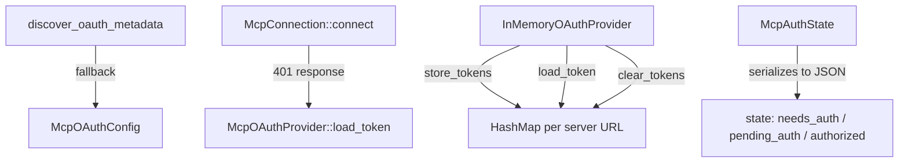

# Other — librefang-runtime-tests

# MCP OAuth Integration Tests

Integration test suite validating OAuth discovery, token lifecycle management, and the `McpAuthState` state machine used by the MCP (Model Context Protocol) connection layer.

## Purpose

This test module guards against regressions in three critical areas:

1. **OAuth metadata discovery** — ensuring fallback behavior when a server doesn't support well-known discovery endpoints.
2. **OAuth provider wiring** — catching bugs where an `oauth_provider: None` silently disables the entire OAuth flow during MCP connection attempts.
3. **Token lifecycle** — verifying store, load, clear, isolation, and re-authorization behavior through in-memory mock implementations.
4. **Auth state machine** — confirming that serialization of `McpAuthState` variants produces distinct values, preventing UI bugs in the dashboard.

## Architecture



## Test Categories

### OAuth Metadata Discovery

Two tests exercise `discover_oauth_metadata` from the `mcp_oauth` module:

| Test | Behavior |
|------|----------|
| `test_discover_fallback_to_config` | When the well-known endpoint is unreachable, falls back to values from `McpOAuthConfig` (`auth_url`, `token_url`, `client_id`). |
| `test_discover_fails_without_any_source` | Returns an error containing `"OAuth metadata"` when neither discovery nor config provides endpoint information. |

The fallback test targets a non-resolvable hostname (`nonexistent.example.com`) to guarantee the HTTP discovery attempt fails, forcing the config path.

### OAuth Provider Wiring (Regression Test)

`test_http_connect_calls_oauth_provider_load_token` — a regression test for a specific bug where `oauth_provider: None` was passed during `connect_mcp_servers` in the kernel, silently disabling OAuth. The test:

1. Creates a `TrackingOAuthProvider` whose `load_token` sets an `AtomicBool` and returns `None` (no cached token).
2. Constructs an `McpServerConfig` with `McpTransport::Http` pointing at `127.0.0.1:1` (guaranteed connection refused).
3. Calls `McpConnection::connect(config)`.
4. Asserts the connection fails (expected).
5. **Critically**, asserts that `load_token_called` is `true` — proving the provider was invoked during the 401 error path.

If this test fails with *"OAuth provider's load_token was never called"*, the `oauth_provider` field is likely `None` somewhere in the connection wiring.

### Token Lifecycle Tests

These use `InMemoryOAuthProvider`, a mock `McpOAuthProvider` backed by a `tokio::sync::Mutex<HashMap<String, OAuthTokens>>`.

| Test | What it verifies |
|------|-----------------|
| `test_provider_store_then_load` | `store_tokens` followed by `load_token` returns the stored `access_token`. An empty provider returns `None`. |
| `test_provider_clear_removes_token` | `clear_tokens` deletes the token; subsequent `load_token` returns `None`. |
| `test_provider_clear_is_isolated` | Clearing tokens for one server URL does not affect tokens stored for a different URL. |
| `test_provider_reauthorize_after_clear` | After clearing (revoking), a new token can be stored and loaded — validates the store → clear → store cycle. |

### Auth State Machine

Synchronous tests exercising `McpAuthState` serialization via `serde_json`:

| Test | Purpose |
|------|---------|
| `test_auth_state_lifecycle` | Full cycle: `NeedsAuth` → `PendingAuth` → `Authorized` → `NeedsAuth` (after revoke). Ensures revoke produces `needs_auth`, not a missing state — the dashboard needs this to show the "Authorize" button. |
| `test_needs_auth_serializes_differently_from_pending_auth` | Regression for a dashboard bug where "Authorizing..." appeared at boot. Confirms `needs_auth` and `pending_auth` produce distinct `"state"` values in JSON. |

## Mock Providers

### TrackingOAuthProvider

Records whether `load_token` was invoked. Returns `None` for `load_token` (forcing the connection to fail). Used only in the wiring regression test.

### InMemoryOAuthProvider

Full in-memory implementation of `McpOAuthProvider` using a `HashMap` keyed by server URL. Thread-safe via `tokio::sync::Mutex`. Used in all token lifecycle tests to avoid vault or filesystem dependencies.

Both implement the `McpOAuthProvider` trait from `librefang_runtime::mcp_oauth`:

```rust
#[async_trait]
impl McpOAuthProvider for TrackingOAuthProvider { ... }

#[async_trait]
impl McpOAuthProvider for InMemoryOAuthProvider { ... }
```

## Dependencies on Production Code

| Import | Module | Usage |
|--------|--------|-------|
| `discover_oauth_metadata` | `librefang_runtime::mcp_oauth` | Metadata discovery with config fallback |
| `McpConnection::connect` | `librefang_runtime::mcp` | Connection attempt that triggers OAuth provider |
| `McpServerConfig`, `McpTransport` | `librefang_runtime::mcp` | Configuration for test connections |
| `McpAuthState`, `OAuthTokens`, `McpOAuthProvider` | `librefang_runtime::mcp_oauth` | Types under test |
| `McpOAuthConfig` | `librefang_types::config` | Static OAuth configuration fallback |

## Running

```bash
# All tests in this file
cargo test -p librefang-runtime --test mcp_oauth_integration

# Only async token tests
cargo test -p librefang-runtime --test mcp_oauth_integration test_provider

# Only auth state machine tests (synchronous)
cargo test -p librefang-runtime --test mcp_oauth_integration test_auth_state
```