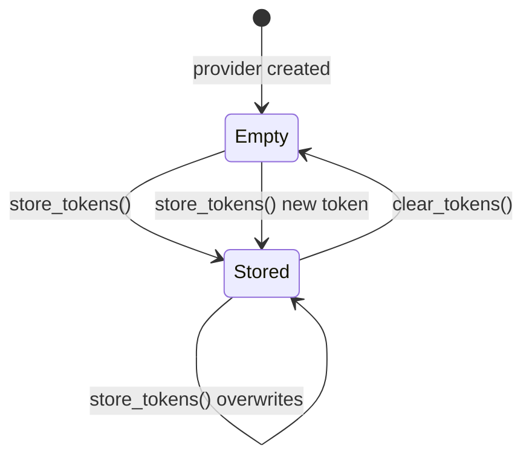

# Other — librefang-runtime-tests

# librefang-runtime-tests — MCP OAuth Integration Tests

## Purpose

This module validates the OAuth authentication layer for MCP (Model Context Protocol) server connections. It ensures that metadata discovery falls back correctly, OAuth providers are wired through the connection stack, token lifecycle operations work in isolation, and auth state transitions serialize properly for the dashboard UI.

Many of these tests are explicitly marked as **regression tests** guarding against bugs that previously shipped — notably a case where `oauth_provider: None` silently disabled the entire OAuth flow, and a case where revoking tokens removed the auth state entirely, causing the "Authorize" button to disappear.

## Test Categories

### OAuth Metadata Discovery

Two tests exercise `discover_oauth_metadata`:

| Test | Scenario | Expected outcome |
|---|---|---|
| `test_discover_fallback_to_config` | Server URL is unreachable, but an `McpOAuthConfig` is provided | Returns metadata built from config values (`auth_url`, `token_url`, `client_id`) |
| `test_discover_fails_without_any_source` | Server URL is unreachable, no config provided | Returns an error containing `"OAuth metadata"` |

These validate the fallback chain: when the well-known discovery endpoint on the MCP server is unreachable, the system falls back to static configuration from `McpOAuthConfig`. If neither source is available, it fails with a descriptive error.

### OAuth Provider Wiring Regression Test

`test_http_connect_calls_oauth_provider_load_token` is the most architecturally significant test in this file. It catches the bug where `oauth_provider: None` was passed in the kernel's `connect_mcp_servers`, silently disabling OAuth.

It works by:

1. Creating a `TrackingOAuthProvider` that records whether `load_token` was invoked (via an `AtomicBool`)
2. Configuring an `McpServerConfig` with `McpTransport::Http` pointing at a port nothing listens on (`127.0.0.1:1`)
3. Calling `McpConnection::connect` and asserting it fails
4. **Critically**: asserting that `load_token` was called on the provider, proving the provider was passed through and consulted — not silently dropped

```
McpConnection::connect(config with oauth_provider: Some(...))
  → attempts HTTP connection → fails/401
  → calls oauth_provider.load_token(server_url)     ← this is what we're verifying
```

If this test fails with *"OAuth provider's load_token was never called"*, it means the provider is not being threaded through the connection logic.

### Token Lifecycle Tests

These tests use `InMemoryOAuthProvider`, a mock `McpOAuthProvider` that stores tokens in a `HashMap` guarded by a `tokio::sync::Mutex`. They validate the CRUD contract of the `McpOAuthProvider` trait:

| Test | What it verifies |
|---|---|
| `test_provider_store_then_load` | `store_tokens` → `load_token` returns the stored access token; initially returns `None` |
| `test_provider_clear_removes_token` | `clear_tokens` removes the token; subsequent `load_token` returns `None` |
| `test_provider_clear_is_isolated` | Clearing tokens for server A does not affect server B's tokens |
| `test_provider_reauthorize_after_clear` | After clearing, a new `store_tokens` with different credentials succeeds — models the revoke → re-authorize flow |

The state machine being validated:



### Auth State Serialization Tests

Two synchronous tests validate `McpAuthState` enum serialization via `serde_json`:

| Test | What it verifies |
|---|---|
| `test_auth_state_lifecycle` | Full cycle: `NeedsAuth` → `PendingAuth` → `Authorized` → `NeedsAuth` (after revoke). Each state serializes with the correct `"state"` discriminant. |
| `test_needs_auth_serializes_differently_from_pending_auth` | `NeedsAuth` and `PendingAuth` produce **different** `"state"` values (`"needs_auth"` vs `"pending_auth"`). |

The lifecycle regression: previously, revoking a token deleted the auth state entirely rather than transitioning to `NeedsAuth`, which caused the dashboard's "Authorize" button to vanish. The test asserts that after revoke, the state is `NeedsAuth` — ensuring the button reappears.

The serialization distinction test guards against a bug where the dashboard showed "Authorizing..." on boot before the user clicked anything, because both states serialized identically.

## Mock Implementations

### `TrackingOAuthProvider`

Records invocation of `load_token` via an `AtomicBool`. Returns `None` for `load_token` (forcing the connection to treat it as no cached token). All other methods are no-ops.

Used exclusively by `test_http_connect_calls_oauth_provider_load_token` to prove the provider is wired through the connection stack.

### `InMemoryOAuthProvider`

Stores `OAuthTokens` in a `HashMap<String, OAuthTokens>` behind a `tokio::sync::Mutex`. Fully functional in-memory implementation of `McpOAuthProvider`:

- **`load_token`**: Returns the `access_token` field from the stored `OAuthTokens`, or `None`.
- **`store_tokens`**: Inserts/overwrites the entry for the server URL.
- **`clear_tokens`**: Removes the entry for the server URL.

## Dependencies on Production Code

This test module imports from:

- **`librefang_runtime::mcp_oauth`**: `discover_oauth_metadata`, `OAuthTokens`, `McpAuthState`, `McpOAuthProvider`
- **`librefang_runtime::mcp`**: `McpConnection`, `McpServerConfig`, `McpTransport`
- **`librefang_types::config`**: `McpOAuthConfig`