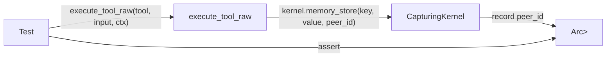

# Other — librefang-runtime-tests

# librefang-runtime-tests

Integration tests for `librefang-runtime` that verify two critical behavioral contracts: **MCP OAuth authentication flows** and **tool runner parameter forwarding**. These tests catch regressions that unit tests in the source crates cannot, because they validate end-to-end wiring between components.

## Test Files

| File | Domain | Tests |
|------|--------|-------|
| `mcp_oauth_integration.rs` | OAuth discovery, token lifecycle, auth state serialization | 9 |
| `tool_runner_forwarding.rs` | Memory tool peer-id forwarding | 7 |
| `tool_runner_forwarding_task_cron.rs` | Task and cron tool forwarding | 5 |

## MCP OAuth Integration Tests

### OAuth Metadata Discovery

Tests for `discover_oauth_metadata` from `librefang_runtime::mcp_oauth`.

- **`test_discover_fallback_to_config`** — When the well-known endpoint is unreachable (nonexistent host), the function falls back to values supplied in `McpOAuthConfig`. Verifies that `authorization_endpoint`, `token_endpoint`, and `client_id` are extracted correctly from the config.
- **`test_discover_fails_without_any_source`** — When neither remote discovery nor a local config is available, the call returns an error containing "OAuth metadata".

### OAuth Provider Wiring (Regression)

- **`test_http_connect_calls_oauth_provider_load_token`** — A regression test that catches the bug where `oauth_provider: None` was passed in the kernel's `connect_mcp_servers`, silently disabling the entire OAuth flow. It uses a `TrackingOAuthProvider` mock with an `AtomicBool` flag to prove that `McpConnection::connect` actually invokes `load_token` on the provider when a Streamable HTTP server returns 401.

The test connects to `http://127.0.0.1:1/nonexistent-mcp` (guaranteed connection refused) and asserts that despite the failure, the provider's `load_token` was called.

### Token Lifecycle via `InMemoryOAuthProvider`

A mock `McpOAuthProvider` implementation backed by `tokio::sync::Mutex<HashMap<String, OAuthTokens>>` that exercises the full store/load/clear cycle without vault dependencies.

| Test | What it verifies |
|------|-----------------|
| `test_provider_store_then_load` | `store_tokens` → `load_token` returns the same access token |
| `test_provider_clear_removes_token` | `clear_tokens` causes subsequent `load_token` to return `None` |
| `test_provider_clear_is_isolated` | Clearing tokens for server A does not affect server B |
| `test_provider_reauthorize_after_clear` | Store → clear → store with new token works (re-authorization after revoke) |

### Auth State Serialization (Regression)

These synchronous tests validate `McpAuthState` enum serialization to prevent dashboard UI bugs.

- **`test_auth_state_lifecycle`** — Walks the full state machine: `NeedsAuth` → `PendingAuth` → `Authorized` → `NeedsAuth` (after revoke). Each state serializes with the expected `"state"` discriminator. The final assertion catches a bug where revoking removed the auth state entirely, leaving no "Authorize" button in the dashboard.
- **`test_needs_auth_serializes_differently_from_pending_auth`** — Ensures `NeedsAuth` and `PendingAuth` produce distinct `"state"` values. Regression for a bug where the dashboard showed "Authorizing..." at boot before the user clicked Authorize.

## Tool Runner Forwarding Tests

These tests verify that `execute_tool_raw` correctly propagates context fields (`sender_id`, `caller_agent_id`) through to the appropriate `KernelHandle` method parameters. This is a security-critical concern: peer-scoped memory must receive the correct `peer_id`.

### Architecture

Each test file uses a **capturing kernel mock** — a `KernelHandle` implementation that records method arguments into `Arc<Mutex<Vec<...>>>` instead of performing real operations. This lets tests assert on what the kernel *received*, not what it *did*.

### Memory Forwarding (`tool_runner_forwarding.rs`)

Uses `CapturingKernel` which records `peer_id: Option<String>` for each of the three memory operations.

| Test | Tool | `sender_id` in ctx | Expected `peer_id` at kernel |
|------|------|--------------------|------------------------------|
| `test_memory_store_forwards_sender_id_as_peer_id` | `memory_store` | `Some("user-42")` | `Some("user-42")` |
| `test_memory_store_forwards_none_when_no_sender` | `memory_store` | `None` | `None` |
| `test_memory_recall_forwards_sender_id_as_peer_id` | `memory_recall` | `Some("user-99")` | `Some("user-99")` |
| `test_memory_recall_forwards_none_when_no_sender` | `memory_recall` | `None` | `None` |
| `test_memory_list_forwards_sender_id_as_peer_id` | `memory_list` | `Some("user-7")` | `Some("user-7")` |
| `test_memory_list_forwards_none_when_no_sender` | `memory_list` | `None` | `None` |
| `test_sender_id_not_leaked_between_calls` | `memory_store` | Sequential: alice, bob, None | Respective `peer_id` per call |

The last test (`test_sender_id_not_leaked_between_calls`) is particularly important — it calls `execute_tool_raw` three times with different `ToolExecContext` instances and verifies that each call receives exactly the `sender_id` from its own context, not a stale value from a previous call.

### Task and Cron Forwarding (`tool_runner_forwarding_task_cron.rs`)

Uses a separate `CapturingKernel` that records `task_post`'s `created_by` parameter and `cron_create`'s `(agent_id, job_json)` pair.

| Test | Tool | Context fields | Kernel assertion |
|------|------|----------------|------------------|
| `test_task_post_forwards_caller_as_created_by` | `task_post` | `caller_agent_id: Some("agent-1")` | `created_by == Some("agent-1")` |
| `test_task_post_forwards_none_created_by` | `task_post` | `caller_agent_id: None` | `created_by == None` |
| `test_cron_create_injects_sender_peer_id` | `cron_create` | `sender_id: Some("peer-xyz")` | `job_json["peer_id"] == "peer-xyz"` |
| `test_cron_create_preserves_existing_peer_id` | `cron_create` | `sender_id: Some("peer-xyz")`, input has `peer_id: "existing"` | `job_json["peer_id"] == "existing"` (not overwritten) |
| `test_cron_create_forwards_caller_as_agent_id` | `cron_create` | `caller_agent_id: Some("agent-1")` | `agent_id == "agent-1"` |

The `test_cron_create_preserves_existing_peer_id` test ensures that when the cron job payload already contains a `peer_id`, the system does not overwrite it with the context's `sender_id`. This prevents accidental cross-contamination of identity.

## Test Helpers

### `make_ctx`

Both tool runner test files define a `make_ctx` helper that constructs a `ToolExecContext` with only the fields needed for the test populated (`kernel`, `sender_id`, `caller_agent_id`). All other fields are `None`. This keeps tests focused and readable.

### Mock Providers

| Provider | Used in | Storage |
|----------|---------|---------|
| `TrackingOAuthProvider` | OAuth wiring regression | `AtomicBool` flag |
| `InMemoryOAuthProvider` | Token lifecycle tests | `Mutex<HashMap>` |
| `CapturingKernel` (memory) | Memory forwarding tests | `Mutex<Vec<Option<String>>>` |
| `CapturingKernel` (task/cron) | Task/cron forwarding tests | `Mutex<Vec<...>>` for task_post and cron_create |

All mock implementations implement the same trait (`McpOAuthProvider` or `KernelHandle`) with stubs returning `Err("not implemented")` for methods not under test, making failures obvious if an unexpected code path is hit.

## Key External Dependencies

- `librefang_runtime::mcp_oauth` — `discover_oauth_metadata`, `McpOAuthProvider`, `McpOAuthError`, `OAuthTokens`, `McpAuthState`
- `librefang_runtime::tool_runner` — `execute_tool_raw`, `ToolExecContext`
- `librefang_runtime::mcp` — `McpConnection`, `McpServerConfig`, `McpTransport`, `empty_taint_rule_sets_handle`
- `librefang_kernel_handle` — `KernelHandle` trait, `AgentInfo`
- `librefang_types::config` — `McpOAuthConfig`