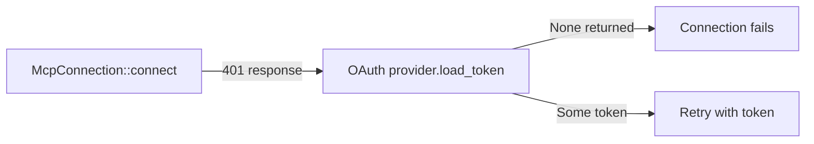
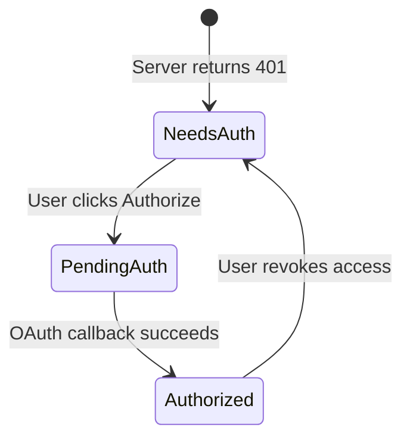

# Other — librefang-runtime-tests

# librefang-runtime-tests: MCP OAuth Integration Tests

## Purpose

This module contains integration tests that validate the OAuth authentication flow for MCP (Model Context Protocol) server connections. It guards against regressions in three critical areas: OAuth metadata discovery, provider wiring during HTTP connections, and the token/auth-state lifecycle.

## Why These Tests Exist

Several tests in this file are explicitly marked as regression tests because they catch specific bugs that shipped previously:

- **`test_http_connect_calls_oauth_provider_load_token`** — catches a bug where `oauth_provider: None` was passed in the kernel's `connect_mcp_servers`, silently disabling the entire OAuth flow.
- **`test_needs_auth_serializes_differently_from_pending_auth`** — catches a bug where the dashboard showed "Authorizing..." at boot before the user had clicked Authorize.
- **`test_auth_state_lifecycle`** — catches a bug where revoking removed the auth state entirely, leaving no "Authorize" button in the dashboard.

## Test Categories

### OAuth Metadata Discovery

| Test | What it verifies |
|---|---|
| `test_discover_fallback_to_config` | When the remote server is unreachable, `discover_oauth_metadata` falls back to values from `McpOAuthConfig` |
| `test_discover_fails_without_any_source` | Discovery returns an error when there is no remote endpoint and no fallback config |

These tests call `discover_oauth_metadata` from `librefang-runtime-mcp/src/mcp_oauth.rs` with a nonexistent URL (`https://nonexistent.example.com/mcp`) to force the fallback path.

### OAuth Provider Wiring

**`test_http_connect_calls_oauth_provider_load_token`** is the key integration test. It proves that `McpConnection::connect` actually invokes the OAuth provider when a Streamable HTTP server returns a 401 error. It uses `TrackingOAuthProvider` — a mock that sets an `AtomicBool` when `load_token` is called — to detect whether the provider was consulted at all.



The test connects to `http://127.0.0.1:1/nonexistent-mcp` (a port with no listener), configures a `TrackingOAuthProvider`, and asserts that `load_token_called` is true after the connection fails. If this assertion fires, someone has reintroduced the bug where the provider is `None`.

### Token Lifecycle via Mock Provider

`InMemoryOAuthProvider` is a mock implementation of `McpOAuthProvider` that stores tokens in an in-memory `HashMap` (no vault dependency). It exercises the `load_token` / `store_tokens` / `clear_tokens` round-trip:

| Test | Behavior verified |
|---|---|
| `test_provider_store_then_load` | `store_tokens` followed by `load_token` returns the stored access token |
| `test_provider_clear_removes_token` | `clear_tokens` removes the token for a given server URL |
| `test_provider_clear_is_isolated` | Clearing tokens for one server does not affect another server |
| `test_provider_reauthorize_after_clear` | After clearing, storing a new token works (store → clear → store round-trip) |

### Auth State Serialization

These are synchronous (`#[test]`) tests that validate `McpAuthState` serializes correctly through its lifecycle. This state machine drives what the dashboard UI shows:



| Test | Behavior verified |
|---|---|
| `test_auth_state_lifecycle` | The full cycle NeedsAuth → PendingAuth → Authorized → NeedsAuth produces correct JSON at each step |
| `test_needs_auth_serializes_differently_from_pending_auth` | `needs_auth` and `pending_auth` serialize to different `"state"` values so the UI can distinguish them |

## Mock Implementations

### `TrackingOAuthProvider`

Records whether `load_token` was called via an `AtomicBool`. Returns `None` from `load_token` to force the connection to fail with 401. Used exclusively by `test_http_connect_calls_oauth_provider_load_token`.

### `InMemoryOAuthProvider`

Full in-memory implementation backed by `tokio::sync::Mutex<HashMap<String, OAuthTokens>>`. Supports all three trait methods (`load_token`, `store_tokens`, `clear_tokens`) and is used by the token lifecycle tests.

## External Dependencies

The tests interact with these parts of the codebase:

- **`librefang_runtime::mcp_oauth`** — `discover_oauth_metadata`, `McpOAuthProvider` trait, `OAuthTokens`, `McpAuthState`
- **`librefang_runtime::mcp`** — `McpConnection::connect`, `McpServerConfig`, `McpTransport`, `empty_taint_rule_sets_handle`
- **`librefang_types::config`** — `McpOAuthConfig`
- **`librefang_types::oauth`** — `OAuthTokens` struct definition

## Running the Tests

```sh
# All tests in this file
cargo test -p librefang-runtime --test mcp_oauth_integration

# Only the token lifecycle tests (fast, no network)
cargo test -p librefang-runtime --test mcp_oauth_integration -- provider_

# Only the auth state serialization tests (synchronous, instant)
cargo test -p librefang-runtime --test mcp_oauth_integration -- auth_state
```

The discovery and HTTP connection tests attempt to reach non-routable addresses, so they exercise timeout/error paths rather than actual network calls. No external services are required.